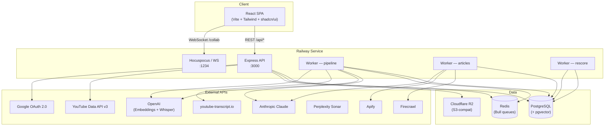

# Falak — Architecture Overview

Falak is a YouTube competitive-intelligence platform. It ingests YouTube channel
and video data, runs AI-powered analysis pipelines, surfaces story ideas, and
provides a rich editorial workspace — all deployed as a single Railway service.

---

## Plain-English Summary

The application is a full-stack Node.js project. The **backend** is an Express
API that talks to a **PostgreSQL** database through **Prisma ORM**. Background
work (video analysis, article processing, score recalculation) runs in
**Bull workers** backed by **Redis** — or falls back to in-process polling when
Redis is unavailable. Media uploads (photos, videos, thumbnails) are stored in
**Cloudflare R2** using the S3-compatible API. Real-time collaborative editing
uses **Hocuspocus / WebSocket**.

The **frontend** is a React SPA built with Vite, Tailwind CSS, and shadcn/ui.
In development the Vite dev-server proxies `/api` requests to the Express
backend. In production the built frontend is served as static files from the
same Express process.

Authentication is **Google OAuth 2.0** → JWT stored in an HTTP-only cookie.
Third-party API keys (Anthropic, OpenAI, YouTube, Firecrawl, Perplexity, Apify)
are encrypted at rest with **AES-256-GCM** and stored in the database.

Everything is deployed to **Railway** with zero IaC, zero CI/CD pipelines, and
no containerisation. Railway runs `npm start`, which applies Prisma migrations
and boots the server.

---

## Component Diagram

---

## Service / Resource Table

| Resource | Technology | Purpose | Config / Key Files |
|---|---|---|---|
| **Web server** | Express 4 (Node 20) | REST API, serves frontend in prod | `src/server.js`, `src/config.js` |
| **Frontend** | React 18 + Vite + TypeScript + Tailwind + shadcn/ui | SPA with editorial workspace | `frontend/` |
| **Database** | PostgreSQL (via Prisma 5) | Primary data store; pgvector for embeddings | `prisma/schema.prisma`, `src/lib/db.js` |
| **Queue / cache** | Redis + Bull 4 | Background job queue (optional — polling fallback) | `src/queue/pipeline.js`, `src/worker.js` |
| **Object storage** | Cloudflare R2 (S3-compat) | Media uploads, thumbnails | `src/services/r2.js`, `src/routes/upload.js` |
| **Realtime / collab** | Hocuspocus + ws | Tiptap collaborative editing | `src/ws-server.js`, `package.json` |
| **Auth** | Google OAuth 2.0 + JWT | Login, session cookies (30-day expiry) | `src/routes/auth.js`, `src/middleware/auth.js` |
| **AI — analysis** | Anthropic Claude | Video analysis, story generation, article processing | `src/services/pipelineProcessor.js`, `src/services/articleProcessor.js` |
| **AI — embeddings** | OpenAI Embeddings (1536-dim) | Semantic search across videos and stories | `src/services/embeddings.js` |
| **AI — transcription** | OpenAI Whisper | Audio → text when no YouTube transcript exists | `src/services/whisper.js` |
| **AI — research** | Perplexity Sonar | Story-idea research (legacy) | `src/services/storyResearcher.js` |
| **Scraping** | Firecrawl | Article extraction, news search | `src/services/firecrawl.js` |
| **Scraping** | Apify | Per-source web crawling actors | `src/services/apify.js` |
| **YouTube data** | YouTube Data API v3 | Channel / video metadata, comments | `src/services/youtube.js` |
| **Transcripts** | youtube-transcript.io | Subtitle fetching | `src/services/transcript.js` |
| **Media processing** | sharp + ffprobe | Thumbnail generation, image/video metadata | `src/services/media.js` |
| **Hosting** | Railway | Build, deploy, and run the app | `railway.json` |

---

## Workers

| Script | Purpose | Trigger |
|---|---|---|
| `src/worker.js` | Video pipeline (import → transcript → analysis → score) | Bull queue or polling loop |
| `src/worker-articles.js` | Article pipeline (fetch → clean → translate → analyse → rank) | Polling loop |
| `src/worker-rescore.js` | Periodic story rescoring | Polling loop |
| `src/ws-server.js` | Hocuspocus WebSocket server for Tiptap collab | Always-on process |

---

## Database Models

| Model | Description |
|---|---|
| `Channel` | YouTube channel profile (ours or competitor) |
| `ChannelSnapshot` | Point-in-time channel stats |
| `Video` | YouTube video with metadata, transcript, analysis, embedding |
| `PipelineItem` | Video processing pipeline state machine |
| `Comment` | YouTube comment with sentiment |
| `Story` | AI-generated or manual story idea with scores |
| `StoryLog` | Audit log for story actions |
| `User` | Google-authenticated user with role and access control |
| `Session` | JWT session token |
| `GalleryAlbum` | Media album per channel |
| `GalleryMedia` | Photo/video upload stored in R2 |
| `ApiKey` | Encrypted third-party API key (global) |
| `YoutubeApiKey` | Encrypted YouTube API key (rotation pool) |
| `ApiUsage` | Per-call usage log for external APIs |
| `ArticleSource` | News source config (Firecrawl, Apify, etc.) |
| `ApifyRun` | Apify actor run record |
| `Article` | Fetched article with processing pipeline |
| `ScoreProfile` | Self-learning scoring weights per channel |
| `Alert` | Notification (new video, viral spike, etc.) |
| `Dialect` | AI dialect prompt per country / engine |

---

## Environment Structure

There is **one environment** — production on Railway. There is no staging or dev
environment on the cloud. Local development uses `.env` (copied from
`.env.example`) with a local PostgreSQL database.

### Required Environment Variables

| Variable | Purpose |
|---|---|
| `DATABASE_URL` | PostgreSQL connection string |
| `JWT_SECRET` | HMAC secret for JWT signing |
| `APP_URL` | Public app URL (CORS origin, OAuth redirect) |
| `GOOGLE_CLIENT_ID` | Google OAuth client ID |
| `GOOGLE_CLIENT_SECRET` | Google OAuth client secret |

### Optional Environment Variables

| Variable | Default | Purpose |
|---|---|---|
| `PORT` | `3000` | HTTP listen port |
| `NODE_ENV` | `development` | Environment flag |
| `REDIS_URL` | — | Redis for Bull queues (omit for polling fallback) |
| `OWNER_EMAIL` | — | Auto-admin email on first login |
| `ANTHROPIC_API_KEY` | — | Seed key for Claude (can also be set in DB) |
| `ENCRYPTION_KEY` | — | AES-256-GCM key for API-key encryption at rest |
| `R2_ACCOUNT_ID` | — | Cloudflare R2 account |
| `R2_ACCESS_KEY_ID` | — | R2 access key |
| `R2_SECRET_ACCESS_KEY` | — | R2 secret key |
| `R2_BUCKET_NAME` | `falak-uploads` | R2 bucket |
| `R2_PUBLIC_URL` | — | Public CDN URL for R2 objects |
| `WS_PORT` | `1234` | Hocuspocus WebSocket port |

---

## Key Conventions

| Convention | Detail |
|---|---|
| **Language** | Backend is plain JavaScript (CommonJS). Frontend is TypeScript. |
| **ORM** | All database access goes through Prisma. Raw SQL only for pgvector operations. |
| **IDs** | CUIDs everywhere (`@default(cuid())`). |
| **Naming** | camelCase in code, snake_case in DB (Prisma mapping). |
| **Secrets** | `.env` locally, Railway env vars in prod. API keys in DB encrypted with AES-256-GCM. |
| **Validation** | Zod for request validation. |
| **Logging** | Pino (structured JSON). |
| **Error handling** | Central error middleware in `src/middleware/errors.js`. |
| **Migrations** | Prisma Migrate. Auto-applied on deploy via `prisma migrate deploy`. |
| **Static serving** | Express serves `frontend/dist` in production. |
| **Proxy (dev)** | Vite proxies `/api` → `:3000` and `/collab` → WebSocket. |
| **Node version** | 20.x (`.nvmrc`). |
| **Region** | Not explicitly configured — Railway defaults. |

---

## What's Absent (by design)

- **No IaC** — Railway is configured via dashboard + `railway.json`.
- **No CI/CD** — Deploys are triggered by Railway on push (or manually).
- **No Docker** — Railway builds from source.
- **No staging/preview environments** — Single prod deployment.
- **No monorepo tooling** — One root `package.json` orchestrates the backend; `frontend/` has its own `package.json`.

---

*Last updated: 2026-03-20*
