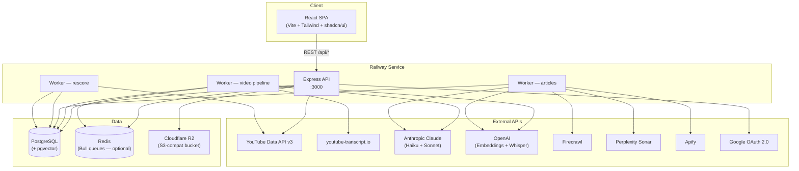
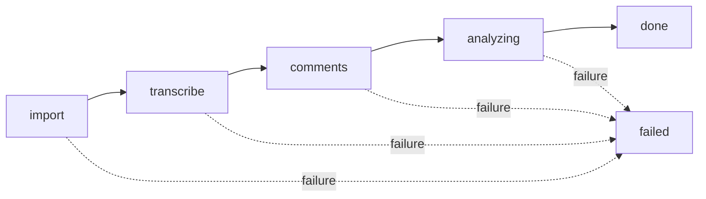
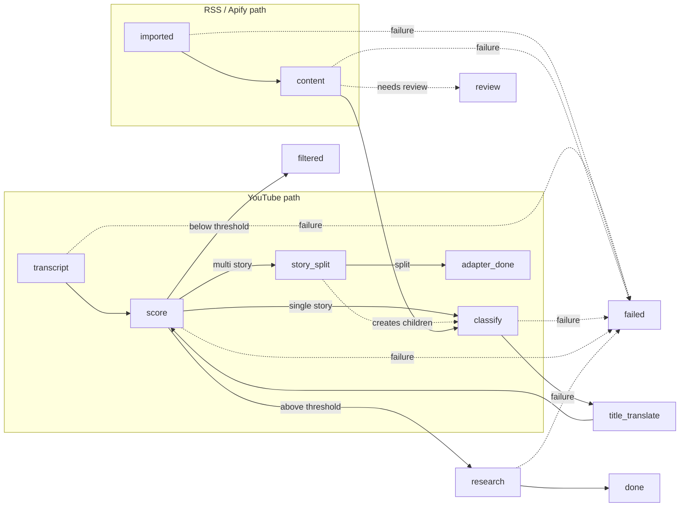
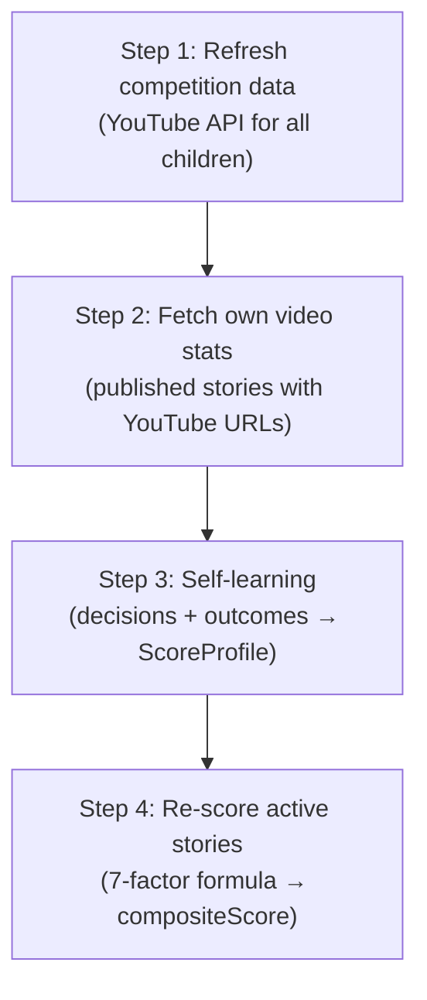

# Falak — Architecture Reference

Falak is a YouTube competitive-intelligence platform. It ingests YouTube channel
and video data, runs AI-powered analysis pipelines, surfaces story ideas, and
provides a rich editorial workspace — all deployed as a single Railway service.

---

## Table of Contents

1. [Plain-English Summary](#1--plain-english-summary)
2. [Component Diagram](#2--component-diagram)
3. [Service / Resource Table](#3--service--resource-table)
4. [Database Model Details](#4--database-model-details)
5. [API Endpoints](#5--api-endpoints)
6. [Pipeline & Worker Flows](#6--pipeline--worker-flows)
7. [Scoring System](#7--scoring-system)
8. [Frontend Structure](#8--frontend-structure)
9. [External API Integration Details](#9--external-api-integration-details)
10. [Authentication & Authorization Flow](#10--authentication--authorization-flow)
11. [Key Conventions & Code Patterns](#11--key-conventions--code-patterns)
12. [Known Gotchas & Operational Notes](#12--known-gotchas--operational-notes)
13. [Environment Structure](#13--environment-structure)
14. [What's Absent (by design)](#14--whats-absent-by-design)

---

## 1 — Plain-English Summary

### What Falak Does

Falak is a competitive-intelligence tool for Arabic YouTube teams. Users register
their own YouTube channels ("profiles"), add competitor channels, and Falak
automatically tracks performance, analyses content, and discovers story ideas.

From a user perspective the workflow is:

1. **Profile Setup** — pick or create a channel profile (Netflix-style picker).
   Each profile represents a single person / channel — no multi-channel selection.
2. **Competitor Tracking** — add competitor channels by handle. Falak fetches
   their videos, transcripts, and comments, then runs AI analysis.
3. **Analytics Dashboard** — view subscriber growth, engagement, content mix,
   publishing patterns, and head-to-head comparisons.
4. **Story Discovery** — the article pipeline ingests news from RSS, Apify
   sources, and YouTube channels. YouTube videos are transcribed and split into
   individual stories. All articles are classified with AI, researched,
   scored for relevance, promoted to stories, and auto-generate a draft script
   (Claude Sonnet) with branded hooks and research context for team evaluation.
5. **Editorial Workspace** — each story has a plain-text script editor with
   AI script generation (duration picker, auto-uses the profile's channel),
   video upload, transcription (Whisper), title / description / tag generation,
   and an SRT subtitle builder.
6. **Publish Queue** — bulk video upload; AI processing (transcribe → title →
   description + tags) runs entirely in the background via `POST /api/stories/:id/process`.
   Users can navigate to the story detail immediately after upload.
7. **Gallery** — per-channel media library for photos and videos stored in R2.
8. **Vector Intelligence** — pgvector-powered similarity search and a
   self-learning scoring profile that improves with every editorial decision.

### How Backend and Frontend Interact

The **frontend** is a React SPA (Vite + TypeScript + Tailwind + shadcn/ui). In
development, Vite dev-server on `:5173` proxies `/api` to Express on `:3000`. In
production, the SPA is built to `frontend/dist` and served as static files by the
same Express process — a single Railway service handles everything.

All data flows through REST endpoints under `/api/*`. Auth uses an HTTP-only JWT
cookie set during Google OAuth login — the frontend sends `credentials: "include"`
with every `fetch` call.

### How Background Jobs Fit In

Three worker loops start in-process inside `server.js` after boot:

- **Video pipeline worker** — processes videos through 4 stages (import →
  transcribe → comments → AI analysis). If Redis is available, it consumes a
  Bull queue; otherwise it polls the database every 10 seconds.
- **Article pipeline worker** — runs concurrent per-stage loops (each stage has its
  own independent polling loop within one Node.js process). AI stages share a
  concurrency semaphore (max 5). Every batch is persisted to `PipelineBatch` +
  `PipelineBatchItem` for full history. Stages: transcript → story_count →
  story_split → imported → content → classify → title_translate → score → research
  → done. Also polls article sources every 5 minutes for new imports.
- **Rescore worker** — runs a cycle once per hour. Refreshes competition stats
  from YouTube, learns from editorial decisions and published-video outcomes, and
  re-scores all active stories.
- **Trending worker** — fetches YouTube trending videos every 6 hours for
  configured countries (default: SA). Stores lightweight snapshots
  (`TrendingSnapshot` + `TrendingEntry`) for historical analysis. Configurable
  via `TRENDING_COUNTRIES` env var (comma-separated country codes). Retains 90
  days of data.

### How Auth Works End to End

1. Frontend redirects to `GET /api/auth/google/url` → builds Google OAuth URL.
2. User signs in at Google → redirected to `GET /api/auth/google/callback`.
3. Backend exchanges the code for tokens, verifies the ID token, creates or
   updates the `User` record, creates a `Session`, signs a JWT (30-day expiry),
   and sets it as an `httpOnly`, `sameSite: lax` cookie named `token`.
4. Every subsequent request carries the cookie. `requireAuth` middleware verifies
   the JWT, loads the session and user, and attaches `req.user`.
5. Role-based access uses `requireRole('owner', 'admin', ...)` middleware.
6. `OWNER_EMAIL` env var auto-promotes the matching email to `role: 'owner'` on
   first login.

### How API Keys Are Managed

Third-party API keys live in the `ApiKey` table (one row per service) and
`YoutubeApiKey` table (multiple keys for quota rotation). All keys are encrypted
at rest with AES-256-GCM using `ENCRYPTION_KEY` from env. The settings page lets
admins save, delete, and toggle keys. YouTube keys are randomly selected from the
active pool on each API call, providing basic load distribution.

### Fallback Behaviors

- **Redis optional**: if `REDIS_URL` is not set, the video worker falls back to
  polling the database every 10 seconds. The article and rescore workers always
  poll regardless.
- **R2 optional**: if R2 env vars are missing, upload routes still accept
  requests but `getClient()` returns `null` and uploads fail gracefully.
- **AI key optional**: pipeline stages that need an API key (Anthropic, OpenAI,
  Firecrawl, Perplexity) skip non-fatal steps when the key is missing.
- **Transcript fallback**: youtube-transcript.io → empty string (pipeline marks
  the video as having no transcript and continues).

---

## 2 — Component Diagram



---

## 3 — Service / Resource Table

| Resource | Technology | Purpose | Key Files |
|---|---|---|---|
| **Web server** | Express 4 (Node 20) | REST API, serves frontend in prod | `src/server.js`, `src/config.js` |
| **Frontend** | React 18 + Vite + TypeScript + Tailwind + shadcn/ui | SPA with editorial workspace | `frontend/` |
| **Database** | PostgreSQL (via Prisma 5) + pgvector | Primary data store; 1536-dim vector embeddings | `prisma/schema.prisma`, `src/lib/db.js` |
| **Queue** | Redis + Bull 4 | Background job queue (optional — polling fallback) | `src/queue/pipeline.js`, `src/worker.js` |
| **Object storage** | Cloudflare R2 (S3-compat) | Media uploads, thumbnails, video files | `src/services/r2.js`, `src/routes/upload.js` |
| **Auth** | Google OAuth 2.0 + JWT | Login, session cookies (30-day expiry) | `src/routes/auth.js`, `src/middleware/auth.js` |
| **AI — analysis** | Anthropic Claude (Haiku + Sonnet) | Video analysis, classification, translation, scoring | `src/services/pipelineProcessor.js` |
| **AI — embeddings** | OpenAI text-embedding-3-small | Semantic similarity search | `src/services/embeddings.js` |
| **AI — transcription** | OpenAI Whisper | Audio → text for uploaded videos | `src/services/whisper.js` |
| **AI — research** | Perplexity Sonar | Background research for articles | `src/services/storyResearcher.js` |
| **Scraping** | Firecrawl | Article content extraction | `src/services/firecrawl.js` |
| **Scraping** | Apify | Per-source actor-based web crawling | `src/services/apify.js` |
| **YouTube data** | YouTube Data API v3 | Channel/video metadata, comments | `src/services/youtube.js` |
| **Transcripts** | youtube-transcript.io | YouTube subtitle fetching | `src/services/transcript.js` |
| **Media processing** | sharp + ffprobe + ffmpeg | Thumbnail generation, EXIF, video metadata | `src/services/media.js` |
| **Hosting** | Railway | Build, deploy, run (single service) | `railway.json` |

---

## 4 — Database Model Details

### YouTube Data

#### Channel

Represents a YouTube channel — either "ours" (a profile the team manages) or a
"competitor" linked to a parent profile. Top-level "ours" channels are the entry
point for the entire app; competitors are children attached via `parentChannelId`.

| Field | Type | Required | Default | Description |
|---|---|---|---|---|
| `id` | String | Yes | `cuid()` | Primary key |
| `parentChannelId` | String | No | — | Parent channel for competitors |
| `youtubeId` | String | Yes | — | YouTube channel ID (unique) |
| `handle` | String | Yes | — | YouTube `@handle` |
| `nameAr` | String | Yes | — | Arabic display name |
| `nameEn` | String | No | — | English display name |
| `type` | String | Yes | `"ours"` | `ours` or `competitor` |
| `avatarUrl` | String | No | — | YouTube avatar URL |
| `status` | String | Yes | `"active"` | `active` or `paused` |
| `subscribers` | BigInt | Yes | 0 | Subscriber count |
| `totalViews` | BigInt | Yes | 0 | Lifetime view count |
| `videoCount` | Int | Yes | 0 | Total video count |
| `uploadCadence` | Float | No | — | Average days between uploads |
| `lastFetchedAt` | DateTime | No | — | Last YouTube API fetch |
| `startHook` | String | No | — | Branded intro phrase for scripts |
| `endHook` | String | No | — | Branded outro phrase for scripts |
| `nationality` | String | No | — | Country code (selects AI dialect) |
| `color` | String | Yes | `"#3b82f6"` | Profile accent color |
| `lastStatsRefreshAt` | DateTime | No | — | Last rescore cycle timestamp |
| `rescoreIntervalHours` | Int | No | 24 | Hours between rescore cycles |
| `createdAt` | DateTime | Yes | `now()` | — |
| `updatedAt` | DateTime | Yes | auto | — |

**Relations:** Has many `Video`, `ChannelSnapshot`, `Story`, `ArticleSource`, `Alert`, `GalleryMedia`, `GalleryAlbum`. Has one `ScoreProfile`. Self-relation for competitors via `parentChannel` / `competitors`.
**Indexes:** `parentChannelId`. **Unique:** `youtubeId`.

#### ChannelSnapshot

A point-in-time capture of a channel's stats for historical trend tracking. Created
during rescore refresh cycles and manual channel refreshes.

| Field | Type | Required | Default | Description |
|---|---|---|---|---|
| `id` | String | Yes | `cuid()` | Primary key |
| `channelId` | String | Yes | — | FK → Channel |
| `subscribers` | BigInt | Yes | — | Subscribers at snapshot time |
| `totalViews` | BigInt | Yes | — | Total views at snapshot time |
| `videoCount` | Int | Yes | — | Video count at snapshot time |
| `avgViews` | Int | Yes | — | Average views per video |
| `engagement` | Float | Yes | — | Engagement rate `(likes+comments)/views×100` |
| `snapshotAt` | DateTime | Yes | `now()` | Timestamp |

**Relations:** Belongs to `Channel`. **Indexes:** `[channelId, snapshotAt]`.

#### Video

A YouTube video with fetched metadata, AI transcript, analysis results, and a
1536-dim vector embedding for similarity search.

| Field | Type | Required | Default | Description |
|---|---|---|---|---|
| `id` | String | Yes | `cuid()` | Primary key |
| `channelId` | String | Yes | — | FK → Channel |
| `youtubeId` | String | Yes | — | YouTube video ID (unique) |
| `titleAr` | String | No | — | Arabic title |
| `titleEn` | String | No | — | English title |
| `description` | Text | No | — | Video description |
| `publishedAt` | DateTime | No | — | YouTube publish date |
| `viewCount` | BigInt | Yes | 0 | View count |
| `likeCount` | BigInt | Yes | 0 | Like count |
| `commentCount` | BigInt | Yes | 0 | Comment count |
| `duration` | String | No | — | ISO 8601 duration (e.g. `PT15M30S`) |
| `videoType` | String | Yes | `"video"` | `video` or `short` |
| `thumbnailUrl` | String | No | — | YouTube thumbnail URL |
| `transcription` | Text | No | — | JSON segments or plain text transcript |
| `analysisResult` | Json | No | — | AI analysis (partA + partB + sentiment) |
| `omitFromAnalytics` | Boolean | Yes | false | Exclude from analytics |
| `embedding` | vector(1536) | No | — | pgvector embedding for similarity |
| `createdAt` | DateTime | Yes | `now()` | — |
| `updatedAt` | DateTime | Yes | auto | — |

**Relations:** Belongs to `Channel`. Has one `PipelineItem`. Has many `Comment`.
**Indexes:** `channelId`, `publishedAt`. **Unique:** `youtubeId`.

#### PipelineItem

State machine that tracks a video through the analysis pipeline. Each video gets
one PipelineItem when it enters the system.

| Field | Type | Required | Default | Description |
|---|---|---|---|---|
| `id` | String | Yes | `cuid()` | Primary key |
| `videoId` | String | Yes | — | FK → Video (unique — 1:1) |
| `stage` | String | Yes | `"import"` | Current pipeline stage |
| `status` | String | Yes | `"queued"` | `queued`, `running`, `done`, `failed` |
| `retries` | Int | Yes | 0 | Retry count |
| `error` | String | No | — | Last error message |
| `result` | Json | No | — | Stage output data |
| `lastStage` | String | No | — | Previous stage (for retry) |
| `startedAt` | DateTime | No | — | Processing start time |
| `finishedAt` | DateTime | No | — | Processing end time |
| `createdAt` | DateTime | Yes | `now()` | — |
| `updatedAt` | DateTime | Yes | auto | — |

**Stages:** `import` → `transcribe` → `comments` → `analyzing` → `done` (or `failed`).
**Indexes:** `[stage, status]`. **Unique:** `videoId`.

#### Comment

A YouTube comment fetched from the video, with AI-assigned sentiment.

| Field | Type | Required | Default | Description |
|---|---|---|---|---|
| `id` | String | Yes | `cuid()` | Primary key |
| `videoId` | String | Yes | — | FK → Video |
| `youtubeId` | String | Yes | — | YouTube comment ID (unique) |
| `text` | Text | Yes | — | Comment body |
| `authorName` | String | No | — | Commenter display name |
| `likeCount` | Int | Yes | 0 | Like count |
| `publishedAt` | DateTime | No | — | Comment date |
| `sentiment` | String | No | — | AI: `positive`, `negative`, `question`, `neutral` |
| `createdAt` | DateTime | Yes | `now()` | — |

**Relations:** Belongs to `Video`. **Indexes:** `videoId`. **Unique:** `youtubeId`.

### AI Pipeline & Stories

#### Story

An AI-generated or manually created story idea. Flows through stages from
`suggestion` → `liked` → `scripting` → `filmed` → `done`. Can also
be `skip` or `trash` (negative decisions used for learning), or `filtered`
(automatically filtered out by the article pipeline threshold gate).

| Field | Type | Required | Default | Description |
|---|---|---|---|---|
| `id` | String | Yes | `cuid()` | Primary key |
| `channelId` | String | Yes | — | FK → Channel |
| `headline` | String | Yes | — | Story headline (Arabic) |
| `origin` | String | Yes | `"ai"` | `ai` or `manual` |
| `stage` | String | Yes | `"suggestion"` | Workflow stage |
| `coverageStatus` | String | No | — | Competition coverage info |
| `sourceUrl` | String | No | — | Original article URL |
| `sourceName` | String | No | — | Source publication name |
| `sourceDate` | DateTime | No | — | Article publish date |
| `relevanceScore` | Int | No | — | 0–100 relevance to channel |
| `viralScore` | Int | No | — | 0–100 viral potential |
| `firstMoverScore` | Int | No | — | 0–100 first-mover advantage |
| `compositeScore` | Float | No | — | Weighted composite (0–10) |
| `finalScore` | Float | No | — | Final score (0–1), compositeScore / 10 |
| `scriptLong` | Text | No | — | Full-length script |
| `scriptShort` | Text | No | — | Short-form script |
| `brief` | Json | No | — | Rich metadata (article, research, video, tags, etc.) |
| `producedVideoId` | String | No | — | FK → Video (unique) — links story to its published YouTube video |
| `embedding` | vector(1536) | No | — | pgvector embedding |
| `lastRescoredAt` | DateTime | No | — | Last rescore timestamp |
| `rescoreLog` | Json | No | — | Last 20 rescore entries |
| `queryVersion` | String | No | — | Search query version |
| `createdAt` | DateTime | Yes | `now()` | — |
| `updatedAt` | DateTime | Yes | auto | — |

**Relations:** Belongs to `Channel`. Has many `StoryLog`. Optional 1:1 to `Video` via `producedVideoId`.
**Indexes:** `[channelId, stage]`. **Unique:** `producedVideoId`.

#### StoryLog

Immutable audit log for every action taken on a story — stage changes, AI
operations, user notes.

| Field | Type | Required | Default | Description |
|---|---|---|---|---|
| `id` | String | Yes | `cuid()` | Primary key |
| `storyId` | String | Yes | — | FK → Story |
| `action` | String | Yes | — | Action name (e.g. `stage_change`, `auto_rescore`) |
| `note` | String | No | — | Human-readable detail |
| `userId` | String | No | — | FK → User (null for system actions) |
| `createdAt` | DateTime | Yes | `now()` | — |

**Relations:** Belongs to `Story`, `User`. **Indexes:** `storyId`.

### Articles

#### ArticleSource

Configuration for an external article source — RSS feed, Apify actor, or YouTube
channel. Each source belongs to a channel and has its own fetch schedule, keyword
gates, and optional per-source API key. YouTube channels use cadence-based polling
via `nextCheckAt`.

| Field | Type | Required | Default | Description |
|---|---|---|---|---|
| `id` | String | Yes | `cuid()` | Primary key |
| `channelId` | String | Yes | — | FK → Channel |
| `type` | String | Yes | — | `rss`, `apify_actor`, or `youtube_channel` |
| `label` | String | Yes | — | Display name |
| `config` | Json | Yes | — | Type-specific config (URL, actorId, keywords, etc.) |
| `image` | Text | No | — | Source icon (base64) |
| `apiKeyEncrypted` | Text | No | — | Per-source Apify API key (AES-256-GCM) |
| `lastImportedRunId` | String | No | — | Last Apify run imported |
| `isActive` | Boolean | Yes | true | Enable/disable fetching |
| `language` | String | Yes | `"en"` | Source language |
| `lastPolledAt` | DateTime | No | — | Last fetch time |
| `nextCheckAt` | DateTime | No | — | Cadence-based: next scheduled check time |
| `fetchLog` | Json | No | — | Last 30 fetch results (ring buffer) |
| `createdAt` | DateTime | Yes | `now()` | — |
| `updatedAt` | DateTime | Yes | auto | — |

**Relations:** Belongs to `Channel`. Has many `Article`, `ApifyRun`.
**Indexes:** `channelId`.

#### Article

An article fetched from a source, processed through the pipeline.
For RSS/Apify: imported → content → classify → title_translate → score → [threshold gate] → research → done.
For YouTube: transcript → story_count → [story_split] → classify → ... (same downstream pipeline). `story_count` uses server-side pattern matching (no AI). Only videos flagged as multi-story reach `story_split` (AI). Videos with multiple stories get split into child articles via `parentArticleId`.

| Field | Type | Required | Default | Description |
|---|---|---|---|---|
| `id` | String | Yes | `cuid()` | Primary key |
| `channelId` | String | Yes | — | Channel scope |
| `sourceId` | String | Yes | — | FK → ArticleSource |
| `parentArticleId` | String | No | — | FK → Article (self-relation for story splits) |
| `url` | String | Yes | — | Article URL |
| `title` | String | No | — | Article title |
| `description` | Text | No | — | Article description |
| `content` | Text | No | — | Raw HTML content |
| `contentClean` | Text | No | — | Cleaned plain text |
| `contentAr` | Text | No | — | Arabic translation (legacy — no longer populated by pipeline) |
| `publishedAt` | DateTime | No | — | Article publish date |
| `language` | String | No | — | Detected language |
| `category` | String | No | — | Article category from source |
| `tags` | Json | No | — | Article tags array from source |
| `featuredImage` | String | No | — | Featured image URL from source |
| `images` | Json | No | — | Article image URLs array from source |
| `stage` | String | Yes | `"imported"` | Pipeline stage |
| `status` | String | Yes | `"queued"` | `queued`, `running`, `done`, `filtered`, `failed`, `review` |
| `retries` | Int | Yes | 0 | Retry count |
| `error` | String | No | — | Last error |
| `startedAt` | DateTime | No | — | Processing start |
| `finishedAt` | DateTime | No | — | Processing end |
| `processingLog` | Json | No | — | Per-stage processing details |
| `analysis` | Json | No | — | AI classification + research + scoring |
| `relevanceScore` | Float | No | — | Channel relevance (0–1) |
| `finalScore` | Float | No | — | Composite score (0–1) |
| `rankReason` | String | No | — | Why this score |
| `storyId` | String | No | — | Promoted story ID |
| `createdAt` | DateTime | Yes | `now()` | — |
| `updatedAt` | DateTime | Yes | auto | — |

**Stages (RSS/Apify):** `imported` → `content` → `classify` → `title_translate` → `score` → `[threshold gate]` → `research` → `done`.
**Stages (YouTube):** `transcript` → `story_count` → [`story_split`] → `classify` → ... (same from classify onwards). `story_count` is pure server logic (regex patterns). `story_split` only runs when multi-story is detected. Parent articles that are split go to `adapter_done`.
Articles below the dynamic threshold are set to `filtered` and stop processing. Terminal stages: `done`, `filtered`, `failed`, `adapter_done`.
**Unique:** `[channelId, url]`. **Indexes:** `[sourceId, stage]`, `[channelId, stage]`, `[stage, status]`.

#### ApifyRun

Tracks individual Apify actor runs to avoid re-importing the same dataset.

| Field | Type | Required | Default | Description |
|---|---|---|---|---|
| `id` | String | Yes | `cuid()` | Primary key |
| `sourceId` | String | Yes | — | FK → ArticleSource |
| `runId` | String | Yes | — | Apify run ID |
| `datasetId` | String | No | — | Apify dataset ID |
| `startedAt` | DateTime | No | — | Run start |
| `finishedAt` | DateTime | No | — | Run end |
| `itemCount` | Int | No | — | Items in dataset |
| `status` | String | Yes | — | `imported`, `skipped_empty`, `failed` |
| `importedAt` | DateTime | No | — | When imported into Falak |
| `createdAt` | DateTime | Yes | `now()` | — |

**Unique:** `[sourceId, runId]`. **Indexes:** `[sourceId, startedAt DESC]`.

### Auth & Users

#### User

A Google-authenticated user with role-based access control.

| Field | Type | Required | Default | Description |
|---|---|---|---|---|
| `id` | String | Yes | `cuid()` | Primary key |
| `email` | String | Yes | — | Google email (unique) |
| `name` | String | No | — | Display name |
| `avatarUrl` | String | No | — | Google avatar |
| `googleId` | String | No | — | Google sub ID (unique) |
| `role` | String | Yes | `"viewer"` | `owner`, `admin`, `editor`, `viewer` |
| `note` | String | No | — | Admin note |
| `isActive` | Boolean | Yes | true | Enable/disable access |
| `canCreateProfile` | Boolean | Yes | false | Allow non-admin users to create profiles |
| `pageAccess` | Json | No | — | Array of page slugs user can access (`null` = all). Slugs: `home`, `competitors`, `pipeline`, `analytics`, `stories`, `article-pipeline`, `gallery`, `settings`, `design-system`, `admin` |
| `channelAccess` | Json | No | — | Array of channel IDs user can access (`null` = all) |
| `createdAt` | DateTime | Yes | `now()` | — |
| `updatedAt` | DateTime | Yes | auto | — |

**Unique:** `email`, `googleId`.

#### Session

JWT session token with expiry. One user can have multiple active sessions.

| Field | Type | Required | Default | Description |
|---|---|---|---|---|
| `id` | String | Yes | `cuid()` | Primary key |
| `userId` | String | Yes | — | FK → User |
| `token` | String | Yes | — | JWT token value (unique) |
| `expiresAt` | DateTime | Yes | — | Session expiry (30 days) |
| `createdAt` | DateTime | Yes | `now()` | — |

**Indexes:** `token`.

### Media

#### GalleryAlbum

An album within a channel's media gallery.

| Field | Type | Required | Default | Description |
|---|---|---|---|---|
| `id` | String | Yes | `cuid()` | Primary key |
| `channelId` | String | Yes | — | FK → Channel |
| `name` | String | Yes | — | Album name |
| `description` | String | No | — | Album description |
| `isLocked` | Boolean | Yes | `false` | Prevents deletion/removal/rename/upload (used by auto-generated "Stories" album) |
| `showInAllMedia` | Boolean | Yes | `true` | When `false`, media in this album is excluded from the "All Media" view |
| `coverMediaId` | String | No | — | FK → GalleryMedia (album cover) |
| `createdById` | String | Yes | — | FK → User |
| `createdAt` | DateTime | Yes | `now()` | — |
| `updatedAt` | DateTime | Yes | auto | — |

**Indexes:** `[channelId, createdAt DESC]`, `coverMediaId`.

#### GalleryMedia

A photo or video uploaded to R2 within a channel's gallery.

| Field | Type | Required | Default | Description |
|---|---|---|---|---|
| `id` | String | Yes | `cuid()` | Primary key |
| `channelId` | String | Yes | — | FK → Channel |
| `albumId` | String | No | — | FK → GalleryAlbum |
| `type` | Enum | Yes | — | `PHOTO` or `VIDEO` |
| `fileName` | String | Yes | — | Original file name |
| `fileSize` | BigInt | Yes | — | Size in bytes |
| `mimeType` | String | Yes | — | MIME type |
| `width` | Int | No | — | Pixel width |
| `height` | Int | No | — | Pixel height |
| `duration` | Float | No | — | Video duration in seconds |
| `r2Key` | String | Yes | — | R2 object key (unique) |
| `r2Url` | String | Yes | — | R2 public/signed URL |
| `thumbnailR2Key` | String | No | — | Thumbnail R2 key |
| `thumbnailR2Url` | String | No | — | Thumbnail URL |
| `metadata` | Json | No | — | EXIF/ffprobe metadata |
| `uploadedById` | String | Yes | — | FK → User |
| `createdAt` | DateTime | Yes | `now()` | — |
| `updatedAt` | DateTime | Yes | auto | — |

**Unique:** `r2Key`. **Indexes:** `[channelId, createdAt DESC]`, `[albumId, createdAt DESC]`, `uploadedById`.

### Scoring & Intelligence

#### ScoreProfile

Self-learning scoring profile per channel. Evolves with every editorial decision
and published video outcome.

| Field | Type | Required | Default | Description |
|---|---|---|---|---|
| `id` | String | Yes | `cuid()` | Primary key |
| `channelId` | String | Yes | — | FK → Channel (unique — 1:1) |
| `nicheTags` | String[] | Yes | `[]` | English niche tags for Content DNA |
| `nicheTagsAr` | String[] | Yes | `[]` | Arabic niche tags for Content DNA |
| `nicheEmbedding` | vector(1536) | No | — | Semantic embedding of niche tags |
| `nicheEmbeddingGeneratedAt` | DateTime | No | — | When niche embedding was last generated |
| `weightAdjustments` | Json | No | — | Custom weight overrides |
| `tagSignals` | Json | No | — | Per-tag preference signals (−1 to +1) |
| `contentTypeSignals` | Json | No | — | Per-content-type preference signals |
| `regionSignals` | Json | No | — | Per-region preference signals |
| `aiViralAccuracy` | Float | Yes | 1.0 | Calibrated AI viral prediction accuracy |
| `aiRelevanceAccuracy` | Float | Yes | 1.0 | Calibrated AI relevance accuracy |
| `channelAvgViews` | BigInt | Yes | 0 | Channel's average views |
| `channelMedianViews` | BigInt | Yes | 0 | Channel's median views |
| `totalOutcomes` | Int | Yes | 0 | Published stories with YouTube stats |
| `totalDecisions` | Int | Yes | 0 | Total liked/skip/trash decisions |
| `currentThreshold` | Float | Yes | 0.30 | Dynamic filtering threshold (updated by threshold gate) |
| `lastLearnedAt` | DateTime | No | — | Last learning cycle |
| `storyPatterns` | Json | No | — | Configurable story detection patterns: `titleWords` (plain words), `transitionPhrases` (plain phrases), `minTransitions` (int). Managed via Story Rules UI tab. |
| `createdAt` | DateTime | Yes | `now()` | — |
| `updatedAt` | DateTime | Yes | auto | — |

**Unique:** `channelId`.

#### Alert

A notification record — score changes, competitor activity, new viral videos.

| Field | Type | Required | Default | Description |
|---|---|---|---|---|
| `id` | String | Yes | `cuid()` | Primary key |
| `channelId` | String | Yes | — | FK → Channel |
| `storyId` | String | No | — | Related story |
| `videoId` | String | No | — | Related video |
| `type` | String | Yes | — | `score_change`, `competitor_published`, etc. |
| `title` | String | Yes | — | Alert headline |
| `detail` | Json | No | — | Structured detail |
| `isRead` | Boolean | Yes | false | Read status |
| `createdAt` | DateTime | Yes | `now()` | — |

**Indexes:** `[channelId, isRead]`, `[channelId, createdAt DESC]`.

#### AppSetting

Simple key-value store for persistent application state (e.g., worker pause flags).

| Field | Type | Required | Default | Description |
|---|---|---|---|---|
| `key` | String | Yes | — | Primary key (e.g., `articlePipelinePaused`) |
| `value` | String | Yes | — | Setting value |
| `updatedAt` | DateTime | Yes | auto | Last update |

#### PipelineBatch

Persisted record of each worker batch. Created asynchronously after batch completes.

| Field | Type | Required | Default | Description |
|---|---|---|---|---|
| `id` | String (CUID) | Yes | auto | Primary key |
| `pipeline` | String | Yes | — | `"article"` or `"video"` |
| `stage` | String | Yes | — | Pipeline stage (e.g., `classify`) |
| `batchSeq` | Int | Yes | — | Auto-incrementing batch number |
| `itemCount` | Int | Yes | — | Total items in this batch |
| `succeededCount` | Int | Yes | 0 | Items that passed this stage |
| `failedCount` | Int | Yes | 0 | Items that failed |
| `catchup` | Boolean | Yes | false | Whether this was a catch-up drain |
| `channelIds` | String[] | Yes | — | Channels represented in this batch |
| `startedAt` | DateTime | Yes | now | Batch processing start |
| `finishedAt` | DateTime | No | — | Batch processing end |

Indexes: `[pipeline, stage, finishedAt DESC]`, `[channelIds]`

#### PipelineBatchItem

Per-article result within a batch. Captures status, error, timing, and retry attempt.

| Field | Type | Required | Default | Description |
|---|---|---|---|---|
| `id` | String (CUID) | Yes | auto | Primary key |
| `batchId` | String | Yes | — | FK → PipelineBatch (cascade delete) |
| `articleId` | String | Yes | — | The article processed |
| `status` | String | Yes | — | `succeeded`, `failed`, `blocked`, `review` |
| `error` | String | No | — | Error message if failed |
| `durationMs` | Int | No | — | Processing time in milliseconds |
| `attempt` | Int | Yes | 1 | Which retry attempt this was |
| `createdAt` | DateTime | Yes | now | When recorded |

Indexes: `[batchId]`, `[articleId, createdAt DESC]`

### Config

#### ApiKey

Encrypted third-party API key. One row per service (global, not per-channel).

| Field | Type | Required | Default | Description |
|---|---|---|---|---|
| `id` | String | Yes | `cuid()` | Primary key |
| `service` | String | Yes | — | Service name (unique): `anthropic`, `embedding`, `firecrawl`, `perplexity`, `yt-transcript` |
| `encryptedKey` | Text | Yes | — | AES-256-GCM encrypted key (`iv:tag:ciphertext`) |
| `isActive` | Boolean | Yes | true | Active flag |
| `lastUsedAt` | DateTime | No | — | Last API call |
| `usageCount` | Int | Yes | 0 | Total calls |
| `quotaLimit` | Int | No | — | Monthly quota limit |
| `quotaUsed` | Int | Yes | 0 | Monthly quota used |
| `quotaResetAt` | DateTime | No | — | Quota reset date |
| `createdAt` | DateTime | Yes | `now()` | — |
| `updatedAt` | DateTime | Yes | auto | — |

**Unique:** `service`.

#### YoutubeApiKey

Multiple YouTube Data API keys for quota rotation. Randomly selected on each call.

| Field | Type | Required | Default | Description |
|---|---|---|---|---|
| `id` | String | Yes | `cuid()` | Primary key |
| `label` | String | Yes | `"Key 1"` | Display label |
| `encryptedKey` | Text | Yes | — | AES-256-GCM encrypted key |
| `isActive` | Boolean | Yes | true | Active flag |
| `lastUsedAt` | DateTime | No | — | Last API call |
| `usageCount` | Int | Yes | 0 | Total calls |
| `sortOrder` | Int | Yes | 0 | Display order |
| `createdAt` | DateTime | Yes | `now()` | — |
| `updatedAt` | DateTime | Yes | auto | — |

**Indexes:** `isActive`.

#### GoogleSearchKey

Multiple SerpAPI keys for web-search quota rotation (100 searches/month free per key).
Same schema as `YoutubeApiKey`.

| Field | Type | Required | Default | Description |
|---|---|---|---|---|
| `id` | String | Yes | `cuid()` | Primary key |
| `label` | String | Yes | `"Key 1"` | Display label |
| `encryptedKey` | Text | Yes | — | AES-256-GCM encrypted key |
| `isActive` | Boolean | Yes | true | Active flag |
| `lastUsedAt` | DateTime | No | — | Last API call |
| `usageCount` | Int | Yes | 0 | Total calls |
| `sortOrder` | Int | Yes | 0 | Display order |
| `createdAt` | DateTime | Yes | `now()` | — |
| `updatedAt` | DateTime | Yes | auto | — |

**Indexes:** `isActive`.

SerpAPI keys replace the former Google Custom Search JSON API (deprecated by Google).
No CX ID needed — SerpAPI handles search engine routing internally.

#### ApiUsage

Fire-and-forget log of every external API call for the usage dashboard.

| Field | Type | Required | Default | Description |
|---|---|---|---|---|
| `id` | String | Yes | `cuid()` | Primary key |
| `channelId` | String | Yes | — | Channel scope |
| `service` | String | Yes | — | Service name |
| `action` | String | No | — | Specific API action |
| `tokensUsed` | Int | No | — | Token count (AI calls) |
| `status` | String | Yes | `"ok"` | `ok` or `fail` |
| `error` | Text | No | — | Error message (truncated to 500 chars) |
| `createdAt` | DateTime | Yes | `now()` | — |

**Indexes:** `[channelId, createdAt DESC]`, `service`.

#### Dialect

Arabic dialect prompt instructions per country and AI engine. Seeded at startup.

| Field | Type | Required | Default | Description |
|---|---|---|---|---|
| `id` | String | Yes | `cuid()` | Primary key |
| `countryCode` | String | Yes | — | ISO country code |
| `engine` | String | Yes | `"claude"` | AI engine (`claude`) |
| `name` | String | Yes | — | Dialect name |
| `short` | String | Yes | — | Short prompt instruction |
| `long` | String | Yes | — | Full prompt instruction |

**Unique:** `[countryCode, engine]`. **Indexes:** `engine`.

---

### TrendingSnapshot

Stores metadata for each trending data fetch. Completely standalone — no FK to
Channel or Video tables.

| Column | Type | Required | Default | Notes |
|---|---|---|---|---|
| `id` | String (CUID) | Yes | auto | PK |
| `country` | String | Yes | — | ISO 3166-1 alpha-2 country code |
| `fetchedAt` | DateTime | Yes | `now()` | When the snapshot was taken |
| `totalVideos` | Int | Yes | `0` | Number of entries in this snapshot |

**Indexes:** `[country, fetchedAt DESC]`.

### TrendingEntry

Lightweight trending video data point — stores only metadata and stats, not full
video content. Each entry belongs to a `TrendingSnapshot`.

| Column | Type | Required | Default | Notes |
|---|---|---|---|---|
| `id` | String (CUID) | Yes | auto | PK |
| `snapshotId` | String | Yes | — | FK → TrendingSnapshot (cascade delete) |
| `rank` | Int | Yes | — | Position in trending list |
| `youtubeVideoId` | String | Yes | — | YouTube video ID (not FK to Video) |
| `title` | String | Yes | — | Video title at time of snapshot |
| `channelName` | String | Yes | — | Channel name at time of snapshot |
| `channelId` | String | Yes | — | YouTube channel ID (not FK to Channel) |
| `categoryId` | String | No | — | YouTube category ID |
| `categoryName` | String | No | — | Human-readable category name |
| `viewCount` | BigInt | Yes | `0` | Views at time of snapshot |
| `likeCount` | BigInt | Yes | `0` | Likes at time of snapshot |
| `commentCount` | BigInt | Yes | `0` | Comments at time of snapshot |
| `duration` | String | No | — | ISO 8601 duration |
| `publishedAt` | DateTime | No | — | Video publish date |
| `thumbnailUrl` | String | No | — | Thumbnail URL |

**Indexes:** `snapshotId`, `youtubeVideoId`, `categoryName`.

### AiGenerationLog

Full audit trail for every AI generation call — stores system prompt, user prompt,
complete response, token counts, and timing. Used by the AI Monitor page.

| Column | Type | Required | Default | Notes |
|---|---|---|---|---|
| `id` | String (CUID) | Yes | auto | PK |
| `channelId` | String | Yes | — | FK → Channel (cascade delete) |
| `storyId` | String | No | — | Story that triggered the call |
| `action` | String | Yes | — | Human-readable action label |
| `model` | String | Yes | — | AI model used (e.g. `claude-sonnet-4-6`) |
| `systemPrompt` | Text | No | — | Full system prompt sent |
| `userPrompt` | Text | No | — | Full user prompt sent |
| `response` | Text | No | — | Complete AI response |
| `inputTokens` | Int | No | — | Input token count |
| `outputTokens` | Int | No | — | Output token count |
| `durationMs` | Int | No | — | Request duration in milliseconds |
| `status` | String | Yes | `"ok"` | `ok` or `fail` |
| `error` | Text | No | — | Error message on failure |
| `createdAt` | DateTime | Yes | `now()` | — |

**Indexes:** `[channelId, createdAt DESC]`, `storyId`, `action`.

> **Channel.styleGuide** (`Json?`) — stores learned AI corrections, hook examples,
> and style notes. Populated by the AI learning pipeline when stories reach "done".
> Injected into script generation prompts as few-shot examples. Managed via
> the AI Monitor page.

---

## 5 — API Endpoints

**96 total route handlers** across 19 route files.

### Auth — `/api/auth`

| Method | Path | Auth | Description |
|---|---|---|---|
| GET | `/api/auth/google/url` | No | Returns Google OAuth consent URL. `?returnTo=` for post-login redirect. |
| GET | `/api/auth/google/callback` | No | OAuth callback — exchanges code, creates user/session, sets JWT cookie, redirects. |
| POST | `/api/auth/logout` | No | Clears session and cookie. |
| GET | `/api/auth/me` | Yes | Returns current user profile `{ id, email, name, avatarUrl, role, pageAccess, channelAccess, canCreateProfile }`. |

### Admin — `/api/admin`

| Method | Path | Auth | Description |
|---|---|---|---|
| GET | `/api/admin/pages` | owner/admin | Lists all assignable page slugs and labels. |
| GET | `/api/admin/profiles` | owner/admin | Lists all profiles (channels) for assignment. |
| GET | `/api/admin/users` | owner/admin | Lists all users with access settings. |
| POST | `/api/admin/users` | owner/admin | Creates a new user by email (pre-login provisioning). |
| PATCH | `/api/admin/users/:id` | owner/admin | Updates role, note, pageAccess, channelAccess, canCreateProfile, isActive. |
| DELETE | `/api/admin/users/:id` | owner/admin | Removes user and their sessions. Cannot remove owner. |

### Profiles — `/api/profiles`

| Method | Path | Auth | Description |
|---|---|---|---|
| GET | `/api/profiles` | Yes | Lists all "ours" channels with story/competitor counts. |
| POST | `/api/profiles` | owner/admin | Creates a profile by YouTube handle. Promotes existing competitor if found. |
| PATCH | `/api/profiles/:id` | owner/admin | Updates profile display fields (nameAr, nameEn, color, status). |
| DELETE | `/api/profiles/:id` | owner | Deletes a profile (cascading). |
| GET | `/api/profiles/:id/usage` | owner/admin | Paginated API usage logs for a profile. |

### Channels — `/api/channels`

| Method | Path | Auth | Description | Side Effects |
|---|---|---|---|---|
| GET | `/api/channels` | Yes | List channels (cursor pagination). `?parentChannelId=&limit=&cursor=` | — |
| GET | `/api/channels/:id` | Yes | Single channel with stats and deltas from latest snapshot. | — |
| GET | `/api/channels/:id/videos` | Yes | Videos for a channel (offset pagination) with pipeline status. | — |
| GET | `/api/channels/:id/publish-not-done` | Yes | Count of stories with uploaded video not yet done (any origin). | — |
| POST | `/api/channels` | editor+ | Add channel by handle/URL. | YouTube API → creates Channel + Videos + PipelineItems, enqueues jobs |
| POST | `/api/channels/:id/refresh` | editor+ | Re-fetch channel metadata and create snapshot. | YouTube API → updates Channel, creates ChannelSnapshot |
| POST | `/api/channels/:id/fetch-videos` | editor+ | Pull latest videos from YouTube. | YouTube API → upserts Videos + PipelineItems, enqueues jobs |
| POST | `/api/channels/:id/analyze-all` | editor+ | Queue all videos for AI analysis. | Creates PipelineItems at "analyzing" stage |
| PATCH | `/api/channels/:id` | editor+ | Update channel fields (type, hooks, nationality). | — |
| GET | `/api/channels/:id/niche-tags` | Yes | Get Content DNA niche tags (English + Arabic). | Upserts ScoreProfile if missing |
| PATCH | `/api/channels/:id/niche-tags` | editor+ | Update Content DNA niche tags. | Upserts ScoreProfile |
| POST | `/api/channels/:id/generate-niche-embedding` | editor+ | Generate niche embedding from Content DNA tags. | OpenAI Embeddings → ScoreProfile.nicheEmbedding |
| GET | `/api/channels/:id/niche-embedding-status` | Yes | Check if niche embedding exists. | — |
| DELETE | `/api/channels/all` | admin+ | Delete ALL channels. | Cascading deletes |
| DELETE | `/api/channels/:id` | admin+ | Delete one channel. | Cascading deletes |

### Videos — `/api/videos`

| Method | Path | Auth | Description | Side Effects |
|---|---|---|---|---|
| GET | `/api/videos/:id` | Yes | Video with analysis, comments (top 200), pipeline status. | — |
| POST | `/api/videos/:id/refetch-comments` | Yes (15/min) | Re-fetch top 100 comments from YouTube. | YouTube API → upserts Comments |
| POST | `/api/videos/:id/refetch-transcript` | Yes (15/min) | Re-fetch transcript. | Transcript API → updates Video.transcription |
| POST | `/api/videos/:id/omit-from-analytics` | Yes | Toggle omit flag. | — |
| GET | `/api/videos/:id/logs` | Yes | Pipeline stage log timeline. | — |

### Pipeline — `/api/pipeline`

| Method | Path | Auth | Description | Side Effects |
|---|---|---|---|---|
| GET | `/api/pipeline` | Yes | Full pipeline state — items by stage, counts, paused flag. | — |
| POST | `/api/pipeline/process` | editor+ | Process one item (enqueue Bull job or run in-process). | Runs pipeline stage |
| POST | `/api/pipeline/pause` | admin+ | Pause all channels. | Updates Channel.status |
| POST | `/api/pipeline/resume` | admin+ | Resume all channels. | Updates Channel.status |
| POST | `/api/pipeline/retry-all-failed` | editor+ (20/min) | Retry all failed items. | Resets PipelineItems, enqueues jobs |
| POST | `/api/pipeline/:id/retry` | editor+ (20/min) | Retry one failed item (max 9 retries). | Resets PipelineItem, enqueues job |

### Stories — `/api/stories`

| Method | Path | Auth | Description | Side Effects |
|---|---|---|---|---|
| GET | `/api/stories` | Yes | List stories by channel/stage, sorted by compositeScore. | — |
| GET | `/api/stories/summary` | Yes | Stage counts and first-mover stats. | — |
| GET | `/api/stories/:id` | Yes | Single story with full log history. Research images merged from linked article's analysis. | — |
| POST | `/api/stories` | editor+ | Create a story. | — |
| POST | `/api/stories/manual` | editor+ | Create manual story in "filmed" stage. | — |
| POST | `/api/stories/:id/process` | editor+ | Kick off background AI processing (transcribe → title → description + tags in parallel). Returns immediately. | Updates `brief.processingStatus` |
| PATCH | `/api/stories/:id` | editor+ | Update story (stage change triggers learning). | StoryLog, refreshPreferenceProfile, learnFromDecisions |
| DELETE | `/api/stories/:id` | admin+ | Delete a story. | — |
| POST | `/api/stories/:id/fetch-article` | editor+ | Scrape source URL content. | Firecrawl API → updates Story.brief |
| POST | `/api/stories/:id/cleanup` | editor+ | AI-clean scraped article. | Anthropic API |
| POST | `/api/stories/:id/generate-script` | editor+ | AI-generate script (SSE stream). Includes research brief, dialect, branded hooks. | Anthropic Sonnet (streaming) |
| POST | `/api/stories/:id/fetch-subtitles` | editor+ | Fetch YouTube transcript as SRT. | Transcript API |
| POST | `/api/stories/:id/transcribe` | editor+ | Whisper transcription of uploaded video. | OpenAI Whisper → R2 download |
| POST | `/api/stories/:id/generate-title` | editor+ | AI-generate YouTube title. | Anthropic API |
| POST | `/api/stories/:id/generate-description` | editor+ | AI-generate YouTube description. | Anthropic API |
| POST | `/api/stories/:id/suggest-tags` | editor+ | AI-suggest YouTube SEO tags. | Anthropic API |
| POST | `/api/stories/:id/classify-video` | editor+ | Detect Short vs regular video. | YouTube API |
| PATCH | `/api/stories/:id/link-video` | editor+ | Link story to its produced YouTube video by `youtubeId`. | — |
| POST | `/api/stories/:id/retranslate-research` | editor+ | Copy Arabic research brief from linked article; AI fallback only if no existing translation. | Anthropic Haiku (fallback only) |
| POST | `/api/stories/batch-retranslate` | admin+ | Batch-translate all stories missing Arabic research briefs. | Anthropic Haiku |
| POST | `/api/stories/:id/log` | editor+ | Add a log entry. | — |
| POST | `/api/stories/:id/rescore` | editor+ | Re-score single story via niche embedding dot product. | — |
| POST | `/api/stories/rescore-all` | editor+ | Re-score all active stories in channel via niche embedding. | — |
| POST | `/api/stories/re-evaluate` | admin+ | Full rescore cycle for a channel. | YouTube API + scoring |
| POST | `/api/stories/recalculate-scores` | admin+ | Batch recalc compositeScore. | — |

### Article Sources — `/api/article-sources`

| Method | Path | Auth | Description |
|---|---|---|---|
| GET | `/api/article-sources` | Yes | List sources for a channel with stage counts and run history. |
| POST | `/api/article-sources` | editor+ | Create RSS or Apify actor source. |
| PATCH | `/api/article-sources/:id` | editor+ | Update source config. |
| DELETE | `/api/article-sources/:id?deleteStories=true` | admin+ | Delete a source. Optional `deleteStories=true` also removes linked stories. |
| POST | `/api/article-sources/:id/test` | editor+ | Dry-run fetch (no save). |
| POST | `/api/article-sources/:id/reimport-run` | editor+ | Re-import articles from an Apify run. |
| GET | `/api/article-sources/field-schema` | Yes | JSON schema for source config fields. |
| POST | `/api/article-sources/test-config` | editor+ | Dry-run fetch with arbitrary config. |

### Article Pipeline — `/api/article-pipeline`

| Method | Path | Auth | Description |
|---|---|---|---|
| GET | `/api/article-pipeline` | Yes | Kanban view — articles by stage or per-source workflow. |
| GET | `/api/article-pipeline/firecrawl-example` | Yes | Find one Firecrawl-scraped article. |
| GET | `/api/article-pipeline/:id/detail` | Yes | Full article detail with truncated content. |
| GET | `/api/article-pipeline/:id/events` | Yes | SSE stream — pushes `{stage,status}` on each stage transition. |
| GET | `/api/article-pipeline/:sourceId/articles` | Yes | Articles for a specific source. |
| POST | `/api/article-pipeline/ingest` | editor+ | Trigger article ingestion. **Requires Content DNA embedding** — returns 400 if niche embedding not generated. |
| POST | `/api/article-pipeline/pause` | admin+ | Pause article worker (persisted in DB via `AppSetting`). |
| POST | `/api/article-pipeline/resume` | admin+ | Resume article worker (persisted in DB via `AppSetting`). |
| POST | `/api/article-pipeline/reset` | admin+ | Wipe all stories, articles, alerts; reset scoring weights in ScoreProfile. **Preserves Content DNA** (niche tags + embedding). Resets source polling state. |
| POST | `/api/article-pipeline/:id/retry` | editor+ | Retry failed article. |
| POST | `/api/article-pipeline/:id/restart` | editor+ | Restart article from a stage. |
| POST | `/api/article-pipeline/restart-stage` | editor+ | Bulk restart all articles in a stage. |
| POST | `/api/article-pipeline/:id/skip` | editor+ | Skip review article to next stage. |
| POST | `/api/article-pipeline/:id/drop` | editor+ | Mark article as dropped. |
| PATCH | `/api/article-pipeline/:id/content` | editor+ | Paste content manually. |
| POST | `/api/article-pipeline/retry-all-failed` | editor+ | Retry all failed articles. |
| POST | `/api/article-pipeline/test-run` | admin+ | Force-pick N imported articles (any status), reset & process end-to-end (returns runId for polling). **Requires Content DNA embedding.** |
| POST | `/api/article-pipeline/test-video` | admin+ | Force-pick 1 transcript-stage YouTube article, process through transcript → story_count → [story_split] → full pipeline. **Requires Content DNA embedding.** |
| GET | `/api/article-pipeline/story-patterns?channelId=X` | Yes | Get story detection patterns for a channel (title words, transition phrases, min threshold). |
| PUT | `/api/article-pipeline/story-patterns` | editor+ | Save story detection patterns for a channel (plain words/phrases, no regex). |
| POST | `/api/article-pipeline/story-patterns/reset` | editor+ | Reset story patterns to defaults. |
| GET | `/api/article-pipeline/test-run/:runId` | Yes | Poll test run progress (shared by test-run and test-video). |

### Upload — `/api/upload`

| Method | Path | Auth | Description |
|---|---|---|---|
| POST | `/api/upload/init` | editor+ | Initialize upload — returns presigned URL (direct) or multipart details. |
| POST | `/api/upload/resume` | editor+ | Get fresh presigned URLs for remaining multipart parts. |
| POST | `/api/upload/complete` | editor+ | Finalize upload — complete multipart, create gallery media or update story. |
| GET | `/api/upload/signed-url/:key(*)` | Yes | Temporary signed read URL (1 hour). |
| POST | `/api/upload/abort` | editor+ | Cancel in-progress multipart upload. |

### Gallery — `/api/gallery`

| Method | Path | Auth | Description |
|---|---|---|---|
| GET | `/api/gallery/:channelId` | Yes | List media (cursor or page pagination). |
| POST | `/api/gallery/:channelId` | editor+ | Create media record. |
| POST | `/api/gallery/:channelId/bulk-delete` | editor+ | Bulk delete media + R2 objects. |
| GET | `/api/gallery/:channelId/albums` | Yes | List albums with counts. |
| POST | `/api/gallery/:channelId/albums` | editor+ | Create album. |
| GET | `/api/gallery/:channelId/albums/:albumId` | Yes | Album detail with media. |
| PATCH | `/api/gallery/:channelId/albums/:albumId` | editor+ | Update album. Locked albums only accept `showInAllMedia`. |
| DELETE | `/api/gallery/:channelId/albums/:albumId` | editor+ | Delete album (media unassigned). Blocked for locked albums. |
| POST | `/api/gallery/:channelId/albums/:albumId/add` | editor+ | Add media to album. Blocked for locked albums. |
| POST | `/api/gallery/:channelId/albums/:albumId/remove` | editor+ | Remove media from album. Blocked for locked albums. |
| GET | `/api/gallery/:channelId/:mediaId` | Yes | Single media with signed URLs. |
| PATCH | `/api/gallery/:channelId/:mediaId` | editor+ | Rename or move media. |
| GET | `/api/gallery/:channelId/:mediaId/download` | Yes | Signed download URL. |
| DELETE | `/api/gallery/:channelId/:mediaId` | editor+ | Delete media + R2 objects. |

### Settings — `/api/settings`

| Method | Path | Auth | Description |
|---|---|---|---|
| GET | `/api/settings` | admin+ | List all API key metadata (no raw keys) + YouTube keys + SerpAPI keys. |
| POST | `/api/settings/keys` | admin+ | Save/update encrypted API key. |
| DELETE | `/api/settings/keys/:service` | admin+ | Clear an API key. |
| GET | `/api/settings/youtube-keys` | admin+ | List YouTube API keys. |
| POST | `/api/settings/youtube-keys` | admin+ | Add YouTube API key. |
| DELETE | `/api/settings/youtube-keys/:id` | admin+ | Delete YouTube API key. |
| PATCH | `/api/settings/youtube-keys/:id` | admin+ | Toggle/rename YouTube key. |
| GET | `/api/settings/google-search-keys` | admin+ | List SerpAPI keys (table reuses GoogleSearchKey model). |
| POST | `/api/settings/google-search-keys` | admin+ | Add SerpAPI key. |
| DELETE | `/api/settings/google-search-keys/:id` | admin+ | Delete SerpAPI key. |
| PATCH | `/api/settings/google-search-keys/:id` | admin+ | Toggle/rename SerpAPI key. |
| POST | `/api/settings/test-key` | admin+ | Lightweight test for any API key — sends a minimal request to the service. |
| POST | `/api/settings/embedding-key` | admin+ | Save OpenAI embedding key. |
| DELETE | `/api/settings/embedding-key` | admin+ | Clear embedding key. |
| GET | `/api/settings/embedding-status` | admin+ | Embedding key status + score profile info. |

### Other

| Method | Path | Auth | Description |
|---|---|---|---|
| GET | `/api/analytics` | Yes | Full analytics payload (cached 5 min). `?channelId=&period=30d\|90d\|12m` |
| POST | `/api/analytics/flush-cache` | Yes | Clear analytics cache. |
| GET | `/api/dialects` | Yes | List dialects for an engine. |
| GET | `/api/dialects/:countryCode` | Yes | Dialect for a country. |
| GET | `/api/brain` | Yes | Competitive intelligence view (gap analysis, auto-search query). |
| POST | `/api/brain/re-extract` | Yes | Refresh count. |
| GET | `/api/monitor` | Yes | Channel monitoring data. |
| GET | `/api/admin/users` | admin+ | List users. |
| POST | `/api/admin/users` | admin+ | Pre-provision a user. |
| PATCH | `/api/admin/users/:id` | admin+ | Update user role/access. |
| DELETE | `/api/admin/users/:id` | admin+ | Delete user. |
| POST | `/api/admin/retranscribe-all` | admin+ | Re-queue legacy transcripts. |
| GET | `/api/alerts` | Yes | List alerts for channel. |
| POST | `/api/alerts/mark-read` | Yes | Mark alerts as read. |
| GET | `/api/vector-intelligence/status` | Yes | Vector intelligence dashboard data. |
| GET | `/api/public/thumbnails` | No | Up to 60 channel thumbnails (login page background). |
| GET | `/health` | No | Health check (DB + optional Redis ping). |

### Trending Intelligence — `/api/trending`

| Method | Path | Auth | Description |
|---|---|---|---|
| GET | `/` | Yes | Latest trending snapshot for a country (`?country=SA&category=Music`). |
| GET | `/history` | Yes | Snapshot list over time (`?country=SA&days=30`). |
| GET | `/snapshot/:id` | Yes | Full entries for a specific snapshot. |
| GET | `/countries` | Yes | Countries that have trending data. |
| GET | `/categories` | Yes | Distinct categories in latest snapshot (`?country=SA`). |
| GET | `/video-history/:youtubeVideoId` | Yes | Track a video's rank across snapshots. |
| POST | `/fetch` | Admin | Manually trigger a trending data fetch (`{ country: "SA" }`). |

### AI Monitor — `/api/ai-monitor`

| Method | Path | Auth | Description |
|---|---|---|---|
| GET | `/logs` | Yes | Paginated AI generation log list (`?channelId=&page=&limit=`). |
| GET | `/logs/:id` | Yes | Full log detail with prompts and response. |
| GET | `/style-guide/:channelId` | Yes | Channel's learned style guide (corrections, hooks, notes). |
| PATCH | `/style-guide/:channelId` | Admin | Manually edit style guide corrections, signatures, or notes. |
| POST | `/learn/:storyId` | Admin | Trigger learning from a specific story (script vs transcript). |
| POST | `/preview-corrections/:storyId` | Admin | Preview corrections without saving to style guide. |
| GET | `/diff-data/:storyId` | Yes | Get AI script vs actual transcript for diff comparison. |
| GET | `/stories-with-both` | Yes | Stories that have both AI script and transcript (`?channelId=`). |

---

## 6 — Pipeline & Worker Flows

### Video Pipeline Worker (`src/worker.js`)



**Execution mode:** Bull queue (Redis) or polling fallback (10s interval).

| Stage | What Happens | External API | DB Writes |
|---|---|---|---|
| **import** | Fetches video metadata from YouTube (title, stats, duration, thumbnail). Detects Short vs regular. | YouTube Data API v3 | Updates `Video` fields |
| **transcribe** | Fetches transcript segments from youtube-transcript.io. Stores as JSON array. | youtube-transcript.io | Updates `Video.transcription` |
| **comments** | Fetches top 100 comments sorted by relevance. | YouTube Data API v3 | Upserts `Comment` records |
| **analyzing** | 4 AI calls: (A) Classification via Haiku, (B) Insights via Sonnet, (C) Comment sentiment via Haiku, (D) Hook strength via Haiku. Computes 4-signal weighted sentiment score. Generates embedding. | Anthropic Claude (×4), OpenAI Embeddings | Updates `Video.analysisResult`, `Comment.sentiment`, `Video.embedding` |

**Concurrency:**
- import/transcribe/comments: 3 items in parallel
- analyzing: 1 at a time with 5s gap between items (rate limit protection)

**Retry logic:** Max 3 retries per item. On failure, retries from the same stage.
After 3 retries → `stage: 'failed'`, `status: 'failed'`.

**Stuck item rescue:** Items stuck as `running` for >10 minutes are automatically
reset to `queued`.

**Bull vs Polling:**
- **Bull mode**: `processJob` handles one item at a time, then chains the next
  stage via `addJob()`. The queue manages concurrency.
- **Polling mode**: `tick()` runs every 10s — picks items for each stage and
  processes them. Import/transcribe/comments run in parallel; analyzing runs serially.

### Article Pipeline Worker (`src/worker-articles.js`)



**Execution mode:** Adaptive polling (2s when busy, 10s when idle). No Bull queue support.

| Stage | What Happens | External API | DB Writes |
|---|---|---|---|
| **transcript** | Fetches YouTube video transcript via youtube-transcript.io API. Also fetches video metadata (title, description, thumbnail). | YouTube Transcript API | `Article.content`, `Article.contentClean`, `Article.analysis.youtubeId` |
| **story_count** | Server-side pattern matching — checks title patterns and transcript transition markers. No AI cost. Single story → classify. Multi-story → story_split. Patterns configurable via Story Rules UI tab. | — | `Article.stage` |
| **story_split** | AI (Haiku) splits multi-story transcript into child articles. Only reached when story_count detects multi-story (~5% of videos). | Anthropic Haiku | Creates child `Article` records, `Article.stage` |
| **imported** | Logs initial state. | — | — |
| **content** | Extracts content: raw HTML → Firecrawl scrape → HTTP fetch → title+desc fallback. Min 300 chars or goes to review. | Firecrawl | `Article.contentClean` |
| **classify** | AI classification (Haiku): topic, tags, contentType, region, summary, uniqueAngle. Works in original language. Retries once if language mismatch. | Anthropic Haiku | `Article.analysis`, `Article.language` |
| **title_translate** | Lightweight Arabic translation of title + first 2 sentences via Haiku. Stored in `analysis.titleTranslateAr` for scoring/niche match. Non-blocking on failure. | Anthropic Haiku | `Article.analysis.titleTranslateAr` |
| **score** | Generates embedding from Arabic title translation → similarity search → AI scoring (Haiku on original content) → final score formula → dynamic threshold gate. Articles below threshold are set to `filtered`. | OpenAI Embeddings, Anthropic Haiku | `Article.finalScore`, `Article.stage` (→ `filtered` or `research`) |
| **research** | Multi-source research: SerpAPI Google News (5 related articles) + SerpAPI Google Images (10 images) run in parallel → Perplexity context (fed with found URLs) → Claude Sonnet synthesis into structured brief (in article's original language). Images downloaded to R2 "Stories" gallery album. Non-fatal on failure. Only runs for articles above threshold. Includes retry logic for transient failures (502, timeouts). After research, promotes article to `Story`. | SerpAPI, Perplexity, Anthropic Sonnet | `Article.analysis.research`, `Article.analysis.images`, creates `GalleryMedia`, creates `Story` |

**Concurrent per-stage loops:** Each pipeline stage runs its own independent
polling loop within a single Node.js process. This means classify can process
8 items while score processes 3 and research processes 2 — all simultaneously.
No stage blocks another. AI stages share a concurrency semaphore (max 3 concurrent
AI calls) to stay within Anthropic/OpenAI rate limits.

| Stage | Batch | Poll Interval | Serial? | AI? |
|---|---|---|---|---|
| transcript | 5 | 5s | No | No |
| story_count | 5 | 3s | No | No |
| story_split | 1 | 10s | Yes | Yes |
| imported | 5 | 3s | No | No |
| content | 5 | 5s | No | No |
| classify | 8 | 5s | No | Yes |
| title_translate | 8 | 5s | No | Yes |
| score | 3 | 8s | Yes | Yes |
| research | 5 | 5s | No | Yes |

**Batch persistence:** Every batch is persisted to the `PipelineBatch` table
with per-item results in `PipelineBatchItem`. Each item records its status
(succeeded/failed/blocked/review), error message, processing duration, and
retry attempt number. Persistence is fire-and-forget (async, non-blocking)
so it adds zero latency to the pipeline. The batch items endpoint also
computes a `stepSummary` — per-sub-step aggregate (ok/failed/skipped/total)
derived from articles' `processingLog` entries for that stage.

**Batch lifecycle:** Batches are partial-completion — items that succeed move
to the next stage immediately, items that fail go back to the queue for a
future batch. A batch with 6/8 succeeded is recorded as "partial" (75%).
Failed items increment their retry counter and are picked up in subsequent
batches until MAX_RETRIES (3), after which they move to "failed" permanently.

**Content DNA gate:** The pipeline requires a niche embedding (Content DNA) before any
articles can be ingested. Both manual ingestion (`POST /ingest`, `test-run`, `test-video`)
and the worker's auto-poll silently skip channels without a generated niche embedding.
This ensures all scored articles have a meaningful niche relevance score rather than
defaulting to 0.

**Source polling:** Every 5 minutes, checks all active sources for new Apify runs,
RSS items, and YouTube channel videos. Channels without a Content DNA embedding are
skipped. Uses cadence-based `nextCheckAt` for YouTube sources (active: 2d, regular: 5d,
slow: 10d, inactive: 20d). Auto-imports new articles.

**YouTube cadence:** Derived from `config.lastVideoFoundAt`:
- **Active** (<3 days): check every 2 days
- **Regular** (3–14 days): check every 5 days
- **Slow** (14–30 days): check every 10 days
- **Inactive** (>30 days): check every 20 days

**Pause/Resume:** Exposed via API endpoints. State is persisted in the `AppSetting` table
(key `articlePipelinePaused`) so it survives process restarts. When paused, `tick()` returns immediately.

### Self-Describing Pipeline Logs

Every `log.push()` in `articleProcessor.js` and `storyResearcher.js` uses self-describing
entries. The `STEP_META` table in `articleProcessor.js` is the single source of truth for
all step rendering metadata.

Each log entry includes:

| Field | Purpose |
|---|---|
| `step` | Unique step ID (e.g., `score_similarity`) |
| `stage` | Which frontend stage section this belongs to (e.g., `score`) |
| `label` | Display label (e.g., "Competition Match") |
| `icon` | Lucide icon key (e.g., `target`) |
| `subtitle` | Optional subtitle (e.g., "Match vs. existing stories") |
| `display` | Optional array of UI primitive blocks for rich rendering |

The `display` array supports these block types:
- `text` — plain text
- `stat` — label + value pair
- `gauge` — percentage bar (0–1)
- `badge` — colored pill (variant: success/primary/muted)
- `breakdown` — score rows with value × weight = contribution
- `formula` — raw → adjustments → final
- `list` — array of items with title + subtitle
- `expandable` — collapsible text block
- `quality` — quality evaluation badge

**Adding a new pipeline step:** Add the step to `STEP_META` in `articleProcessor.js`
and use `lp()` for the log entry. The frontend renders it automatically via the
`UnknownEntries` fallback in `StageSection`. If the step has a `display` array,
it gets rich rendering; otherwise, it shows status/error/reason from the entry fields.

**Adding a new pipeline stage:** Add a new entry to `ARTICLE_STAGES` in
`frontend/src/pages/ArticlePipelineV2.tsx`. The frontend's `getStepLogs`
matches entries by `entry.stage`, so all log entries with the new stage ID
automatically appear in the new section.

### Rescore Worker (`src/worker-rescore.js`)

Runs every **1 hour** (`CHECK_INTERVAL_MS`). For each "ours" root channel where
the rescore interval has elapsed:



| Step | What Happens | External API | DB Writes |
|---|---|---|---|
| **Refresh competition** | Fetches channel stats + recent 50 videos for each child channel. 2s delay between channels. | YouTube Data API v3 | `Channel.*`, `ChannelSnapshot`, `Video` upserts |
| **Own video stats** | Reads stats from linked Video (via `producedVideoId`) or fetches via YouTube API for stories with `brief.youtubeUrl`. | YouTube Data API v3 (fallback only) | `Story.brief.views/likes/comments` |
| **Self-learning** | Builds tag/type/region signals from editorial decisions. Calibrates AI accuracy from published outcomes. | — | `ScoreProfile.*` |
| **Re-score stories** | Computes 7-factor composite score for all stories in active stages. Creates alerts for significant changes. | — | `Story.compositeScore`, `StoryLog`, `Alert` |

### Trending Worker (`src/worker-trending.js`)

Runs every **6 hours** (`INTERVAL_MS`). Fetches YouTube trending videos via the
Data API v3 (`chart=mostPopular`) for each configured country and stores
lightweight snapshots. Completely standalone — no FK to Channel or Video tables.

| Step | What Happens | External API | DB Writes |
|---|---|---|---|
| **Fetch trending** | Calls `videos.list?chart=mostPopular` for each country in `TRENDING_COUNTRIES` env var (default: `SA`). | YouTube Data API v3 | `TrendingSnapshot`, `TrendingEntry` |
| **Cleanup** | Deletes snapshots older than 90 days. | — | `TrendingSnapshot` deletes (cascades to entries) |

**Configuration:**
- `TRENDING_COUNTRIES` env var: comma-separated country codes (e.g. `SA,AE,KW`). Default: `SA`.
- Interval: 6 hours (hardcoded).
- Retention: 90 days.

### Service Registry & Health Gate

The **Service Registry** (`src/lib/serviceRegistry.js`) is the single source of
truth for external service health and API key management. It replaces the
scattered `db.apiKey.findUnique()` + `decrypt()` pattern that was previously
duplicated across ~18 call sites.

**Architecture:**

```
┌──────────────────────────────────────────────────────┐
│                 Service Registry                      │
│                                                      │
│  getKey(service)      → decrypted key or null        │
│  requireKey(service)  → key or ServiceKeyMissingError │
│  hasKey(service)      → boolean                      │
│  checkHealth(service) → { status, error, checkedAt } │
│  markDown(service)    → poisons health cache         │
│  markUp(service)      → marks healthy                │
│  classifyHttpError()  → typed ServiceError           │
│  autoDiscover()       → scans src/services/*.js      │
└──────────────────────────────────────────────────────┘
```

**Files:**

| File | Purpose |
|---|---|
| `src/lib/serviceErrors.js` | Typed error hierarchy: `ServiceKeyMissingError`, `ServiceKeyInvalidError`, `ServiceQuotaExhaustedError`, `ServiceTransientError` |
| `src/lib/serviceRegistry.js` | Central registry with key retrieval, health cache (5-min TTL), HTTP error classification |
| `src/lib/pipelinePreflight.js` | Stage → service dependency maps, `preflight()`, `blockDependents()`, `unblockReady()` |

**How services register:** Each service file exports a `SERVICE_DESCRIPTOR`:

```javascript
const SERVICE_DESCRIPTOR = {
  name: 'anthropic',
  displayName: 'Anthropic Claude',
  keySource: 'apiKey',  // 'apiKey' | 'youtubeApiKey' | 'googleSearchKey' | 'env'
}
```

`autoDiscover()` scans `src/services/*.js` at startup and registers all found descriptors.

**Error classification:** `classifyHttpError(service, status, body, headers)` maps
HTTP responses to typed errors:

| HTTP Status | Error Type | Retryable? |
|---|---|---|
| 401, 403 | `ServiceKeyInvalidError` | No |
| 402 | `ServiceQuotaExhaustedError` | No |
| 429 (no Retry-After, or quota message) | `ServiceQuotaExhaustedError` | No |
| 429 (with Retry-After) | `ServiceTransientError` | Yes |
| 400 (credit/balance message) | `ServiceQuotaExhaustedError` | No |
| 5xx | `ServiceTransientError` | Yes |

**Pipeline preflight:** Before every stage, the worker calls `preflight(pipeline, stage)`.
If required services are down, the item is set to `status: 'blocked'` (retries are **not**
consumed). When a mid-flight error is caught, `blockDependents(serviceName)` blocks all
other queued items at affected stages.

**Unblock sweep:** `unblockReady()` runs every tick in both workers. It checks blocked
items and moves them back to `queued` when their required services become available.
Saving a key in Settings immediately calls `markUp()` + `unblockReady()`.

**Pipeline item statuses:**

| Status | Meaning |
|---|---|
| `queued` | Ready to process |
| `running` | Currently being processed |
| `blocked` | Waiting for a service to be restored (config/balance issue — retries preserved) |
| `done` | Completed successfully |
| `failed` | Exhausted all retries on transient errors |
| `review` | (Articles only) Needs manual review |
| `filtered` | (Articles only) Below score threshold |

**API endpoints:**

| Endpoint | Purpose |
|---|---|
| `GET /api/settings/service-health` | Live health status of all registered services + blocked item counts |
| `POST /api/settings/unblock` | Manually trigger unblock sweep after fixing a key |

---

## 7 — Scoring System

### What Gets Scored

1. **Videos** — 4-signal weighted sentiment score during the "analyzing" pipeline stage.
2. **Articles** — `finalScore` (0–1) computed during the "score" pipeline stage before promotion to Story.
3. **Stories** — `compositeScore` (0–10) set on creation and periodically updated by the rescore worker.

### Video Sentiment Score (Pipeline)

Computed in `doStageAnalyzing` after all AI calls complete:

```
Signal 1 (weight 0.4): Comment positivity ratio
  >60% positive → 1.0, 40-60% → 0.6, <40% → 0.2
  ("positive" and "question" both count as positive)

Signal 2 (weight 0.3): Like-to-view ratio
  >3% → 1.0, 1.5-3% → 0.6, <1.5% → 0.2

Signal 3 (weight 0.2): Content format engagement potential
  story/investigation/mystery/crime/history/thriller → 0.8, else → 0.5

Signal 4 (weight 0.1): Hook strength (Claude Haiku)
  "strong" → 1.0, "weak" → 0.3, else → 0.5

Final = S1×0.4 + S2×0.3 + S3×0.2 + S4×0.1
Verdict: >0.6 = "positive", 0.4-0.6 = "neutral", <0.4 = "negative"
```

### Article Final Score (Pipeline)

Computed in `doStageScore`:

```
freshness = exp(-daysSincePublished / 7 × ln2)    # half-life: 7 days
preferenceBias = calculatePreferenceBias(analysis, profile)  # range -0.5 to +0.5
competitionPenalty = 0.05 if topSimilarity ≥ 0.7, 0.02 if ≥ 0.5, else 0

nicheScore = cosine_similarity(articleEmbedding, nicheEmbedding) if niche embedding exists, else 0
topicDemand = min(1.0, avgPerformanceRatio / 2.0) from similar competitor videos, else 0

# Three-tier formula depending on available signals:
# Best case — niche embedding + competitor demand data:
rawScore = relevance × 0.20 + viralPotential × 0.15 + nicheScore × 0.40 + topicDemand × 0.25
# Niche only — no competitor data for this topic:
rawScore = relevance × 0.30 + viralPotential × 0.25 + nicheScore × 0.45
# Fallback — no embedding generated yet:
rawScore = relevance × 0.35 + viralPotential × 0.30 + freshness × 0.35

finalScore = clamp(rawScore × 0.60 + preferenceBias × 0.40 - competitionPenalty, 0, 1)
```

**Preference bias** (from `articleFeedback.js`):
- +0.4 × liked tag overlap ratio
- −0.3 × omit tag overlap ratio
- +0.15 for preferred contentType match
- −0.1 for avoided contentType match
- +0.15 for preferred region match

### Score Conversion Helpers (`src/lib/scoringConfig.js`)

All conversions between `finalScore` (0–1) and `compositeScore` (0–10) go through
two shared functions so there is a single source of truth:

```
finalScoreToComposite(f)  → round(clamp(f, 0, 1) × 100) / 10   # 0–1 → 0–10 (1 decimal)
compositeToFinalScore(c)  → round(clamp(c, 0, 10) × 10) / 100  # 0–10 → 0–1 (2 decimals)
```

Used by: article promotion, niche-rescore routes, and the rescore worker.

### Story Composite Score (on creation)

At promotion time, `compositeScore = finalScoreToComposite(article.finalScore)`.
The simple composite formula (used by PATCH and batch recalculation) lives in
`computeSimpleComposite()` in `src/lib/scoringConfig.js`:

```
compositeScore = round((relevanceScore×0.35 + viralScore×0.40 + firstMoverScore×0.25) / 10, 1)
```

Where `firstMoverScore` = 80 if breaking (published <48h ago), else 40.

### Rescore Formula (periodic re-evaluation)

The rescore worker computes a 7-factor composite for each active story:

```
1. Freshness = exp(-daysSince / 7 × ln2)

2. Proven Viral Boost = clamp((avgCompetitorViewRatio - 1) × 15, -15, 30)

3. Own Channel Boost = clamp((avgOwnViewRatio - 1) × 10, -10, 15)

4. Tag/ContentType/Region Boosts from ScoreProfile (each clamped -0.3 to +0.3)

5. AI Viral Correction = viralScore × aiViralAccuracy

6. First Mover Adjustment:
   Penalty: -20 per new competitor video (max -60)
   Time decay after 7 days: × max(0.3, 1 - (daysSince-7)/30)

7. Base Score = relevance×0.25 + correctedViral×0.25 + adjustedFirstMover×0.15 + freshness×100×0.10
   Learned Boost = provenViralBoost×0.10 + ownBoost×0.05 + tagBoost×100×0.05 + ctBoost×100×0.03 + regionBoost×100×0.02
   rawComposite = clamp(baseScore + learnedBoost × confidence, 0, 100)
   compositeScore = finalScoreToComposite(rawComposite / 100)
```

### ScoreProfile Self-Learning

**From decisions** (liked/skip/trash):

```
signal = (positiveCount / totalCount - 0.5) × 2    # range [-1, +1]
blended = existing × 0.9 + fresh × 0.1             # learning rate 0.1
```

Requires ≥5 decisions to start learning.

**From outcomes** (published video YouTube stats):

Stats are read from the linked `Video` model (via `producedVideoId`) or from `brief.views`
(populated by `fetchOwnVideoStats`). Performance combines views and engagement:

```
engagementRatio = (likes + comments) / views
engagementSignal = min(2, engagementRatio / 0.02)
performanceRatio = viewRatio × 0.70 + engagementSignal × 0.30
aiViralAccuracy = prev × 0.9 + observedAccuracy × 0.1
tagSignal = clamp((avgViewRatio - 1) × 0.3, -0.5, 0.5)
merged = existingDecisionSignal × 0.4 + outcomeSignal × 0.6   # outcomes weighted more
```

Requires ≥3 outcomes.

**Confidence levels:**
- `< 5 decisions` → 0.0
- `5–14` → 0.3
- `15–29` → 0.6
- `30+` → 0.9 (never 1.0 — always trusts AI at least 10%)

---

## 8 — Frontend Structure

### Tech Stack

- **React 18** with `@vitejs/plugin-react-swc`
- **TypeScript** (strict)
- **Tailwind CSS** with `tailwindcss-animate` + `@tailwindcss/typography`
- **shadcn/ui** (Radix primitives, 48 components in `components/ui/`)
- **TanStack Query** for gallery data fetching/caching
- **Sonner** for toast notifications
- **Lucide** for icons

### Routes

| Route | Page | Description |
|---|---|---|
| `/login` | Login | Google OAuth sign-in with thumbnail background |
| `/` | ProfilePicker | Netflix-style channel profile selector |
| `/c/:channelId` | ProfileHome | Channel dashboard (stats, growth, recent videos) |
| `/c/:channelId/competitors` | Competitions | Competitor channel management |
| `/c/:channelId/channel/:id` | ChannelDetail | Single channel with video table |
| `/c/:channelId/video/:id` | VideoDetail | Video analysis (6 tabs: Overview, Sentiment, Viral, Comments, Pipeline, History) |
| `/c/:channelId/pipeline` | Pipeline | Two tabs: Pipeline (video processing), Monitor (channel sync) |
| `/c/:channelId/analytics` | Analytics | Full competitive analytics (~2000 lines) |
| `/c/:channelId/stories` | Stories | AI Intelligence story list with stage filters |
| `/c/:channelId/story/:id` | StoryDetail | Story editor with AI tools; AI Draft block (title, script, tags) + Original Story + stage workflow (~1630 lines) |
| `/c/:channelId/publish` | PublishQueue | Bulk video upload + processing |
| `/c/:channelId/article-pipeline` | ArticlePipelineV2 | 4 tabs: Pipeline, Sources, Story Rules, Intelligence |
| `/c/:channelId/article/:id` | ArticleDetail | Article inspector with 9-stage timeline + SSE live updates |
| `/c/:channelId/gallery` | Gallery | Media gallery with albums |
| `/c/:channelId/gallery/album/:albumId` | AlbumDetail | Album detail view |
| `/c/:channelId/trending` | Trending | YouTube trending intelligence — country selector, category filters, history |
| `/c/:channelId/settings` | Settings | API keys + usage dashboard |
| `/c/:channelId/ai-monitor` | AiMonitor | AI generation log, style guide editor, script-vs-transcript diff view |
| `/c/:channelId/admin` | Admin | User access control |

### State Management

- **TanStack Query:** Gallery hooks (`useGalleryMedia`, `useGalleryAlbums`, `useGalleryActions`).
- **Local `useState`:** All other pages fetch in `useEffect` and store in local state.
- **`useSyncExternalStore`:** Upload queue system — `storyQueue` and `galleryQueue` are module-level singletons.
- **No Redux, Zustand, or global context** beyond what shadcn/ui provides.

### API Call Pattern

Native `fetch` with `credentials: "include"` (cookie auth). No axios. Gallery
has a typed `request<T>()` helper in `gallery-api.ts`.

### Upload System

`uploadEngine.ts` implements a low-level multipart uploader: sliding-window
concurrency, resumable uploads via localStorage, adaptive chunk sizes. Two queue
instances: `storyQueue` (1 concurrent file) and `galleryQueue` (3 concurrent files).

### Navigation

Collapsible sidebar (`AppSidebar.tsx`) with hover-expand and pin. Mobile: hamburger
drawer. Layout: `ChannelLayout` (validates channel) → `AppLayout` (sidebar + auth
guard) → Page.

---

## 9 — External API Integration Details

### Anthropic Claude

| Item | Detail |
|---|---|
| **Service file** | `src/services/pipelineProcessor.js` (`callAnthropic`, `callAnthropicStream`) |
| **Models** | `claude-haiku-4-5-20251001` (classification, sentiment, translation, scoring), `claude-sonnet-4-6` (insights, research synthesis) |
| **Endpoint** | `POST https://api.anthropic.com/v1/messages` |
| **Key storage** | `ApiKey` table, `service: 'anthropic'`, AES-256-GCM encrypted |
| **Rate limit handling** | Up to 3 retries on 429 with delays `[10s, 30s, 60s]`. Honours `Retry-After` header (capped 120s). 2s inter-call delay within one video. |
| **Timeout** | 120s per call |
| **Fallback** | Key missing → stage skipped or returns 400 |
| **Used by** | Video analysis (4 calls), article classification, article translation (3 calls), article scoring, script generation (streaming), title/description/tag generation, article cleanup, research synthesis |

### OpenAI Embeddings

| Item | Detail |
|---|---|
| **Service file** | `src/services/embeddings.js` |
| **Model** | `text-embedding-3-small` (1536 dimensions) |
| **Endpoint** | `POST https://api.openai.com/v1/embeddings` |
| **Key storage** | `ApiKey` table, `service: 'embedding'`, AES-256-GCM encrypted |
| **Fallback** | Key missing → embedding generation skipped (non-fatal) |
| **Used by** | Video analysis (post-analysis), article scoring (similarity search), story promotion |

### OpenAI Whisper

| Item | Detail |
|---|---|
| **Service file** | `src/services/whisper.js` |
| **Model** | `whisper-1` |
| **Endpoint** | `POST https://api.openai.com/v1/audio/transcriptions` |
| **Key storage** | `ApiKey` table, `service: 'openai'` or `'embedding'` (first match) |
| **Large files** | Files >24MB are split into proportional audio chunks, timestamps offset |
| **Timeout** | 5-minute ffmpeg timeout, 2-minute per-chunk upload timeout |
| **Used by** | Story transcription (manual upload workflow) |

### YouTube Data API v3

| Item | Detail |
|---|---|
| **Service file** | `src/services/youtube.js` |
| **Endpoints** | `GET /channels`, `GET /videos`, `GET /playlistItems`, `GET /commentThreads` |
| **Key storage** | `YoutubeApiKey` table (multiple keys), randomly selected per call |
| **Rate limit handling** | No retry. Random key selection provides basic load distribution. |
| **Shorts detection** | `HEAD https://www.youtube.com/shorts/{id}` — 200 = short, redirect = regular. Falls back to duration ≤180s. |
| **Pagination** | `fetchRecentVideos` paginates through `playlistItems` using `nextPageToken` (50 per page). Video details fetched in batches of 50. Default limit: 500 videos per channel. |
| **Fallback** | Comments disabled → returns `[]`. Shorts check fails → duration heuristic. |
| **Used by** | Channel add/refresh, video fetch, comment fetch, rescore stats refresh, article pipeline ingest |

### youtube-transcript.io

| Item | Detail |
|---|---|
| **Service file** | `src/services/transcript.js` |
| **Endpoint** | `POST https://www.youtube-transcript.io/api/transcripts` |
| **Key storage** | `ApiKey` table, `service: 'yt-transcript'` |
| **Rate limit handling** | Up to 4 retries with exponential backoff (2s × 2^attempt). Honours `Retry-After` for 429. |
| **Caching** | In-memory cache (2-hour TTL) |
| **Fallback** | No transcript → returns `''` (empty string) |

### Firecrawl

| Item | Detail |
|---|---|
| **Service file** | `src/services/firecrawl.js` |
| **Endpoints** | `POST /v2/scrape` (30s timeout), `POST /v1/search` (60s timeout) |
| **Key storage** | `ApiKey` table, `service: 'firecrawl'` |
| **Rate limit handling** | Scrape: 1 retry with 2s delay on 429/503/timeout. Search: no retries. |
| **Content limit** | 120K chars (truncated) |
| **Fallback** | Returns `{error: '...'}` (never throws) |
| **Used by** | Article content extraction, article research (web search) |

### Perplexity Sonar

| Item | Detail |
|---|---|
| **Service file** | `src/services/perplexity.js`, `src/services/storyResearcher.js` |
| **Model** | `sonar` |
| **Endpoint** | `POST https://api.perplexity.ai/chat/completions` |
| **Key storage** | `ApiKey` table, `service: 'perplexity'` |
| **Timeout** | 60s |
| **Fallback** | Failure is non-fatal in research pipeline |
| **Used by** | Article research (background context) |

### SerpAPI (Google Search + Images)

| Item | Detail |
|---|---|
| **Service file** | `src/services/storyResearcher.js` |
| **Engines** | `google` (with `tbm=nws` for Google News) and `google_images_light` |
| **Endpoints** | `GET https://serpapi.com/search?engine=google` and `GET https://serpapi.com/search?engine=google_images_light` |
| **Key storage** | `GoogleSearchKey` table (multiple keys), rotated by `lastUsedAt ASC` |
| **Rate limit handling** | Key rotation (least-recently-used first). `lastUsedAt` and `usageCount` updated on each call. |
| **Result limits** | 5 news articles, 10 images per article |
| **Retry** | 1 retry on transient failures (5xx, timeouts) with 2s delay |
| **Fallback** | Failure is non-fatal — article is promoted to Story and marked done |
| **Used by** | Article research stage — Google News search finds related articles (URLs fed to Perplexity), Image search fetches related images (downloaded to R2 "Stories" gallery album). Both run in parallel. |

### Apify

| Item | Detail |
|---|---|
| **Service file** | `src/services/apify.js` |
| **Endpoints** | `GET /v2/acts/{id}/runs/...`, `GET /v2/datasets/{id}/items` |
| **Key storage** | Per-source: `ArticleSource.apiKeyEncrypted`, AES-256-GCM encrypted |
| **Pagination** | 1000 items per page, auto-paginated |
| **Fallback** | `listSuccessfulRuns` returns `[]` on failure |
| **Used by** | Article source ingestion |

---

## 10 — Authentication & Authorization Flow

### Google OAuth 2.0 Login Flow

1. Frontend calls `GET /api/auth/google/url?returnTo=/path`
2. Backend builds Google OAuth consent URL with scopes `openid profile email`
3. Frontend redirects user to Google
4. Google redirects to `GET /api/auth/google/callback?code=...&state=...`
5. Backend exchanges code for tokens at `https://oauth2.googleapis.com/token`
6. Backend verifies ID token via `google-auth-library`
7. Backend creates/updates `User` record (email, name, avatar, googleId)
8. Backend creates `Session` record (token = JWT, expiresAt = 30 days)
9. Backend signs JWT with `config.JWT_SECRET` containing `{ userId }`, 30-day expiry
10. Backend sets `token` cookie: `httpOnly: true`, `sameSite: 'lax'`, `secure` in production, `maxAge: 30 days`
11. Backend redirects to `state` (returnTo) path or `/`

### Auth Middleware (`requireAuth`)

1. Extracts token from `req.cookies.token` or `Authorization: Bearer` header
2. No token → 401 "Not authenticated"
3. Verifies JWT with `config.JWT_SECRET`
4. Looks up `Session` by token (includes `User`)
5. Session not found or expired → 401 "Session expired"
6. User not active (`isActive: false`) → 403 "Account disabled"
7. Sets `req.user = session.user`, calls `next()`

### Role System

| Role | Permissions |
|---|---|
| `owner` | Full access. Can delete profiles, manage users. Auto-assigned via `OWNER_EMAIL`. |
| `admin` | Almost full access. Can manage users, settings, pause/resume workers. Cannot delete profiles. |
| `editor` | Can create/edit channels, stories, articles, gallery. Cannot manage users or settings. |
| `viewer` | Read-only access to all data. Can read alerts. |

`requireRole(...roles)` middleware checks `req.user.role`. Returns 403 if not in
the allowed list.

### OWNER_EMAIL Auto-Admin

On first login, if the user's email matches `OWNER_EMAIL` env var, their role is
automatically set to `owner`. This bootstraps the first admin without manual
database intervention.

### Session Management

Sessions are stored in the `Session` table. Each login creates a new session.
Logout deletes the session and clears the cookie. Sessions expire after 30 days.
The frontend auto-checks auth via `useCurrentUser` (refreshes on tab focus and
every 10 minutes).

---

## 11 — Key Conventions & Code Patterns

### Error Handling

Central error middleware in `src/middleware/errors.js`. Error response format:

```json
{ "error": { "code": "NOT_FOUND", "message": "Record not found", "details": {} } }
```

Error factory functions: `NotFound(msg)` → 404, `ValidationError(msg, details)` → 400,
`Unauthorized(msg)` → 401, `Forbidden(msg)` → 403.

Prisma `P2025` errors auto-map to 404. `asyncWrap(fn)` catches rejected promises
in Express 4 route handlers.

### Zod Validation

Two helpers in `src/lib/validate.js`:
- `parseBody(body, schema)` — validates request body
- `parseQuery(query, schema)` — validates query parameters

On failure, throws `ValidationError` with `result.error.flatten().fieldErrors`.
Used in route handlers at the top of each endpoint.

### Pino Logging

- Level: `info` in production, `debug` in development
- Structured JSON output
- HTTP request logging via `pino-http` middleware
- Request correlation via `X-Request-Id` header
- 500+ errors logged with request context (requestId, method, path)

### AES-256-GCM Encryption

`src/services/crypto.js` encrypts/decrypts API keys:

```
encrypt(text) → "iv:authTag:ciphertext" (hex-encoded)
decrypt(payload) → plaintext
```

Key: first 32 bytes of `ENCRYPTION_KEY` env var. Falls back to a hardcoded
placeholder in development (`'fallback_key_replace_in_production!'`).

### Route Handler Pattern

```javascript
router.post('/:id/action',
  requireRole('owner', 'admin', 'editor'),
  asyncWrap(async (req, res) => {
    const { id } = req.params
    const data = parseBody(req.body, schema)
    // ... business logic ...
    res.json({ ok: true, result })
  })
)
```

### Utility Libraries

| File | Purpose |
|---|---|
| `src/lib/db.js` | Prisma client. Connection pooling (limit=10, timeout=30). BigInt serialization middleware. |
| `src/lib/cache.js` | In-memory TTL cache factory. Pre-built: `analyticsCache` (5 min), `transcriptCache` (2 hr). |
| `src/lib/validate.js` | Zod `parseBody` / `parseQuery` helpers. |
| `src/lib/dialects.js` | Looks up Arabic dialect by country code for AI prompts. |
| `src/lib/logger.js` | Pino logger instance. |
| `src/lib/serialise.js` | BigInt → string serializer (applied globally via Prisma middleware). |
| `src/lib/subtitles.js` | Timestamped script text → SRT subtitle converter. |
| `src/lib/scoringConfig.js` | Single source of truth for all scoring weights (rescore base, learned boost, simple composite). Consumed by rescorer, articleProcessor, stories route, and served to the frontend via the vector-intelligence status API. |

### Frontend Conventions

- `cn()` from `src/lib/utils.ts` for className composition (clsx + tailwind-merge)
- shadcn/ui primitives — no alternative component libraries
- Lucide icons
- Sonner for toasts (top-center)
- `@` alias → `frontend/src/`
- Dark mode class-based, fonts: Inter (sans), JetBrains Mono (mono)
- All dates displayed in Asia/Riyadh timezone (GMT+3)

---

## 12 — Known Gotchas & Operational Notes

### Redis is Optional

When `REDIS_URL` is absent:
- Video pipeline worker falls back to polling (10s interval) — slightly slower
  but functionally identical. Bull queue features (priority, delay, rate limiting)
  are unavailable.
- Article and rescore workers always use polling regardless of Redis.
- `GET /health` skips the Redis ping.

### YouTube API Key Rotation

Multiple YouTube API keys are stored in `YoutubeApiKey` table. On each API call,
one active key is selected **randomly**. This provides basic quota distribution
but not deterministic round-robin. If a key's quota is exhausted, YouTube returns
a 403 and the request fails (no automatic key rotation on failure).

### pgvector

Used for 1536-dim embeddings on `Video` and `Story` tables. Queries use the
`<=>` cosine distance operator via raw SQL:

```sql
SELECT *, 1 - (embedding <=> $1::vector) AS similarity
FROM "Video"
WHERE embedding IS NOT NULL AND "channelId" IN (...)
ORDER BY embedding <=> $1::vector
LIMIT 10
```

The pgvector extension must be enabled on the PostgreSQL instance. Railway's
managed PostgreSQL includes it by default.

### Sharp + ffprobe

- `sharp` generates 480px-wide JPEG thumbnails (75% quality, progressive).
- `@ffprobe-installer/ffprobe` extracts video metadata (codec, fps, duration).
- `ffmpeg-static` extracts video frames for thumbnails and splits audio for Whisper.
- These native binaries work on Railway's Linux build environment. No additional
  system dependencies needed.

### Railway-Specific Behaviors

- **Build:** `npm install && npm run build` (`prisma generate` + frontend Vite build)
- **Start:** `prisma migrate deploy && node src/server.js` (auto-migrates on deploy)
- **Restart:** ON_FAILURE, max 3 retries
- **Keep-alive:** `keepAliveTimeout = 65s`, `headersTimeout = 66s` (tuned for Railway's proxy)
- **Trust proxy:** Enabled (`trust proxy: 1`) for correct IP/protocol detection
- **Ephemeral disk:** 5 GB limit. Large file processing streams to R2, not local disk.
  Whisper temp files are cleaned up in `finally` blocks.

### Hardcoded Limits & Magic Numbers

| Value | Location | Purpose |
|---|---|---|
| 10s | worker.js | Polling interval (`POLL_MS`) |
| 2s / 10s | worker-articles.js | Adaptive polling interval (`POLL_BUSY_MS` / `POLL_IDLE_MS`) |
| 5 min | worker-articles.js | Source polling interval (`SOURCE_POLL_MS`) |
| 1 hour | worker-rescore.js | Rescore check interval |
| 3 | All workers | Max retries before failure |
| 10 min | All workers | Stuck item timeout |
| 100 | youtube.js | Max comments per fetch |
| 500 | youtube.js | Max recent videos per channel (paginated, 50/page) |
| 50,000 chars | pipelineProcessor.js | Transcript truncation for AI |
| 8,000 chars | pipelineProcessor.js | Comment text truncation for AI |
| 120,000 chars | firecrawl.js, articleFetcher.js | Max scraped content length |
| 24 MB | whisper.js | Max Whisper file size (safety margin) |
| 5 min | cache.js | Analytics cache TTL |
| 2 hours | cache.js | Transcript cache TTL |
| 500 req/min | server.js | API rate limit |
| 30 req/15min | server.js | Auth rate limit |
| 300 chars | articleProcessor.js | Min content length for "classify" |
| 30 days | auth.js | JWT/session expiry |
| 7 days | scoring | Freshness half-life |
| 48 hours | scoring | "Breaking" story threshold |

### Intentionally Absent

| What | Why |
|---|---|
| **Docker** | Railway builds from source; no container needed. |
| **CI/CD** | Railway auto-deploys from `main` branch push. |
| **IaC** | Single Railway service; `railway.json` + dashboard is sufficient. |
| **Staging env** | Team uses local dev with `.env`. No cloud staging. |
| **Monorepo tooling** | Single app with `frontend/` subfolder; no need for Turborepo/Nx. |
| **Type-checking on backend** | Backend is CommonJS JavaScript (no TypeScript). |
| **Global state management** | Pages are self-contained; TanStack Query handles gallery caching. |

---

## 13 — Environment Structure

There is **one environment** — production on Railway. Local development uses
`.env` (copied from `.env.example`) with a local PostgreSQL database.

### Required Environment Variables

| Variable | Purpose |
|---|---|
| `DATABASE_URL` | PostgreSQL connection string |
| `JWT_SECRET` | HMAC secret for JWT signing |
| `APP_URL` | Public app URL (CORS origin, OAuth redirect) |
| `GOOGLE_CLIENT_ID` | Google OAuth client ID |
| `GOOGLE_CLIENT_SECRET` | Google OAuth client secret |

### Optional Environment Variables

| Variable | Default | Purpose |
|---|---|---|
| `PORT` | `3000` | HTTP listen port |
| `NODE_ENV` | `development` | Environment flag |
| `REDIS_URL` | — | Redis for Bull queues (omit for polling fallback) |
| `OWNER_EMAIL` | — | Auto-admin email on first login |
| `ANTHROPIC_API_KEY` | — | Seed key for Claude (also settable in DB) |
| `ENCRYPTION_KEY` | — | AES-256-GCM key for API-key encryption at rest |
| `R2_ACCOUNT_ID` | — | Cloudflare R2 account |
| `R2_ACCESS_KEY_ID` | — | R2 access key |
| `R2_SECRET_ACCESS_KEY` | — | R2 secret key |
| `R2_BUCKET_NAME` | `falak-uploads` | R2 bucket |
| `R2_PUBLIC_URL` | — | Public CDN URL for R2 objects |

---

## 14 — What's Absent (by design)

- **No IaC** — Railway is configured via dashboard + `railway.json`.
- **No CI/CD** — Deploys are triggered by Railway on push (or manually).
- **No Docker** — Railway builds from source.
- **No staging/preview environments** — Single prod deployment.
- **No monorepo tooling** — One root `package.json` orchestrates the backend;
  `frontend/` has its own `package.json`.

---

## Section 11 — Infrastructure Hardening (2026-03-20)

Changes applied in the infrastructure audit iteration:

### Critical Fixes
- **Bull queue broken** — `src/queue/pipeline.js` referenced a removed `Project` model. Fixed to use `Channel` directly.
- **Insecure crypto fallback** — `src/services/crypto.js` used a known fallback key when `ENCRYPTION_KEY` was unset. Now logs a loud warning; `decrypt()` validates payload format.
- **Graceful shutdown** — `src/server.js` now handles `SIGTERM`/`SIGINT`, drains HTTP connections, closes Bull queue, disconnects Prisma, with a 15s forced-exit timeout.
- **Fatal error handling** — `uncaughtException` now triggers graceful shutdown instead of leaving the process in a corrupted state.
- **Session cache invalidation** — `sessionCache.flush()` on one expired token no longer invalidates all cached sessions; only the expired token is evicted.

### Security Fixes
- **Analytics flush-cache** — Now requires `owner` or `admin` role (was open to any authenticated user).
- **Brain re-extract** — Now requires `owner` or `admin` role.
- **Channel type validation** — `PATCH /api/channels/:id` now validates `type` against `['ours', 'competitor']`.
- **Crypto decrypt** — Validates payload format before attempting decryption.

### Reliability Fixes
- **Fetch timeouts** — YouTube, Apify, and OpenAI embedding API calls now have `AbortController` timeouts (10–60s).
- **Bull error handlers** — Added `queue.on('error')` and `queue.on('failed')` handlers to prevent unhandled rejections.
- **scoreLearner.js** — Fixed wrong Prisma `where` clause (`channel: { id }` → `channelId`).
- **embeddings.js** — Added null checks on `storeVideoEmbedding`/`storeStoryEmbedding`; fixed `excludeStoryId || ''` to proper SQL NULL handling.
- **Error handler ordering** — Moved Express error handler after static/catch-all routes so SPA errors are properly formatted.
- **Analytics route** — Added try/catch wrapper to prevent unhandled promise rejections.

### Database Indexes
- `Session.userId`, `Session.expiresAt` — For session cleanup queries.
- `Article.storyId` — For article-to-story join queries.

### Frontend Fixes
- **useCurrentUser** — Added `cancelledRef` to prevent `setState` after unmount.
- **AppLayout** — Added `cancelled` flag to auth check fetch to prevent navigation after unmount.

---

## Section 12 — Scalability & Performance Hardening (2026-03-20, Iteration 2)

Changes applied in the second infrastructure audit iteration:

### Critical Fixes
- **migrateVideoTypes() unbounded N+1** — `src/server.js` startup migration loaded ALL videos with `videoType='video'` then made one HTTP call per candidate. Now batches in chunks of 100 with `take/skip` pagination and per-item error isolation.
- **express.json body size** — Added `{ limit: '2mb' }` to prevent DoS via oversized request bodies.
- **Apify dataset hard cap** — `src/services/apify.js` `fetchDatasetItemsByDatasetId` had no upper limit when `maxItems=0`. Added a 50,000-item hard cap to prevent unbounded fetching.
- **Fetch timeouts on transcript.js** — Added `AbortController` timeout (30s) to `youtube-transcript.io` API calls.
- **Fetch timeouts on whisper.js** — Added timeouts: 5 min for R2 video download, 5 min for Whisper API call.
- **Fetch timeouts on media.js** — Added `fetchWithTimeout` (120s) to all R2 signed URL fetch calls across image/video thumbnail generation, processing, and metadata extraction.

### Query Bounding (LIMIT/take)
- **brain.js** — `competitorVideos` and `ourVideos` queries now capped at `take: 2000`.
- **analytics.js** — Video fetch now capped at `take: 50000`.
- **channels.js importVideosForChannel** — New videos query capped at `take: 500`.
- **pipeline.js retry-all-failed** — Failed items query capped at `take: 500`.
- **misc.js retranscribe-all** — Capped at `take: 1000`.
- **gallery.js albums** — Albums list capped at `take: 200`; album detail media capped at `take: 500`.
- **stories.js** — Story detail and PATCH log includes capped at `take: 50`.

### N+1 Query Elimination
- **channels.js analyze-all** — Replaced per-video `findFirst` + `create` loop with batch `findMany` to get existing pipeline items, then `$transaction` batch creates.
- **channels.js importVideosForChannel** — Replaced per-video `pipelineItem.create` loop with batched `$transaction` in groups of 25.
- **articleSources.js GET /** — Replaced per-source `article.groupBy` N+1 with a single `groupBy` using `sourceId IN (...)`.
- **articlePipeline.js getSourcesView** — Same fix: replaced per-source `groupBy` loop with a single batched `groupBy` query.
- **rescorer.js** — Replaced sequential `getChannelStats` calls with `Promise.allSettled` batches (concurrency 5).

### Memory & Cache
- **cache.js LRU** — `get()` now moves accessed entries to end of Map, making eviction truly LRU instead of FIFO.
- **_testRuns cap** — `articlePipeline.js` test-run Map now has a `MAX_TEST_RUNS = 50` limit with oldest-eviction.

### Database Indexes
- `Channel(type, status, parentChannelId)` — Composite index for the common "ours + active + parent=null" channel queries.

### Frontend
- **QueryClient staleTime** — Set `defaultOptions.queries.staleTime: 60_000`, `retry: 1`, `refetchOnWindowFocus: false` to reduce redundant API calls across all pages.

---

## Section 13 — Infrastructure Hardening (2026-03-20, Iteration 3)

### Dead Code Cleanup
- **Deleted 3 unrouted pages**: `Index.tsx`, `OurChannels.tsx`, `Channels.tsx` — never wired to any route.
- **Deleted 9 unused story-detail components**: `StoryDetailPrevNext`, `StoryDetailStageLiked`, `StoryDetailStageApprovedFilmedPublish`, `StoryDetailStageDone`, `StoryDetailScriptBox`, `StoryDetailScriptBoxSaved`, `StoryDetailScores`, `StoryDetailAIAnalysis`, `StoryDetailRankingList` — exported from barrel but never imported by any page.
- **Deleted unused components**: `NavLink.tsx`, `AIWriterBox.tsx` — zero imports across the codebase.
- **Deleted shadcn sidebar/toast system**: `sidebar.tsx`, `toaster.tsx`, `toast.tsx`, `use-toast.ts` — app uses custom `AppSidebar` and Sonner instead.
- **Deleted dead hooks**: `use-toast.ts`, `use-mobile.tsx` — only consumers were deleted files.
- **Deleted 4 mock data files**: `analyticsMock.ts`, `monitorMock.ts`, `pipelineMock.ts`, `storiesMock.ts` — never imported.
- **Cleaned `mock.ts`**: Removed 280+ lines of hardcoded data arrays and asset imports; kept only type definitions (`Channel`, `Video`, `PipelineStep`).
- **Deleted orphaned assets**: 6 avatar images, 8 thumbnail images, 2 temp preview PNGs.
- **Total**: 3,519 lines removed across 44 files.

### Security Fixes
- **alerts.js missing auth**: Added `router.use(requireAuth)` before `requireRole` — previously unauthenticated requests would hit `requireRole`, crash on `req.user.role`, and return 500 instead of 401.
- **auth.js response bug**: `/api/auth/me` returned `projectAccess` (undefined) instead of `channelAccess` from the User model.

### Reliability Fixes
- **unhandledRejection shutdown**: `process.on('unhandledRejection')` now calls `gracefulShutdown()` instead of only logging — prevents the process from running in an inconsistent state.
- **Worker SIGTERM/SIGINT handlers**: All three workers (`worker.js`, `worker-articles.js`, `worker-rescore.js`) now register `SIGTERM` and `SIGINT` handlers that disconnect Prisma, close Bull queues, and exit cleanly within a 10s timeout.

### Frontend Reliability
- **ProfileHome.tsx**: Added `cancelled` flag to the 6-fetch `useEffect` — prevents state updates on unmounted component during fast navigation.
- **ChannelDetail.tsx**: Added `cancelled` flags to both channel and video fetch effects.
- **VideoDetail.tsx**: Added `cancelled` flag to the video fetch effect.
- **ArticleDetail.tsx**: Fixed `useEffect(fetchArticle, [id])` anti-pattern — `fetchArticle` was recreated every render, causing the effect to reference stale closure. Replaced with `useEffect(() => { fetchArticle(); }, [id])`.
- **Settings.tsx scroll listener**: `fetchUsagePage` callback included `usageLoading` in deps, causing it to be recreated on every load state change, which re-attached the scroll event listener on every fetch. Fixed by using refs (`usageLoadingRef`, `usageCursorRef`) for the loading guard, stabilizing the callback identity.

---

## Section 14 — Dead API Cleanup & Performance Hardening (2026-03-20, Iteration 4)

### Dead Route Deletion
- **Deleted `brain.js`**: Loaded up to 4,000 video rows into memory per request. Zero frontend consumers — the Brain page logic was removed.
- **Deleted `alerts.js`**: Standalone alerts API was never called by the frontend. Alerts are returned inline via `GET /api/vector-intelligence/status`.
- **Deleted `dialects.js`**: HTTP API had zero consumers. Dialect logic is still used internally via `src/lib/dialects.js` in stories.js.
- **Removed admin router from `misc.js`**: All 5 admin endpoints (`GET/POST/PATCH/DELETE /users`, `POST /retranscribe-all`) had zero frontend consumers — `Admin.tsx` uses hardcoded mock data. Removed 106 lines.
- **Unmounted 4 dead routes** from `server.js`: `/api/brain`, `/api/alerts`, `/api/dialects`, `/api/admin`.
- **Total**: 729 lines deleted across 15 files.

### Backend Performance
- **BigInt serialization**: Added `bigintJson` middleware to `/api/videos` and `/api/pipeline` — prevents `TypeError: BigInt value can't be serialized` for video view/like/comment counts.
- **Parallelized DB queries in `settings.js`**: `GET /api/settings` (2 queries) and `GET /api/settings/embedding-status` (3 queries) now use `Promise.all()` instead of sequential awaits.
- **Fixed `sessionCache.set(token, null)`**: Replaced with `sessionCache.delete(token)` in `auth.js` — setting null kept the key in the Map, leaking memory.
- **Capped PROFILE_CACHE**: Added max size of 50 entries with oldest-first eviction in `articleFeedback.js` — previously unbounded Map that grew indefinitely.
- **Bull queue concurrency**: Increased from 1 to 5 in `worker.js` — allows 5 pipeline jobs to process simultaneously when Redis is available.

### Database Indexes
Added 3 missing composite indexes via migration `20260320100000_add_missing_indexes`:
- `Comment(videoId, likeCount DESC)` — top comments query on video detail page
- `Story(channelId, lastRescoredAt)` — rescore worker channel scanning
- `Article(channelId, createdAt DESC)` — article listing sorted by newest

### Frontend Performance
- **Analytics.tsx**: Memoized `buildRankings` — was called 8 times per render (once per field tab + 4 for comparison cards + 3 for benchmarks). Now computed once via `useMemo` keyed on `channels`, producing a map of all 4 tab rankings.
- **Stories.tsx**: Wrapped stage filter + composite score sort in `useMemo` keyed on `[stories, activeStage]`.
- **Admin.tsx**: Wrapped user search filter in `useMemo` keyed on `[users, searchQuery]`.
- **VideoTable.tsx**: Wrapped in `React.memo` to skip re-renders when parent state changes but videos don't. Added `loading="lazy"` to all 3 thumbnail `` tags (desktop + 2 mobile).

---

## Section 15 — Critical Fixes (2026-03-20, Iteration 5)

### Worker Race Condition — Atomic Claim
- **Problem**: Both `worker.js` and `worker-articles.js` used a read-then-write pattern: `findMany(status: 'queued')` then `update(status: 'running')`. Two workers polling simultaneously could claim the same item, causing duplicate processing.
- **Fix**: Replaced with atomic claim pattern — `findMany` (select only IDs) → `updateMany` with `WHERE status = 'queued'` (only rows still queued get claimed) → `findMany` (fetch only the successfully claimed items with full includes).

### Analytics Memory — DB-Level Aggregation
- **Problem**: `GET /api/analytics` loaded up to 50,000 video rows into memory (`take: 50000`) then grouped and aggregated everything in JavaScript. High memory pressure and large response payloads.
- **Fix**: Replaced with 5 parallel DB queries using `Promise.all`:
  - `groupBy(channelId)` for per-channel aggregate stats (views, likes, comments, count)
  - `groupBy(channelId, videoType)` for content mix (videos vs shorts)
  - `findMany(orderBy: viewCount desc, take: 10)` for top videos
  - Lightweight `findMany` with minimal select (6 fields) for trend/pattern computation
  - `channelSnapshot.findMany` for growth data (runs in parallel)
- Monthly trend now pre-computes `viewData` and `likeData` arrays server-side (all 3 tabs: Videos/Views/Likes), eliminating the need to send raw video arrays to the frontend.
- `ch.videos` removed from response payload — frontend updated to use pre-computed trend data.

### Cache API — Missing `delete()` Method
- **Problem**: `sessionCache.delete(token)` in `auth.js` called an undefined method. The cache API (`createCache` in `cache.js`) only had `get`, `set`, `flush`, `size` — no `delete`. Expired sessions were never evicted on access, leaking memory.
- **Fix**: Added `delete(key)` method to the cache API.

### Stories.tsx — Undefined Variable Reference
- **Problem**: After the previous `useMemo` refactor renamed `stageStories` to `stageStoriesSorted`, two JSX references (stage count display and empty-state check) still used the old name, causing a runtime crash.
- **Fix**: Updated both references to `stageStoriesSorted`.

---

## Section 16 — Crash Fixes, Security Hardening & N+1 Elimination (2026-03-20, Iteration 6)

### Crash Bug Fixes

#### Unhandled Async Rejections in `videos.js`
- **Problem**: `GET /api/videos/:id` and `POST /api/videos/:id/omit-from-analytics` used `throw NotFound(...)` inside async handlers. Express 4 does not catch async rejections — this triggered `unhandledRejection`, causing process exit.
- **Fix**: Wrapped both handlers with `asyncWrap()` which catches async errors and forwards them to the Express error handler middleware.

#### Unhandled Async Rejection in `pipeline.js`
- **Problem**: `GET /api/pipeline` called `parseQuery(req.query, pipelineQuerySchema)` without try/catch. Invalid query params (e.g. `?stage=invalid`) threw `ValidationError` — unhandled rejection → process crash.
- **Fix**: Wrapped handler body in try/catch; validation errors return proper 400 response.

#### YouTube API Null Guard
- **Problem**: `fetchRecentVideos` and `fetchComments` in `youtube.js` accessed `plData.items.map(...)`, `vData.items.map(...)`, and `data.items.map(...)` without guarding against `undefined`. If YouTube returns a response without `items`, these crash with `TypeError: Cannot read property 'map' of undefined`.
- **Fix**: Changed to `(plData.items || []).map(...)`, `(vData.items || []).map(...)`, `(data.items || []).map(...)`.

### Security Hardening

#### ENCRYPTION_KEY Production Check
- **Problem**: If `ENCRYPTION_KEY` env var is missing, `crypto.js` silently uses a hardcoded fallback key (`dev_only_insecure_fallback_key!!`). In production, all stored API keys would be decryptable with this known key.
- **Fix**: Now throws at startup if `NODE_ENV === 'production'` and `ENCRYPTION_KEY` is not set. Dev still uses fallback with a warning.


#### R2 Signed URL Access Control
- **Problem**: `GET /api/upload/signed-url/:key(*)` accepted any R2 key and returned a signed read URL. Any authenticated user could read any object in the bucket.
- **Fix**: Added `requireRole('owner', 'admin', 'editor')` and path prefix validation. Only keys starting with `videos/`, `gallery/`, `thumbnails/`, or `media/` are allowed.

### N+1 Query Elimination

#### `pipeline.js` — Retry All Failed (up to 500 items)
- **Before**: `for (const item of failed) { await db.pipelineItem.update(...) }` — up to 500 individual UPDATE queries.
- **After**: Filters eligible items, then `db.$transaction(eligible.map(...))` — single transaction for all updates.

#### `articlePipeline.js` — Insert Articles (10–100+ items)
- **Before**: `for (const raw of passed) { await db.article.create(...) }` — one INSERT per article.
- **After**: Builds array of valid articles, then `db.article.createMany({ data: toInsert, skipDuplicates: true })` — single bulk INSERT.

#### `articleSources.js` — Reimport Run (find + create in loop)
- **Before**: For each article: `await db.article.findUnique(...)` then `await db.article.create(...)` — 2 queries per article.
- **After**: Builds array, then `db.article.createMany({ data: toInsert, skipDuplicates: true })` — single bulk INSERT.

#### `rescorer.js` — StoryLog + Alert Creates (1–50 items)
- **Before**: `await db.storyLog.create(...)` inside the story loop, and `await db.alert.create(...)` in a separate loop.
- **After**: Collects all entries, then `db.storyLog.createMany({ data: logEntries })` and `db.alert.createMany({ data: alerts, skipDuplicates: true })`.

#### `channels.js` — PipelineItem Lookup (25 per batch)
- **Before**: `for (const v of batch) { await db.pipelineItem.findFirst({ where: { videoId: v.id } }) }` — one query per video.
- **After**: `db.pipelineItem.findMany({ where: { videoId: { in: ids } }, distinct: ['videoId'] })` — single query for all.

#### `statsRefresher.js` — Own Video Stats Batch Write
- **Before**: `await db.story.update(...)` inside the loop after each YouTube fetch — one UPDATE per story.
- **After**: Collects all updates, then `db.$transaction(pendingUpdates.map(...))` — single transaction at the end.

### Stories Page Performance

#### Backend — Lighter List Payload
- **Before**: `GET /api/stories` returned all columns plus `include: { log: { take: 20 } }` — up to 500 stories × 20 logs = 10,000 log rows in the response.
- **After**: Uses `select` with only the 14 fields needed for the list view. Logs excluded from list endpoint (only needed on StoryDetail).

#### Frontend — Memoized Stage Counts
- **Before**: Stage filter tabs computed `stories.filter((st) => st.stage === s.key).length` — 8 full array scans on every render.
- **After**: Pre-computed via `useMemo` into a `stageCounts` map keyed on `stories`. Tabs read `stageCounts[s.key] || 0`.

### Known Limitation — Channel-Level Access Control
- `User.channelAccess` and `User.pageAccess` fields exist in the schema but are not enforced in any backend route. All authenticated users can access all channels' data. This is acceptable for a single-team app but would need middleware enforcement for multi-tenant use.

---

## Section 17 — Second-Pass Hardening (2026-03-20, Iteration 7)

### Crash Fixes

#### `articleSources.js` — `label.trim()` on null
- **Problem**: `PATCH /api/article-sources/:id` with `{ "label": null }` crashed with `TypeError: null.trim()`.
- **Fix**: Changed to `String(req.body.label || '').trim()`.

#### `stories.js` — `stage.charAt(0)` on non-string
- **Problem**: `PATCH /api/stories/:id` with non-string `stage` (e.g. number) crashed with TypeError on `.charAt(0)`.
- **Fix**: Added `typeof req.body.stage === 'string'` guard.

#### `transcript.js` — Unguarded `res.json()`
- **Problem**: If youtube-transcript.io returns non-JSON (HTML error page), `res.json()` throws unhandled rejection in the worker.
- **Fix**: Wrapped in try/catch, returns `null` on parse failure.

### Security Hardening

#### Error Message Leakage
- **Problem**: Error handler sent raw `err.message` for 500 errors, potentially exposing DB schema, Prisma internals, or external API details.
- **Fix**: In production, 500 errors now return generic `"An internal error occurred"`. Full message still logged server-side.

#### SSRF Protection
- **Problem**: `fetchArticleText` in `articleFetcher.js` fetched any user-supplied URL without blocking private IP ranges. An attacker could use `POST /api/stories/:id/fetch-article` with `sourceUrl: "http://169.254.169.254/..."` to access internal services.
- **Fix**: Added `isSafeUrl()` function that resolves the hostname via DNS, checks against private/reserved IP ranges (10.x, 172.16-31.x, 192.168.x, 127.x, 169.254.x, localhost), and blocks the request before fetching.

#### R2 Signed URL — Tightened
- Existing `requireRole` + path prefix validation from Iteration 6 confirmed working.

### N+1 Query Elimination (continued)

#### `rescorer.js` — Story Updates (10-100+ items)
- **Before**: `db.story.update` called inside the loop for each changed story, then `storyLog.createMany` and `alert.createMany` separately.
- **After**: `rescoreStory` returns `dbUpdate` descriptor instead of writing directly. All story updates, log creates, and alert creates are batched in a single `db.$transaction`.

#### `articlePipeline.js` — ApifyRun Records (1-20 items)
- **Before**: `db.apifyRun.create` called 1-3 times per run inside the loop.
- **After**: All run records collected in `pendingRunRecords` array, then `db.apifyRun.createMany` at the end.

### Stories Page Performance (continued)

#### Backend — Slim Mode for List Endpoint
- **Problem**: `brief` field (containing article content, scripts, transcripts — up to 100KB per story) was always included in list responses. For 500 stories, this produced multi-MB payloads.
- **Fix**: Added `?slim=true` query parameter. When set, `brief` is excluded from the select. Stories.tsx and StoryDetail.tsx now use `slim=true`. PublishQueue.tsx continues to get full `brief` (it needs `videoFileName`, `videoFileSize`, etc.).

#### Frontend — `origin` field for Manual badge
- Added `origin` to the select fields so the "Manual" badge still renders correctly without `brief`.

#### StoryDetail — Eliminated Nav Fetch Waterfall
- **Before**: The prev/next navigation list was fetched only after the story loaded (`[channelId, story?.id]` dependency). This created a waterfall: story fetch → nav list fetch.
- **After**: Nav list fetch starts immediately when `channelId` is available (`[channelId]` dependency), running in parallel with the story fetch.

---

## Section 18 — Third-Pass Verification (2026-03-20, Iteration 8)

### Crash Fix
- **`articlePipeline.js`**: `return getSourcesView(...)` changed to `return await getSourcesView(...)`. Without `await`, the surrounding try/catch did not catch rejections from the async function, causing unhandled promise rejections.

### Security
- **RSS SSRF**: `fetchRSS()` in `articlePipeline.js` now calls `isSafeUrl()` (exported from `articleFetcher.js`) before fetching, blocking private/reserved IP ranges.
- **JWT algorithm pinning**: Both `auth.js` middleware and WebSocket upgrade now use `jwt.verify(token, secret, { algorithms: ['HS256'] })` to prevent algorithm confusion attacks.

### N+1 Elimination
- **Rescorer embedding preload**: Previously, `rescoreStory` made 2–3 raw SQL queries per story (embedding check + embedding text, twice). Now `rescoreActiveStories` preloads all embeddings in a single `SELECT ... WHERE id = ANY(...)` query and passes the map to `rescoreStory`. For 100 active stories this eliminates ~300 DB round-trips.

### Stories Page
- **Backend `origin` filter**: `GET /api/stories` now supports `?origin=manual` query parameter. PublishQueue uses this to fetch only manual stories instead of all 500.

---

## Section 19 — Article Inspector Live Updates (2026-03-21)

### SSE Push for Stage Transitions
- **`src/lib/articleEvents.js`** (new): In-process `EventEmitter` singleton shared by the article worker and Express server. The worker emits `article:<id>` events after every stage transition (success, review, or terminal failure). The SSE route subscribes per-client.
- **`src/worker-articles.js`**: Emits `articleEvents.emit(...)` after each `db.article.update` in `processItem` — covers the next-stage, review, and max-retries-failed paths.
- **`src/routes/articlePipeline.js`**: New `GET /:id/events` SSE endpoint. Streams `{stage,status}` JSON payloads to the client on each transition. Includes a 15 s heartbeat and cleans up listeners on disconnect.
- **Frontend `ArticleDetail.tsx`**: Replaced 4 s `setInterval` polling with `EventSource`. On each SSE message the page silently re-fetches full detail. Falls back to 5 s polling if SSE connection fails.

---

## Section 20 — Article Worker Throughput Optimization (2026-03-22)

### Problem
496 articles stuck at the `classify` stage. The worker processed 1 article per tick
with a fixed 10s polling interval, giving ~3.4 hours to clear a 500-article backlog.

### Changes (`src/worker-articles.js`)
- **Higher batch sizes**: classify and title_translate raised from 5 → 8 parallel items.
  score raised to 3, research and translated to 2.
- **Multi-round draining**: Non-serial stages now drain up to 5 rounds per tick
  (e.g. classify processes up to 40 items per tick instead of 5). Rounds stop early
  when the queue empties or a batch comes back under-filled.
- **Adaptive polling**: `POLL_BUSY_MS = 2s` when work was found, `POLL_IDLE_MS = 10s`
  when idle. Cuts backlog drain time by ~5×.
- **`Promise.allSettled`**: Parallel batches use `allSettled` instead of `all` so one
  failing article doesn't abort the entire batch.
- **Per-stage logging**: Each stage logs total items processed per tick for
  observability.

### Throughput comparison (classify, 500 articles)
| Metric | Before | After |
|---|---|---|
| Items per tick | 5 | up to 40 (8 × 5 rounds) |
| Poll interval (busy) | 10s | 2s |
| Est. drain time | ~3.4 hours | ~6–12 minutes |

---

## Section 21 — Real-time Pipeline Dashboard V2 (2026-03-22)

### Problem
The V1 pipeline dashboard polled every 30s and showed only aggregate counts. With 495
articles stuck at classify, the dashboard appeared frozen — no visibility into whether
the worker was actually processing.

### Solution
Added a real-time event bus + SSE-powered V2 dashboard alongside V1 for comparison.

### Backend changes
- **`src/lib/pipelineEvents.js`**: In-memory EventEmitter with a 500-event ring buffer.
  Workers call `emitBatch(pipeline, event)` with types: `tick_start`, `tick_end`,
  `batch_start`, `batch_done`, `stage_done`, `step`.
- **`src/services/articleProcessor.js`**: `getLog()` returns a Proxy-wrapped array.
  Every `log.push(lp(...))` call automatically emits a `step` event via `emitBatch()`,
  giving real-time sub-step visibility for all 100+ log-push sites across every stage
  (content, classify, title_translate, score, research, translated).
  Each step event includes: `articleId`, `stage`, `step`, `label`, `status`, `service`.
- **`src/services/storyResearcher.js`**: `researchStory()` now accepts an optional
  `{ log }` option. When the caller passes the observable log, research sub-steps
  (SerpAPI search, image search, Perplexity, Claude synthesis) emit in real-time as
  they complete — not batched at the end.
- **`src/worker-articles.js`**: Emits batch events for every round (including catch-up
  drains). Each batch gets an auto-incrementing `batchId`.
- **`src/worker.js`**: Same pattern for the video pipeline.
- **`GET /api/article-pipeline/live`**: SSE endpoint that streams all events (batch +
  step). On connect, replays events from the last 60s so the client catches up.
- **`GET /api/article-pipeline/stats-combined?channelId=X`**: Lightweight endpoint
  returning counts for both article and video pipelines in one call.
- **`GET /api/article-pipeline/batches?stage=X&channelId=Y`**: Returns persisted
  batch history for a stage. Supports channel filtering via `channelIds` array.
- **`GET /api/article-pipeline/batches/:id/items`**: Returns batch detail with
  per-article results (status, error, duration, attempt) joined with current article state.
  Includes a `stepSummary` array — per-sub-step aggregation (ok/failed/skipped/total)
  computed from all articles' `processingLog` entries for the batch's stage.

### Frontend changes
- **`ArticlePipelineV2.tsx`**: Main article pipeline page at `/article-pipeline` with:
  - Vertical tree layout for both Video and Article pipelines.
  - SSE subscription to `/api/article-pipeline/live` with fallback to 8s polling.
  - Stages show queued count, active batch indicator, bottleneck pulsing dot.
  - Clicking a stage expands to show batch history (batch #, item count, failures).
  - **Per-sub-step breakdown**: Drawer sub-steps section shows aggregate counts
    (ok/failed/skipped) from batch history with progress bars. Expanding a batch
    shows its per-sub-step summary with inline progress bars before individual items.
  - **Live sub-step trail**: When a stage is active, shows pills for each completed
    API call (e.g. "Classified", "Web Search", "Background", "Synthesis") with
    status coloring (green/ok, red/failed, gray/skipped). Per-article dot progress
    when multiple articles are processing concurrently.
  - Live Activity feed at the bottom showing recent batch completions.
- V1 (`ArticlePipeline.tsx`) removed — V2 is now the sole article pipeline page.
- `App.tsx` routes `/article-pipeline` to `ArticlePipelineV2`.

---

## Section 21 — Quota-Aware Pipeline Halting (2026-03-23)

### Problem
When an external service hit quota/subscription limits (e.g. SerpAPI returning
HTTP 403/429), the pipeline continued processing every article in the queue.
Each article burned an API call only to get the same quota error, wasting
retries and masking the root cause. The SerpAPI functions threw generic `Error`
objects instead of typed `ServiceError`, so the existing `blockDependents`
infrastructure never triggered.

### Changes

**`src/services/storyResearcher.js`**
- `serpApiGoogleSearch` and `serpApiImageSearch` now call
  `registry.classifyHttpError('google_search', ...)` on non-2xx responses,
  producing typed errors (`ServiceQuotaExhaustedError`, `ServiceKeyInvalidError`,
  `ServiceTransientError`). Non-retryable errors also call `registry.markDown`
  to poison the health cache.
- After `Promise.allSettled` for SerpAPI calls, any non-retryable `ServiceError`
  rejection is re-thrown (after logging both step outcomes).
- Perplexity and Anthropic Synthesis catch blocks now re-throw non-retryable
  `ServiceError` instances instead of swallowing them.

**`src/services/articleProcessor.js`**
- `doStageResearch` catch block: non-retryable `ServiceError` is re-thrown so
  the worker sees it and calls `blockDependents`. Transient errors still
  degrade gracefully (non-blocking promote).
- Same pattern applied to all stage catch blocks that call external APIs:
  `firecrawl` (content), `title_translate` (Anthropic), `score_similarity`
  (OpenAI Embeddings), `score_ai_analysis` (Anthropic), `transcript_fetch`
  (YouTube Transcript). Each logs the failure then re-throws if the error is
  a non-retryable `ServiceError`.

### Error propagation flow
```
SerpAPI 403 → classifyHttpError → ServiceKeyInvalidError (retryable=false)
  → Promise.allSettled rejects → log entry written → fatalErr re-thrown
  → doStageResearch catch → re-thrown
  → worker processItem catch → err.isServiceError && !err.retryable
  → blockDependents('google_search') → all queued research-stage articles blocked
  → unblockReady() resumes them once the service is healthy again
```

### Services covered

Every external API now throws typed `ServiceError` on non-2xx responses via
`classifyHttpError`. Non-retryable errors (quota, invalid key) propagate
through every catch block in the pipeline and trigger `blockDependents`.

| Service file | Service name | API | Status |
|---|---|---|---|
| `transcript.js` | `yt-transcript` | YouTube Transcript | Typed |
| `youtube.js` | `youtube` | YouTube Data API | Typed |
| `whisper.js` | `embedding` | OpenAI Whisper | Typed |
| `embeddings.js` | `embedding` | OpenAI Embeddings | Typed |
| `perplexity.js` | `perplexity` | Perplexity Sonar | Typed |
| `pipelineProcessor.js` | `anthropic` | Anthropic Claude | Typed |
| `storyResearcher.js` | `google_search` | SerpAPI (Google Search + Images) | Typed |
| `firecrawl.js` | `firecrawl` | Firecrawl Scrape + Search | Typed |
| `apify.js` | `apify` | Apify REST API | Typed |

**Caller catch blocks patched:** `articleProcessor.js` (firecrawl, title_translate,
score_similarity, score_ai_analysis, transcript_fetch, doStageResearch),
`storyResearcher.js` (SerpAPI allSettled, Perplexity, Synthesis),
`articlePipeline.js` (fetchFromSource, Apify dataset, Apify list runs,
Apify per-run fetch, YouTube channel fetch). All re-throw non-retryable
`ServiceError` instead of swallowing them.

---

## Section 21 — Unified Publish Status (2026-03-26)

### Problem
Manual uploads and AI-pipeline stories tracked status differently.
- Dashboard "Ready to Publish" only counted `origin: 'manual'` stories, so pipeline stories with uploaded videos showed 0.
- PublishQueue had 5 filter tabs (All / In Progress / Stalled / Ready / Done) that didn't match the two real states: video uploaded vs. published.
- The "stalled" state caused confusion (showing "Upload never completed" for videos that were actually uploaded).

### Changes

#### Backend — `GET /api/channels/:id/publish-not-done`
- Removed `origin: 'manual'` filter.
- Now uses raw SQL to count **all** stories where `brief->>'videoR2Key'` exists, `stage != 'done'`, and no `brief->>'youtubeUrl'`.
- Dashboard count now reflects both manual and pipeline stories with uploaded videos.

#### Frontend — `PublishQueue.tsx`
- Simplified `ProcessingStep` type: removed `stalled` and `ready`, added `uploaded`.
- `deriveStep()` now returns: `uploading` → `processing` → `uploaded` → `done` (with `error` branch).
- Filter tabs reduced from 5 to 3: **All / Uploaded / Done**.
- Stats row simplified to: Total / Uploaded / Done.
- Removed "Upload never completed" stalled message and stalled action buttons.
- Cancelled uploads now show as `error` (with retry/re-upload options) instead of `stalled`.

---

*Last updated: 2026-03-26*
