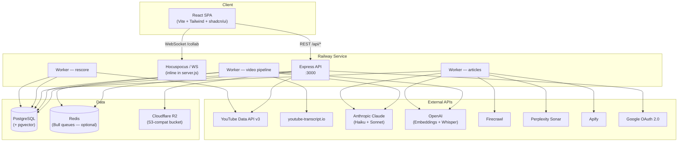
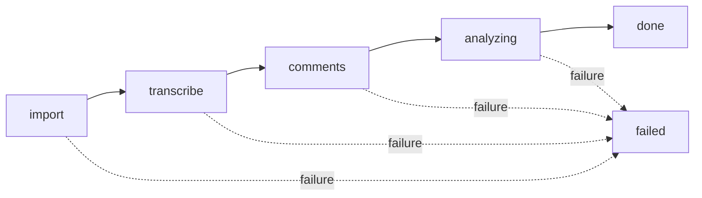
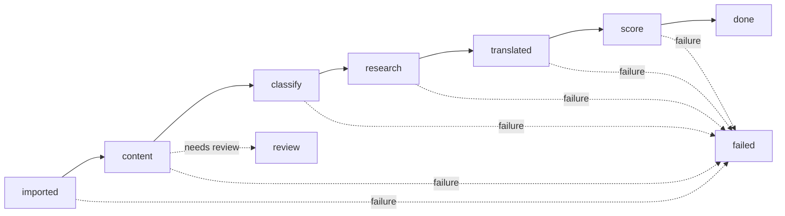
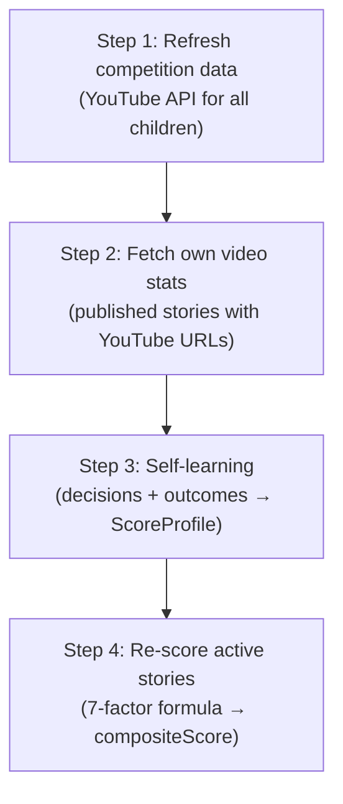

# Falak — Architecture Reference

Falak is a YouTube competitive-intelligence platform. It ingests YouTube channel
and video data, runs AI-powered analysis pipelines, surfaces story ideas, and
provides a rich editorial workspace — all deployed as a single Railway service.

---

## Table of Contents

1. [Plain-English Summary](#1--plain-english-summary)
2. [Component Diagram](#2--component-diagram)
3. [Service / Resource Table](#3--service--resource-table)
4. [Database Model Details](#4--database-model-details)
5. [API Endpoints](#5--api-endpoints)
6. [Pipeline & Worker Flows](#6--pipeline--worker-flows)
7. [Scoring System](#7--scoring-system)
8. [Frontend Structure](#8--frontend-structure)
9. [External API Integration Details](#9--external-api-integration-details)
10. [Authentication & Authorization Flow](#10--authentication--authorization-flow)
11. [Key Conventions & Code Patterns](#11--key-conventions--code-patterns)
12. [Known Gotchas & Operational Notes](#12--known-gotchas--operational-notes)
13. [Environment Structure](#13--environment-structure)
14. [What's Absent (by design)](#14--whats-absent-by-design)

---

## 1 — Plain-English Summary

### What Falak Does

Falak is a competitive-intelligence tool for Arabic YouTube teams. Users register
their own YouTube channels ("profiles"), add competitor channels, and Falak
automatically tracks performance, analyses content, and discovers story ideas.

From a user perspective the workflow is:

1. **Profile Setup** — pick or create a channel profile (Netflix-style picker).
2. **Competitor Tracking** — add competitor channels by handle. Falak fetches
   their videos, transcripts, and comments, then runs AI analysis.
3. **Analytics Dashboard** — view subscriber growth, engagement, content mix,
   publishing patterns, and head-to-head comparisons.
4. **Story Discovery** — the article pipeline ingests news from RSS and Apify
   sources, classifies them with AI, translates to Arabic, scores relevance, and
   promotes the best ones to a kanban-style "AI Intelligence" board.
5. **Editorial Workspace** — each story has a Tiptap collaborative editor with
   AI script generation, video upload, transcription (Whisper), title / description /
   tag generation, and an SRT subtitle builder.
6. **Publish Queue** — bulk video upload with an automated pipeline
   (transcribe → title → description → tags).
7. **Gallery** — per-channel media library for photos and videos stored in R2.
8. **Vector Intelligence** — pgvector-powered similarity search and a
   self-learning scoring profile that improves with every editorial decision.

### How Backend and Frontend Interact

The **frontend** is a React SPA (Vite + TypeScript + Tailwind + shadcn/ui). In
development, Vite dev-server on `:5173` proxies `/api` to Express on `:3000` and
`/collab` to the Hocuspocus WebSocket. In production, the SPA is built to
`frontend/dist` and served as static files by the same Express process — a single
Railway service handles everything.

All data flows through REST endpoints under `/api/*`. Auth uses an HTTP-only JWT
cookie set during Google OAuth login — the frontend sends `credentials: "include"`
with every `fetch` call. Real-time collaborative editing uses a Yjs CRDT via
WebSocket on the `/collab` path.

### How Background Jobs Fit In

Three worker loops start in-process inside `server.js` after boot:

- **Video pipeline worker** — processes videos through 4 stages (import →
  transcribe → comments → AI analysis). If Redis is available, it consumes a
  Bull queue; otherwise it polls the database every 10 seconds.
- **Article pipeline worker** — polls every 10 seconds for articles to process
  through 6 stages (content → classify → research → translate → score → promote).
  Also polls article sources every 5 minutes for new imports.
- **Rescore worker** — runs a cycle once per hour. Refreshes competition stats
  from YouTube, learns from editorial decisions and published-video outcomes, and
  re-scores all active stories.

### How Auth Works End to End

1. Frontend redirects to `GET /api/auth/google/url` → builds Google OAuth URL.
2. User signs in at Google → redirected to `GET /api/auth/google/callback`.
3. Backend exchanges the code for tokens, verifies the ID token, creates or
   updates the `User` record, creates a `Session`, signs a JWT (30-day expiry),
   and sets it as an `httpOnly`, `sameSite: lax` cookie named `token`.
4. Every subsequent request carries the cookie. `requireAuth` middleware verifies
   the JWT, loads the session and user, and attaches `req.user`.
5. Role-based access uses `requireRole('owner', 'admin', ...)` middleware.
6. `OWNER_EMAIL` env var auto-promotes the matching email to `role: 'owner'` on
   first login.

### How API Keys Are Managed

Third-party API keys live in the `ApiKey` table (one row per service) and
`YoutubeApiKey` table (multiple keys for quota rotation). All keys are encrypted
at rest with AES-256-GCM using `ENCRYPTION_KEY` from env. The settings page lets
admins save, delete, and toggle keys. YouTube keys are randomly selected from the
active pool on each API call, providing basic load distribution.

### Fallback Behaviors

- **Redis optional**: if `REDIS_URL` is not set, the video worker falls back to
  polling the database every 10 seconds. The article and rescore workers always
  poll regardless.
- **R2 optional**: if R2 env vars are missing, upload routes still accept
  requests but `getClient()` returns `null` and uploads fail gracefully.
- **AI key optional**: pipeline stages that need an API key (Anthropic, OpenAI,
  Firecrawl, Perplexity) skip non-fatal steps when the key is missing.
- **Transcript fallback**: youtube-transcript.io → empty string (pipeline marks
  the video as having no transcript and continues).

---

## 2 — Component Diagram



---

## 3 — Service / Resource Table

| Resource | Technology | Purpose | Key Files |
|---|---|---|---|
| **Web server** | Express 4 (Node 20) | REST API, serves frontend in prod | `src/server.js`, `src/config.js` |
| **Frontend** | React 18 + Vite + TypeScript + Tailwind + shadcn/ui | SPA with editorial workspace | `frontend/` |
| **Database** | PostgreSQL (via Prisma 5) + pgvector | Primary data store; 1536-dim vector embeddings | `prisma/schema.prisma`, `src/lib/db.js` |
| **Queue** | Redis + Bull 4 | Background job queue (optional — polling fallback) | `src/queue/pipeline.js`, `src/worker.js` |
| **Object storage** | Cloudflare R2 (S3-compat) | Media uploads, thumbnails, video files | `src/services/r2.js`, `src/routes/upload.js` |
| **Realtime** | Hocuspocus + Yjs | Tiptap collaborative editing | `src/server.js` (inline), `src/ws-server.js` |
| **Auth** | Google OAuth 2.0 + JWT | Login, session cookies (30-day expiry) | `src/routes/auth.js`, `src/middleware/auth.js` |
| **AI — analysis** | Anthropic Claude (Haiku + Sonnet) | Video analysis, classification, translation, scoring | `src/services/pipelineProcessor.js` |
| **AI — embeddings** | OpenAI text-embedding-3-small | Semantic similarity search | `src/services/embeddings.js` |
| **AI — transcription** | OpenAI Whisper | Audio → text for uploaded videos | `src/services/whisper.js` |
| **AI — research** | Perplexity Sonar | Background research for articles | `src/services/storyResearcher.js` |
| **Scraping** | Firecrawl | Article extraction, web search | `src/services/firecrawl.js` |
| **Scraping** | Apify | Per-source actor-based web crawling | `src/services/apify.js` |
| **YouTube data** | YouTube Data API v3 | Channel/video metadata, comments | `src/services/youtube.js` |
| **Transcripts** | youtube-transcript.io | YouTube subtitle fetching | `src/services/transcript.js` |
| **Media processing** | sharp + ffprobe + ffmpeg | Thumbnail generation, EXIF, video metadata | `src/services/media.js` |
| **Hosting** | Railway | Build, deploy, run (single service) | `railway.json` |

---

## 4 — Database Model Details

### YouTube Data

#### Channel

Represents a YouTube channel — either "ours" (a profile the team manages) or a
"competitor" linked to a parent profile. Top-level "ours" channels are the entry
point for the entire app; competitors are children attached via `parentChannelId`.

| Field | Type | Required | Default | Description |
|---|---|---|---|---|
| `id` | String | Yes | `cuid()` | Primary key |
| `parentChannelId` | String | No | — | Parent channel for competitors |
| `youtubeId` | String | Yes | — | YouTube channel ID (unique) |
| `handle` | String | Yes | — | YouTube `@handle` |
| `nameAr` | String | Yes | — | Arabic display name |
| `nameEn` | String | No | — | English display name |
| `type` | String | Yes | `"ours"` | `ours` or `competitor` |
| `avatarUrl` | String | No | — | YouTube avatar URL |
| `status` | String | Yes | `"active"` | `active` or `paused` |
| `subscribers` | BigInt | Yes | 0 | Subscriber count |
| `totalViews` | BigInt | Yes | 0 | Lifetime view count |
| `videoCount` | Int | Yes | 0 | Total video count |
| `uploadCadence` | Float | No | — | Average days between uploads |
| `lastFetchedAt` | DateTime | No | — | Last YouTube API fetch |
| `startHook` | String | No | — | Branded intro phrase for scripts |
| `endHook` | String | No | — | Branded outro phrase for scripts |
| `nationality` | String | No | — | Country code (selects AI dialect) |
| `color` | String | Yes | `"#3b82f6"` | Profile accent color |
| `lastStatsRefreshAt` | DateTime | No | — | Last rescore cycle timestamp |
| `rescoreIntervalHours` | Int | No | 24 | Hours between rescore cycles |
| `createdAt` | DateTime | Yes | `now()` | — |
| `updatedAt` | DateTime | Yes | auto | — |

**Relations:** Has many `Video`, `ChannelSnapshot`, `Story`, `ArticleSource`, `Alert`, `GalleryMedia`, `GalleryAlbum`. Has one `ScoreProfile`. Self-relation for competitors via `parentChannel` / `competitors`.
**Indexes:** `parentChannelId`. **Unique:** `youtubeId`.

#### ChannelSnapshot

A point-in-time capture of a channel's stats for historical trend tracking. Created
during rescore refresh cycles and manual channel refreshes.

| Field | Type | Required | Default | Description |
|---|---|---|---|---|
| `id` | String | Yes | `cuid()` | Primary key |
| `channelId` | String | Yes | — | FK → Channel |
| `subscribers` | BigInt | Yes | — | Subscribers at snapshot time |
| `totalViews` | BigInt | Yes | — | Total views at snapshot time |
| `videoCount` | Int | Yes | — | Video count at snapshot time |
| `avgViews` | Int | Yes | — | Average views per video |
| `engagement` | Float | Yes | — | Engagement rate `(likes+comments)/views×100` |
| `snapshotAt` | DateTime | Yes | `now()` | Timestamp |

**Relations:** Belongs to `Channel`. **Indexes:** `[channelId, snapshotAt]`.

#### Video

A YouTube video with fetched metadata, AI transcript, analysis results, and a
1536-dim vector embedding for similarity search.

| Field | Type | Required | Default | Description |
|---|---|---|---|---|
| `id` | String | Yes | `cuid()` | Primary key |
| `channelId` | String | Yes | — | FK → Channel |
| `youtubeId` | String | Yes | — | YouTube video ID (unique) |
| `titleAr` | String | No | — | Arabic title |
| `titleEn` | String | No | — | English title |
| `description` | Text | No | — | Video description |
| `publishedAt` | DateTime | No | — | YouTube publish date |
| `viewCount` | BigInt | Yes | 0 | View count |
| `likeCount` | BigInt | Yes | 0 | Like count |
| `commentCount` | BigInt | Yes | 0 | Comment count |
| `duration` | String | No | — | ISO 8601 duration (e.g. `PT15M30S`) |
| `videoType` | String | Yes | `"video"` | `video` or `short` |
| `thumbnailUrl` | String | No | — | YouTube thumbnail URL |
| `transcription` | Text | No | — | JSON segments or plain text transcript |
| `analysisResult` | Json | No | — | AI analysis (partA + partB + sentiment) |
| `omitFromAnalytics` | Boolean | Yes | false | Exclude from analytics |
| `embedding` | vector(1536) | No | — | pgvector embedding for similarity |
| `createdAt` | DateTime | Yes | `now()` | — |
| `updatedAt` | DateTime | Yes | auto | — |

**Relations:** Belongs to `Channel`. Has one `PipelineItem`. Has many `Comment`.
**Indexes:** `channelId`, `publishedAt`. **Unique:** `youtubeId`.

#### PipelineItem

State machine that tracks a video through the analysis pipeline. Each video gets
one PipelineItem when it enters the system.

| Field | Type | Required | Default | Description |
|---|---|---|---|---|
| `id` | String | Yes | `cuid()` | Primary key |
| `videoId` | String | Yes | — | FK → Video (unique — 1:1) |
| `stage` | String | Yes | `"import"` | Current pipeline stage |
| `status` | String | Yes | `"queued"` | `queued`, `running`, `done`, `failed` |
| `retries` | Int | Yes | 0 | Retry count |
| `error` | String | No | — | Last error message |
| `result` | Json | No | — | Stage output data |
| `lastStage` | String | No | — | Previous stage (for retry) |
| `startedAt` | DateTime | No | — | Processing start time |
| `finishedAt` | DateTime | No | — | Processing end time |
| `createdAt` | DateTime | Yes | `now()` | — |
| `updatedAt` | DateTime | Yes | auto | — |

**Stages:** `import` → `transcribe` → `comments` → `analyzing` → `done` (or `failed`).
**Indexes:** `[stage, status]`. **Unique:** `videoId`.

#### Comment

A YouTube comment fetched from the video, with AI-assigned sentiment.

| Field | Type | Required | Default | Description |
|---|---|---|---|---|
| `id` | String | Yes | `cuid()` | Primary key |
| `videoId` | String | Yes | — | FK → Video |
| `youtubeId` | String | Yes | — | YouTube comment ID (unique) |
| `text` | Text | Yes | — | Comment body |
| `authorName` | String | No | — | Commenter display name |
| `likeCount` | Int | Yes | 0 | Like count |
| `publishedAt` | DateTime | No | — | Comment date |
| `sentiment` | String | No | — | AI: `positive`, `negative`, `question`, `neutral` |
| `createdAt` | DateTime | Yes | `now()` | — |

**Relations:** Belongs to `Video`. **Indexes:** `videoId`. **Unique:** `youtubeId`.

### AI Pipeline & Stories

#### Story

An AI-generated or manually created story idea. Flows through stages from
`suggestion` → `liked` → `scripting` → `filmed` → `publish` → `done`. Can also
be `passed` or `omit` (negative decisions used for learning).

| Field | Type | Required | Default | Description |
|---|---|---|---|---|
| `id` | String | Yes | `cuid()` | Primary key |
| `channelId` | String | Yes | — | FK → Channel |
| `headline` | String | Yes | — | Story headline (Arabic) |
| `origin` | String | Yes | `"ai"` | `ai` or `manual` |
| `stage` | String | Yes | `"suggestion"` | Workflow stage |
| `coverageStatus` | String | No | — | Competition coverage info |
| `sourceUrl` | String | No | — | Original article URL |
| `sourceName` | String | No | — | Source publication name |
| `sourceDate` | DateTime | No | — | Article publish date |
| `relevanceScore` | Int | No | — | 0–100 relevance to channel |
| `viralScore` | Int | No | — | 0–100 viral potential |
| `firstMoverScore` | Int | No | — | 0–100 first-mover advantage |
| `compositeScore` | Float | No | — | Weighted composite (0–10) |
| `scriptLong` | Text | No | — | Full-length script |
| `scriptShort` | Text | No | — | Short-form script |
| `brief` | Json | No | — | Rich metadata (article, research, video, tags, etc.) |
| `embedding` | vector(1536) | No | — | pgvector embedding |
| `lastRescoredAt` | DateTime | No | — | Last rescore timestamp |
| `rescoreLog` | Json | No | — | Last 20 rescore entries |
| `queryVersion` | String | No | — | Search query version |
| `createdAt` | DateTime | Yes | `now()` | — |
| `updatedAt` | DateTime | Yes | auto | — |

**Relations:** Belongs to `Channel`. Has many `StoryLog`.
**Indexes:** `[channelId, stage]`.

#### StoryLog

Immutable audit log for every action taken on a story — stage changes, AI
operations, user notes.

| Field | Type | Required | Default | Description |
|---|---|---|---|---|
| `id` | String | Yes | `cuid()` | Primary key |
| `storyId` | String | Yes | — | FK → Story |
| `action` | String | Yes | — | Action name (e.g. `stage_change`, `auto_rescore`) |
| `note` | String | No | — | Human-readable detail |
| `userId` | String | No | — | FK → User (null for system actions) |
| `createdAt` | DateTime | Yes | `now()` | — |

**Relations:** Belongs to `Story`, `User`. **Indexes:** `storyId`.

### Articles

#### ArticleSource

Configuration for an external article source — RSS feed or Apify actor. Each
source belongs to a channel and has its own fetch schedule, keyword gates, and
optional per-source API key.

| Field | Type | Required | Default | Description |
|---|---|---|---|---|
| `id` | String | Yes | `cuid()` | Primary key |
| `channelId` | String | Yes | — | FK → Channel |
| `type` | String | Yes | — | `rss` or `apify_actor` |
| `label` | String | Yes | — | Display name |
| `config` | Json | Yes | — | Type-specific config (URL, actorId, keywords, etc.) |
| `image` | Text | No | — | Source icon (base64) |
| `apiKeyEncrypted` | Text | No | — | Per-source Apify API key (AES-256-GCM) |
| `lastImportedRunId` | String | No | — | Last Apify run imported |
| `isActive` | Boolean | Yes | true | Enable/disable fetching |
| `language` | String | Yes | `"en"` | Source language |
| `lastPolledAt` | DateTime | No | — | Last fetch time |
| `fetchLog` | Json | No | — | Last 30 fetch results (ring buffer) |
| `createdAt` | DateTime | Yes | `now()` | — |
| `updatedAt` | DateTime | Yes | auto | — |

**Relations:** Belongs to `Channel`. Has many `Article`, `ApifyRun`.
**Indexes:** `channelId`.

#### Article

An article fetched from a source, processed through the 6-stage pipeline
(imported → content → classify → research → translated → score → done).

| Field | Type | Required | Default | Description |
|---|---|---|---|---|
| `id` | String | Yes | `cuid()` | Primary key |
| `channelId` | String | Yes | — | Channel scope |
| `sourceId` | String | Yes | — | FK → ArticleSource |
| `url` | String | Yes | — | Article URL |
| `title` | String | No | — | Article title |
| `description` | Text | No | — | Article description |
| `content` | Text | No | — | Raw HTML content |
| `contentClean` | Text | No | — | Cleaned plain text |
| `contentAr` | Text | No | — | Arabic translation |
| `publishedAt` | DateTime | No | — | Article publish date |
| `language` | String | No | — | Detected language |
| `stage` | String | Yes | `"imported"` | Pipeline stage |
| `status` | String | Yes | `"queued"` | `queued`, `running`, `done`, `failed`, `review` |
| `retries` | Int | Yes | 0 | Retry count |
| `error` | String | No | — | Last error |
| `startedAt` | DateTime | No | — | Processing start |
| `finishedAt` | DateTime | No | — | Processing end |
| `processingLog` | Json | No | — | Per-stage processing details |
| `analysis` | Json | No | — | AI classification + research + scoring |
| `relevanceScore` | Float | No | — | Channel relevance (0–1) |
| `finalScore` | Float | No | — | Composite score (0–1) |
| `rankReason` | String | No | — | Why this score |
| `storyId` | String | No | — | Promoted story ID |
| `createdAt` | DateTime | Yes | `now()` | — |
| `updatedAt` | DateTime | Yes | auto | — |

**Stages:** `imported` → `content` → `classify` → `research` → `translated` → `score` → `done`.
**Unique:** `[channelId, url]`. **Indexes:** `[sourceId, stage]`, `[channelId, stage]`, `[stage, status]`.

#### ApifyRun

Tracks individual Apify actor runs to avoid re-importing the same dataset.

| Field | Type | Required | Default | Description |
|---|---|---|---|---|
| `id` | String | Yes | `cuid()` | Primary key |
| `sourceId` | String | Yes | — | FK → ArticleSource |
| `runId` | String | Yes | — | Apify run ID |
| `datasetId` | String | No | — | Apify dataset ID |
| `startedAt` | DateTime | No | — | Run start |
| `finishedAt` | DateTime | No | — | Run end |
| `itemCount` | Int | No | — | Items in dataset |
| `status` | String | Yes | — | `imported`, `skipped_empty`, `failed` |
| `importedAt` | DateTime | No | — | When imported into Falak |
| `createdAt` | DateTime | Yes | `now()` | — |

**Unique:** `[sourceId, runId]`. **Indexes:** `[sourceId, startedAt DESC]`.

### Auth & Users

#### User

A Google-authenticated user with role-based access control.

| Field | Type | Required | Default | Description |
|---|---|---|---|---|
| `id` | String | Yes | `cuid()` | Primary key |
| `email` | String | Yes | — | Google email (unique) |
| `name` | String | No | — | Display name |
| `avatarUrl` | String | No | — | Google avatar |
| `googleId` | String | No | — | Google sub ID (unique) |
| `role` | String | Yes | `"viewer"` | `owner`, `admin`, `editor`, `viewer` |
| `note` | String | No | — | Admin note |
| `isActive` | Boolean | Yes | true | Enable/disable access |
| `pageAccess` | Json | No | — | Page-level access control |
| `channelAccess` | Json | No | — | Channel-level access control |
| `createdAt` | DateTime | Yes | `now()` | — |
| `updatedAt` | DateTime | Yes | auto | — |

**Unique:** `email`, `googleId`.

#### Session

JWT session token with expiry. One user can have multiple active sessions.

| Field | Type | Required | Default | Description |
|---|---|---|---|---|
| `id` | String | Yes | `cuid()` | Primary key |
| `userId` | String | Yes | — | FK → User |
| `token` | String | Yes | — | JWT token value (unique) |
| `expiresAt` | DateTime | Yes | — | Session expiry (30 days) |
| `createdAt` | DateTime | Yes | `now()` | — |

**Indexes:** `token`.

### Media

#### GalleryAlbum

An album within a channel's media gallery.

| Field | Type | Required | Default | Description |
|---|---|---|---|---|
| `id` | String | Yes | `cuid()` | Primary key |
| `channelId` | String | Yes | — | FK → Channel |
| `name` | String | Yes | — | Album name |
| `description` | String | No | — | Album description |
| `coverMediaId` | String | No | — | FK → GalleryMedia (album cover) |
| `createdById` | String | Yes | — | FK → User |
| `createdAt` | DateTime | Yes | `now()` | — |
| `updatedAt` | DateTime | Yes | auto | — |

**Indexes:** `[channelId, createdAt DESC]`, `coverMediaId`.

#### GalleryMedia

A photo or video uploaded to R2 within a channel's gallery.

| Field | Type | Required | Default | Description |
|---|---|---|---|---|
| `id` | String | Yes | `cuid()` | Primary key |
| `channelId` | String | Yes | — | FK → Channel |
| `albumId` | String | No | — | FK → GalleryAlbum |
| `type` | Enum | Yes | — | `PHOTO` or `VIDEO` |
| `fileName` | String | Yes | — | Original file name |
| `fileSize` | BigInt | Yes | — | Size in bytes |
| `mimeType` | String | Yes | — | MIME type |
| `width` | Int | No | — | Pixel width |
| `height` | Int | No | — | Pixel height |
| `duration` | Float | No | — | Video duration in seconds |
| `r2Key` | String | Yes | — | R2 object key (unique) |
| `r2Url` | String | Yes | — | R2 public/signed URL |
| `thumbnailR2Key` | String | No | — | Thumbnail R2 key |
| `thumbnailR2Url` | String | No | — | Thumbnail URL |
| `metadata` | Json | No | — | EXIF/ffprobe metadata |
| `uploadedById` | String | Yes | — | FK → User |
| `createdAt` | DateTime | Yes | `now()` | — |
| `updatedAt` | DateTime | Yes | auto | — |

**Unique:** `r2Key`. **Indexes:** `[channelId, createdAt DESC]`, `[albumId, createdAt DESC]`, `uploadedById`.

### Scoring & Intelligence

#### ScoreProfile

Self-learning scoring profile per channel. Evolves with every editorial decision
and published video outcome.

| Field | Type | Required | Default | Description |
|---|---|---|---|---|
| `id` | String | Yes | `cuid()` | Primary key |
| `channelId` | String | Yes | — | FK → Channel (unique — 1:1) |
| `weightAdjustments` | Json | No | — | Custom weight overrides |
| `tagSignals` | Json | No | — | Per-tag preference signals (−1 to +1) |
| `contentTypeSignals` | Json | No | — | Per-content-type preference signals |
| `regionSignals` | Json | No | — | Per-region preference signals |
| `aiViralAccuracy` | Float | Yes | 1.0 | Calibrated AI viral prediction accuracy |
| `aiRelevanceAccuracy` | Float | Yes | 1.0 | Calibrated AI relevance accuracy |
| `channelAvgViews` | BigInt | Yes | 0 | Channel's average views |
| `channelMedianViews` | BigInt | Yes | 0 | Channel's median views |
| `totalOutcomes` | Int | Yes | 0 | Published stories with YouTube stats |
| `totalDecisions` | Int | Yes | 0 | Total liked/passed/omit decisions |
| `lastLearnedAt` | DateTime | No | — | Last learning cycle |
| `createdAt` | DateTime | Yes | `now()` | — |
| `updatedAt` | DateTime | Yes | auto | — |

**Unique:** `channelId`.

#### Alert

A notification record — score changes, competitor activity, new viral videos.

| Field | Type | Required | Default | Description |
|---|---|---|---|---|
| `id` | String | Yes | `cuid()` | Primary key |
| `channelId` | String | Yes | — | FK → Channel |
| `storyId` | String | No | — | Related story |
| `videoId` | String | No | — | Related video |
| `type` | String | Yes | — | `score_change`, `competitor_published`, etc. |
| `title` | String | Yes | — | Alert headline |
| `detail` | Json | No | — | Structured detail |
| `isRead` | Boolean | Yes | false | Read status |
| `createdAt` | DateTime | Yes | `now()` | — |

**Indexes:** `[channelId, isRead]`, `[channelId, createdAt DESC]`.

### Config

#### ApiKey

Encrypted third-party API key. One row per service (global, not per-channel).

| Field | Type | Required | Default | Description |
|---|---|---|---|---|
| `id` | String | Yes | `cuid()` | Primary key |
| `service` | String | Yes | — | Service name (unique): `anthropic`, `embedding`, `firecrawl`, `perplexity`, `yt-transcript` |
| `encryptedKey` | Text | Yes | — | AES-256-GCM encrypted key (`iv:tag:ciphertext`) |
| `isActive` | Boolean | Yes | true | Active flag |
| `lastUsedAt` | DateTime | No | — | Last API call |
| `usageCount` | Int | Yes | 0 | Total calls |
| `quotaLimit` | Int | No | — | Monthly quota limit |
| `quotaUsed` | Int | Yes | 0 | Monthly quota used |
| `quotaResetAt` | DateTime | No | — | Quota reset date |
| `createdAt` | DateTime | Yes | `now()` | — |
| `updatedAt` | DateTime | Yes | auto | — |

**Unique:** `service`.

#### YoutubeApiKey

Multiple YouTube Data API keys for quota rotation. Randomly selected on each call.

| Field | Type | Required | Default | Description |
|---|---|---|---|---|
| `id` | String | Yes | `cuid()` | Primary key |
| `label` | String | Yes | `"Key 1"` | Display label |
| `encryptedKey` | Text | Yes | — | AES-256-GCM encrypted key |
| `isActive` | Boolean | Yes | true | Active flag |
| `lastUsedAt` | DateTime | No | — | Last API call |
| `usageCount` | Int | Yes | 0 | Total calls |
| `sortOrder` | Int | Yes | 0 | Display order |
| `createdAt` | DateTime | Yes | `now()` | — |
| `updatedAt` | DateTime | Yes | auto | — |

**Indexes:** `isActive`.

#### ApiUsage

Fire-and-forget log of every external API call for the usage dashboard.

| Field | Type | Required | Default | Description |
|---|---|---|---|---|
| `id` | String | Yes | `cuid()` | Primary key |
| `channelId` | String | Yes | — | Channel scope |
| `service` | String | Yes | — | Service name |
| `action` | String | No | — | Specific API action |
| `tokensUsed` | Int | No | — | Token count (AI calls) |
| `status` | String | Yes | `"ok"` | `ok` or `fail` |
| `error` | Text | No | — | Error message (truncated to 500 chars) |
| `createdAt` | DateTime | Yes | `now()` | — |

**Indexes:** `[channelId, createdAt DESC]`, `service`.

#### Dialect

Arabic dialect prompt instructions per country and AI engine. Seeded at startup.

| Field | Type | Required | Default | Description |
|---|---|---|---|---|
| `id` | String | Yes | `cuid()` | Primary key |
| `countryCode` | String | Yes | — | ISO country code |
| `engine` | String | Yes | `"claude"` | AI engine (`claude`) |
| `name` | String | Yes | — | Dialect name |
| `short` | String | Yes | — | Short prompt instruction |
| `long` | String | Yes | — | Full prompt instruction |

**Unique:** `[countryCode, engine]`. **Indexes:** `engine`.

---

## 5 — API Endpoints

**88 total route handlers** across 18 route files.

### Auth — `/api/auth`

| Method | Path | Auth | Description |
|---|---|---|---|
| GET | `/api/auth/google/url` | No | Returns Google OAuth consent URL. `?returnTo=` for post-login redirect. |
| GET | `/api/auth/google/callback` | No | OAuth callback — exchanges code, creates user/session, sets JWT cookie, redirects. |
| POST | `/api/auth/logout` | No | Clears session and cookie. |
| GET | `/api/auth/me` | Yes | Returns current user profile `{ id, email, name, avatarUrl, role, pageAccess }`. |

### Profiles — `/api/profiles`

| Method | Path | Auth | Description |
|---|---|---|---|
| GET | `/api/profiles` | Yes | Lists all "ours" channels with story/competitor counts. |
| POST | `/api/profiles` | owner/admin | Creates a profile by YouTube handle. Promotes existing competitor if found. |
| PATCH | `/api/profiles/:id` | owner/admin | Updates profile display fields (nameAr, nameEn, color, status). |
| DELETE | `/api/profiles/:id` | owner | Deletes a profile (cascading). |
| GET | `/api/profiles/:id/usage` | owner/admin | Paginated API usage logs for a profile. |

### Channels — `/api/channels`

| Method | Path | Auth | Description | Side Effects |
|---|---|---|---|---|
| GET | `/api/channels` | Yes | List channels (cursor pagination). `?parentChannelId=&limit=&cursor=` | — |
| GET | `/api/channels/:id` | Yes | Single channel with stats and deltas from latest snapshot. | — |
| GET | `/api/channels/:id/videos` | Yes | Videos for a channel (offset pagination) with pipeline status. | — |
| GET | `/api/channels/:id/publish-not-done` | Yes | Count of manual stories not yet done. | — |
| POST | `/api/channels` | editor+ | Add channel by handle/URL. | YouTube API → creates Channel + Videos + PipelineItems, enqueues jobs |
| POST | `/api/channels/:id/refresh` | editor+ | Re-fetch channel metadata and create snapshot. | YouTube API → updates Channel, creates ChannelSnapshot |
| POST | `/api/channels/:id/fetch-videos` | editor+ | Pull latest videos from YouTube. | YouTube API → upserts Videos + PipelineItems, enqueues jobs |
| POST | `/api/channels/:id/analyze-all` | editor+ | Queue all videos for AI analysis. | Creates PipelineItems at "analyzing" stage |
| PATCH | `/api/channels/:id` | editor+ | Update channel fields (type, hooks, nationality). | — |
| DELETE | `/api/channels/all` | admin+ | Delete ALL channels. | Cascading deletes |
| DELETE | `/api/channels/:id` | admin+ | Delete one channel. | Cascading deletes |

### Videos — `/api/videos`

| Method | Path | Auth | Description | Side Effects |
|---|---|---|---|---|
| GET | `/api/videos/:id` | Yes | Video with analysis, comments (top 200), pipeline status. | — |
| POST | `/api/videos/:id/refetch-comments` | Yes (15/min) | Re-fetch top 100 comments from YouTube. | YouTube API → upserts Comments |
| POST | `/api/videos/:id/refetch-transcript` | Yes (15/min) | Re-fetch transcript. | Transcript API → updates Video.transcription |
| POST | `/api/videos/:id/omit-from-analytics` | Yes | Toggle omit flag. | — |
| GET | `/api/videos/:id/logs` | Yes | Pipeline stage log timeline. | — |

### Pipeline — `/api/pipeline`

| Method | Path | Auth | Description | Side Effects |
|---|---|---|---|---|
| GET | `/api/pipeline` | Yes | Full pipeline state — items by stage, counts, paused flag. | — |
| POST | `/api/pipeline/process` | editor+ | Process one item (enqueue Bull job or run in-process). | Runs pipeline stage |
| POST | `/api/pipeline/pause` | admin+ | Pause all channels. | Updates Channel.status |
| POST | `/api/pipeline/resume` | admin+ | Resume all channels. | Updates Channel.status |
| POST | `/api/pipeline/retry-all-failed` | editor+ (20/min) | Retry all failed items. | Resets PipelineItems, enqueues jobs |
| POST | `/api/pipeline/:id/retry` | editor+ (20/min) | Retry one failed item (max 9 retries). | Resets PipelineItem, enqueues job |

### Stories — `/api/stories`

| Method | Path | Auth | Description | Side Effects |
|---|---|---|---|---|
| GET | `/api/stories` | Yes | List stories by channel/stage, sorted by compositeScore. | — |
| GET | `/api/stories/summary` | Yes | Stage counts and first-mover stats. | — |
| GET | `/api/stories/:id` | Yes | Single story with full log history. | — |
| POST | `/api/stories` | editor+ | Create a story. | — |
| POST | `/api/stories/manual` | editor+ | Create manual story in "publish" stage. | — |
| PATCH | `/api/stories/:id` | editor+ | Update story (stage change triggers learning). | StoryLog, refreshPreferenceProfile, learnFromDecisions |
| DELETE | `/api/stories/:id` | admin+ | Delete a story. | — |
| POST | `/api/stories/:id/fetch-article` | editor+ | Scrape source URL content. | Firecrawl API → updates Story.brief |
| POST | `/api/stories/:id/cleanup` | editor+ | AI-clean scraped article. | Anthropic API |
| POST | `/api/stories/:id/generate-script` | editor+ | AI-generate script (SSE stream). | Anthropic API (streaming) |
| POST | `/api/stories/:id/fetch-subtitles` | editor+ | Fetch YouTube transcript as SRT. | Transcript API |
| POST | `/api/stories/:id/transcribe` | editor+ | Whisper transcription of uploaded video. | OpenAI Whisper → R2 download |
| POST | `/api/stories/:id/generate-title` | editor+ | AI-generate YouTube title. | Anthropic API |
| POST | `/api/stories/:id/generate-description` | editor+ | AI-generate YouTube description. | Anthropic API |
| POST | `/api/stories/:id/suggest-tags` | editor+ | AI-suggest YouTube SEO tags. | Anthropic API |
| POST | `/api/stories/:id/classify-video` | editor+ | Detect Short vs regular video. | YouTube API |
| POST | `/api/stories/:id/log` | editor+ | Add a log entry. | — |
| POST | `/api/stories/re-evaluate` | admin+ | Full rescore cycle for a channel. | YouTube API + scoring |
| POST | `/api/stories/recalculate-scores` | admin+ | Batch recalc compositeScore. | — |

### Article Sources — `/api/article-sources`

| Method | Path | Auth | Description |
|---|---|---|---|
| GET | `/api/article-sources` | Yes | List sources for a channel with stage counts and run history. |
| POST | `/api/article-sources` | editor+ | Create RSS or Apify actor source. |
| PATCH | `/api/article-sources/:id` | editor+ | Update source config. |
| DELETE | `/api/article-sources/:id` | admin+ | Delete a source. |
| POST | `/api/article-sources/:id/test` | editor+ | Dry-run fetch (no save). |
| POST | `/api/article-sources/:id/reimport-run` | editor+ | Re-import articles from an Apify run. |
| GET | `/api/article-sources/field-schema` | Yes | JSON schema for source config fields. |
| POST | `/api/article-sources/test-config` | editor+ | Dry-run fetch with arbitrary config. |

### Article Pipeline — `/api/article-pipeline`

| Method | Path | Auth | Description |
|---|---|---|---|
| GET | `/api/article-pipeline` | Yes | Kanban view — articles by stage or per-source workflow. |
| GET | `/api/article-pipeline/firecrawl-example` | Yes | Find one Firecrawl-scraped article. |
| GET | `/api/article-pipeline/:id/detail` | Yes | Full article detail with truncated content. |
| GET | `/api/article-pipeline/:sourceId/articles` | Yes | Articles for a specific source. |
| POST | `/api/article-pipeline/ingest` | editor+ | Trigger article ingestion. |
| POST | `/api/article-pipeline/pause` | admin+ | Pause article worker. |
| POST | `/api/article-pipeline/resume` | admin+ | Resume article worker. |
| POST | `/api/article-pipeline/:id/retry` | editor+ | Retry failed article. |
| POST | `/api/article-pipeline/:id/restart` | editor+ | Restart article from a stage. |
| POST | `/api/article-pipeline/restart-stage` | editor+ | Bulk restart all articles in a stage. |
| POST | `/api/article-pipeline/:id/skip` | editor+ | Skip review article to next stage. |
| POST | `/api/article-pipeline/:id/drop` | editor+ | Mark article as dropped. |
| PATCH | `/api/article-pipeline/:id/content` | editor+ | Paste content manually. |
| POST | `/api/article-pipeline/retry-all-failed` | editor+ | Retry all failed articles. |
| POST | `/api/article-pipeline/test-run` | admin+ | Process N articles end-to-end (returns runId for polling). |
| GET | `/api/article-pipeline/test-run/:runId` | Yes | Poll test run progress. |

### Upload — `/api/upload`

| Method | Path | Auth | Description |
|---|---|---|---|
| POST | `/api/upload/init` | editor+ | Initialize upload — returns presigned URL (direct) or multipart details. |
| POST | `/api/upload/resume` | editor+ | Get fresh presigned URLs for remaining multipart parts. |
| POST | `/api/upload/complete` | editor+ | Finalize upload — complete multipart, create gallery media or update story. |
| GET | `/api/upload/signed-url/:key(*)` | Yes | Temporary signed read URL (1 hour). |
| POST | `/api/upload/abort` | editor+ | Cancel in-progress multipart upload. |

### Gallery — `/api/gallery`

| Method | Path | Auth | Description |
|---|---|---|---|
| GET | `/api/gallery/:channelId` | Yes | List media (cursor or page pagination). |
| POST | `/api/gallery/:channelId` | editor+ | Create media record. |
| POST | `/api/gallery/:channelId/bulk-delete` | editor+ | Bulk delete media + R2 objects. |
| GET | `/api/gallery/:channelId/albums` | Yes | List albums with counts. |
| POST | `/api/gallery/:channelId/albums` | editor+ | Create album. |
| GET | `/api/gallery/:channelId/albums/:albumId` | Yes | Album detail with media. |
| PATCH | `/api/gallery/:channelId/albums/:albumId` | editor+ | Update album. |
| DELETE | `/api/gallery/:channelId/albums/:albumId` | editor+ | Delete album (media unassigned). |
| POST | `/api/gallery/:channelId/albums/:albumId/add` | editor+ | Add media to album. |
| POST | `/api/gallery/:channelId/albums/:albumId/remove` | editor+ | Remove media from album. |
| GET | `/api/gallery/:channelId/:mediaId` | Yes | Single media with signed URLs. |
| PATCH | `/api/gallery/:channelId/:mediaId` | editor+ | Rename or move media. |
| GET | `/api/gallery/:channelId/:mediaId/download` | Yes | Signed download URL. |
| DELETE | `/api/gallery/:channelId/:mediaId` | editor+ | Delete media + R2 objects. |

### Settings — `/api/settings`

| Method | Path | Auth | Description |
|---|---|---|---|
| GET | `/api/settings` | admin+ | List all API key metadata (no raw keys) + YouTube keys. |
| POST | `/api/settings/keys` | admin+ | Save/update encrypted API key. |
| DELETE | `/api/settings/keys/:service` | admin+ | Clear an API key. |
| GET | `/api/settings/youtube-keys` | admin+ | List YouTube API keys. |
| POST | `/api/settings/youtube-keys` | admin+ | Add YouTube API key. |
| DELETE | `/api/settings/youtube-keys/:id` | admin+ | Delete YouTube API key. |
| PATCH | `/api/settings/youtube-keys/:id` | admin+ | Toggle/rename YouTube key. |
| POST | `/api/settings/embedding-key` | admin+ | Save OpenAI embedding key. |
| DELETE | `/api/settings/embedding-key` | admin+ | Clear embedding key. |
| GET | `/api/settings/embedding-status` | admin+ | Embedding key status + score profile info. |

### Other

| Method | Path | Auth | Description |
|---|---|---|---|
| GET | `/api/analytics` | Yes | Full analytics payload (cached 5 min). `?channelId=&period=30d\|90d\|12m` |
| POST | `/api/analytics/flush-cache` | Yes | Clear analytics cache. |
| GET | `/api/dialects` | Yes | List dialects for an engine. |
| GET | `/api/dialects/:countryCode` | Yes | Dialect for a country. |
| GET | `/api/brain` | Yes | Competitive intelligence view (gap analysis, auto-search query). |
| POST | `/api/brain/re-extract` | Yes | Refresh count. |
| GET | `/api/monitor` | Yes | Channel monitoring data. |
| GET | `/api/admin/users` | admin+ | List users. |
| POST | `/api/admin/users` | admin+ | Pre-provision a user. |
| PATCH | `/api/admin/users/:id` | admin+ | Update user role/access. |
| DELETE | `/api/admin/users/:id` | admin+ | Delete user. |
| POST | `/api/admin/retranscribe-all` | admin+ | Re-queue legacy transcripts. |
| GET | `/api/alerts` | Yes | List alerts for channel. |
| POST | `/api/alerts/mark-read` | Yes | Mark alerts as read. |
| GET | `/api/vector-intelligence/status` | Yes | Vector intelligence dashboard data. |
| GET | `/api/public/thumbnails` | No | Up to 60 channel thumbnails (login page background). |
| GET | `/health` | No | Health check (DB + optional Redis ping). |

---

## 6 — Pipeline & Worker Flows

### Video Pipeline Worker (`src/worker.js`)



**Execution mode:** Bull queue (Redis) or polling fallback (10s interval).

| Stage | What Happens | External API | DB Writes |
|---|---|---|---|
| **import** | Fetches video metadata from YouTube (title, stats, duration, thumbnail). Detects Short vs regular. | YouTube Data API v3 | Updates `Video` fields |
| **transcribe** | Fetches transcript segments from youtube-transcript.io. Stores as JSON array. | youtube-transcript.io | Updates `Video.transcription` |
| **comments** | Fetches top 100 comments sorted by relevance. | YouTube Data API v3 | Upserts `Comment` records |
| **analyzing** | 4 AI calls: (A) Classification via Haiku, (B) Insights via Sonnet, (C) Comment sentiment via Haiku, (D) Hook strength via Haiku. Computes 4-signal weighted sentiment score. Generates embedding. | Anthropic Claude (×4), OpenAI Embeddings | Updates `Video.analysisResult`, `Comment.sentiment`, `Video.embedding` |

**Concurrency:**
- import/transcribe/comments: 3 items in parallel
- analyzing: 1 at a time with 5s gap between items (rate limit protection)

**Retry logic:** Max 3 retries per item. On failure, retries from the same stage.
After 3 retries → `stage: 'failed'`, `status: 'failed'`.

**Stuck item rescue:** Items stuck as `running` for >10 minutes are automatically
reset to `queued`.

**Bull vs Polling:**
- **Bull mode**: `processJob` handles one item at a time, then chains the next
  stage via `addJob()`. The queue manages concurrency.
- **Polling mode**: `tick()` runs every 10s — picks items for each stage and
  processes them. Import/transcribe/comments run in parallel; analyzing runs serially.

### Article Pipeline Worker (`src/worker-articles.js`)



**Execution mode:** Polling only (10s interval). No Bull queue support.

| Stage | What Happens | External API | DB Writes |
|---|---|---|---|
| **imported** | Logs initial state. | — | — |
| **content** | Extracts content: raw HTML → Firecrawl scrape → HTTP fetch → title+desc fallback. Min 300 chars or goes to review. | Firecrawl | `Article.contentClean` |
| **classify** | AI classification (Haiku): topic, tags, contentType, region, summary, uniqueAngle. Works in original language. Retries once if language mismatch. | Anthropic Haiku | `Article.analysis`, `Article.language` |
| **research** | Multi-source research: Firecrawl search (5 related articles) → Perplexity context → Claude synthesis into structured brief. Non-fatal on failure. | Firecrawl, Perplexity, Anthropic Sonnet | `Article.analysis.research` |
| **translated** | Translates content + fields + research brief to Arabic via Haiku. Skips if source is already Arabic (copies fields). | Anthropic Haiku (×3 calls) | `Article.contentAr`, `Article.analysis.*Ar` |
| **score** | Generates embedding → similarity search → AI scoring (Haiku) → final score formula → promotes to Story. | OpenAI Embeddings, Anthropic Haiku | `Article.finalScore`, creates `Story` + `Story.embedding` |

**Concurrency:** 5 items for non-AI stages, 1 for AI stages (3s gap).

**Source polling:** Every 5 minutes, checks all active sources for new Apify runs
and RSS items. Auto-imports new articles.

**Pause/Resume:** Exposed via API endpoints. When paused, `tick()` returns immediately.

### Rescore Worker (`src/worker-rescore.js`)

Runs every **1 hour** (`CHECK_INTERVAL_MS`). For each "ours" root channel where
the rescore interval has elapsed:



| Step | What Happens | External API | DB Writes |
|---|---|---|---|
| **Refresh competition** | Fetches channel stats + recent 50 videos for each child channel. 2s delay between channels. | YouTube Data API v3 | `Channel.*`, `ChannelSnapshot`, `Video` upserts |
| **Own video stats** | Fetches YouTube stats for published stories' videos. | YouTube Data API v3 | `Story.brief.views/likes/comments` |
| **Self-learning** | Builds tag/type/region signals from editorial decisions. Calibrates AI accuracy from published outcomes. | — | `ScoreProfile.*` |
| **Re-score stories** | Computes 7-factor composite score for all stories in active stages. Creates alerts for significant changes. | — | `Story.compositeScore`, `StoryLog`, `Alert` |

---

## 7 — Scoring System

### What Gets Scored

1. **Videos** — 4-signal weighted sentiment score during the "analyzing" pipeline stage.
2. **Articles** — `finalScore` (0–1) computed during the "score" pipeline stage before promotion to Story.
3. **Stories** — `compositeScore` (0–10) set on creation and periodically updated by the rescore worker.

### Video Sentiment Score (Pipeline)

Computed in `doStageAnalyzing` after all AI calls complete:

```
Signal 1 (weight 0.4): Comment positivity ratio
  >60% positive → 1.0, 40-60% → 0.6, <40% → 0.2
  ("positive" and "question" both count as positive)

Signal 2 (weight 0.3): Like-to-view ratio
  >3% → 1.0, 1.5-3% → 0.6, <1.5% → 0.2

Signal 3 (weight 0.2): Content format engagement potential
  story/investigation/mystery/crime/history/thriller → 0.8, else → 0.5

Signal 4 (weight 0.1): Hook strength (Claude Haiku)
  "strong" → 1.0, "weak" → 0.3, else → 0.5

Final = S1×0.4 + S2×0.3 + S3×0.2 + S4×0.1
Verdict: >0.6 = "positive", 0.4-0.6 = "neutral", <0.4 = "negative"
```

### Article Final Score (Pipeline)

Computed in `doStageScore`:

```
freshness = exp(-daysSincePublished / 7 × ln2)    # half-life: 7 days
preferenceBias = calculatePreferenceBias(analysis, profile)  # range -0.5 to +0.5
competitionPenalty = 0.05 if topSimilarity ≥ 0.7, 0.02 if ≥ 0.5, else 0

rawScore = relevance × 0.35 + viralPotential × 0.30 + freshness × 0.35
finalScore = clamp(rawScore × 0.60 + preferenceBias × 0.40 - competitionPenalty, 0, 1)
```

**Preference bias** (from `articleFeedback.js`):
- +0.4 × liked tag overlap ratio
- −0.3 × omit tag overlap ratio
- +0.15 for preferred contentType match
- −0.1 for avoided contentType match
- +0.15 for preferred region match

### Story Composite Score (on creation)

```
compositeScore = round((relevanceScore×0.35 + viralScore×0.40 + firstMoverScore×0.25) / 10, 1)
```

Where `firstMoverScore` = 80 if breaking (published <48h ago), else 40.

### Rescore Formula (periodic re-evaluation)

The rescore worker computes a 7-factor composite for each active story:

```
1. Freshness = exp(-daysSince / 7 × ln2)

2. Proven Viral Boost = clamp((avgCompetitorViewRatio - 1) × 15, -15, 30)

3. Own Channel Boost = clamp((avgOwnViewRatio - 1) × 10, -10, 15)

4. Tag/ContentType/Region Boosts from ScoreProfile (each clamped -0.3 to +0.3)

5. AI Viral Correction = viralScore × aiViralAccuracy

6. First Mover Adjustment:
   Penalty: -20 per new competitor video (max -60)
   Time decay after 7 days: × max(0.3, 1 - (daysSince-7)/30)

7. Base Score = relevance×0.25 + correctedViral×0.25 + adjustedFirstMover×0.15 + freshness×100×0.10
   Learned Boost = provenViralBoost×0.10 + ownBoost×0.05 + tagBoost×100×0.05 + ctBoost×100×0.03 + regionBoost×100×0.02
   Final = clamp(baseScore + learnedBoost × confidence, 0, 100)
```

### ScoreProfile Self-Learning

**From decisions** (liked/passed/omit):

```
signal = (positiveCount / totalCount - 0.5) × 2    # range [-1, +1]
blended = existing × 0.9 + fresh × 0.1             # learning rate 0.1
```

Requires ≥5 decisions to start learning.

**From outcomes** (published video YouTube stats):

```
aiViralAccuracy = prev × 0.9 + observedAccuracy × 0.1
tagSignal = clamp((avgViewRatio - 1) × 0.3, -0.5, 0.5)
merged = existingDecisionSignal × 0.4 + outcomeSignal × 0.6   # outcomes weighted more
```

Requires ≥3 outcomes.

**Confidence levels:**
- `< 5 decisions` → 0.0
- `5–14` → 0.3
- `15–29` → 0.6
- `30+` → 0.9 (never 1.0 — always trusts AI at least 10%)

---

## 8 — Frontend Structure

### Tech Stack

- **React 18** with `@vitejs/plugin-react-swc`
- **TypeScript** (strict)
- **Tailwind CSS** with `tailwindcss-animate` + `@tailwindcss/typography`
- **shadcn/ui** (Radix primitives, 48 components in `components/ui/`)
- **TanStack Query** for gallery data fetching/caching
- **Yjs + y-websocket** for collaborative editing
- **Tiptap** for the rich text editor
- **Sonner** for toast notifications
- **Lucide** for icons

### Routes

| Route | Page | Description |
|---|---|---|
| `/login` | Login | Google OAuth sign-in with thumbnail background |
| `/` | ProfilePicker | Netflix-style channel profile selector |
| `/c/:channelId` | ProfileHome | Channel dashboard (stats, growth, recent videos) |
| `/c/:channelId/competitors` | Competitions | Competitor channel management |
| `/c/:channelId/channel/:id` | ChannelDetail | Single channel with video table |
| `/c/:channelId/video/:id` | VideoDetail | Video analysis (6 tabs: Overview, Sentiment, Viral, Comments, Pipeline, History) |
| `/c/:channelId/pipeline` | Pipeline | Two tabs: Pipeline (video processing), Monitor (channel sync) |
| `/c/:channelId/analytics` | Analytics | Full competitive analytics (~2000 lines) |
| `/c/:channelId/stories` | Stories | AI Intelligence story list with stage filters |
| `/c/:channelId/story/:id` | StoryDetail | Story editor with AI tools (~1560 lines) |
| `/c/:channelId/publish` | PublishQueue | Bulk video upload + processing |
| `/c/:channelId/article-pipeline` | ArticlePipeline | 3 tabs: Pipeline, Sources, Intelligence |
| `/c/:channelId/article/:id` | ArticleDetail | Article inspector with 8-stage timeline |
| `/c/:channelId/gallery` | Gallery | Media gallery with albums |
| `/c/:channelId/gallery/album/:albumId` | AlbumDetail | Album detail view |
| `/c/:channelId/settings` | Settings | API keys + usage dashboard |
| `/c/:channelId/admin` | Admin | User access control |

### State Management

- **TanStack Query:** Gallery hooks (`useGalleryMedia`, `useGalleryAlbums`, `useGalleryActions`).
- **Local `useState`:** All other pages fetch in `useEffect` and store in local state.
- **`useSyncExternalStore`:** Upload queue system — `storyQueue` and `galleryQueue` are module-level singletons.
- **No Redux, Zustand, or global context** beyond what shadcn/ui provides.

### API Call Pattern

Native `fetch` with `credentials: "include"` (cookie auth). No axios. Gallery
has a typed `request<T>()` helper in `gallery-api.ts`.

### Upload System

`uploadEngine.ts` implements a low-level multipart uploader: sliding-window
concurrency, resumable uploads via localStorage, adaptive chunk sizes. Two queue
instances: `storyQueue` (1 concurrent file) and `galleryQueue` (3 concurrent files).

### Navigation

Collapsible sidebar (`AppSidebar.tsx`) with hover-expand and pin. Mobile: hamburger
drawer. Layout: `ChannelLayout` (validates channel) → `AppLayout` (sidebar + auth
guard) → Page.

---

## 9 — External API Integration Details

### Anthropic Claude

| Item | Detail |
|---|---|
| **Service file** | `src/services/pipelineProcessor.js` (`callAnthropic`, `callAnthropicStream`) |
| **Models** | `claude-haiku-4-5-20251001` (classification, sentiment, translation, scoring), `claude-sonnet-4-6` (insights, research synthesis) |
| **Endpoint** | `POST https://api.anthropic.com/v1/messages` |
| **Key storage** | `ApiKey` table, `service: 'anthropic'`, AES-256-GCM encrypted |
| **Rate limit handling** | Up to 3 retries on 429 with delays `[10s, 30s, 60s]`. Honours `Retry-After` header (capped 120s). 2s inter-call delay within one video. |
| **Timeout** | 120s per call |
| **Fallback** | Key missing → stage skipped or returns 400 |
| **Used by** | Video analysis (4 calls), article classification, article translation (3 calls), article scoring, script generation (streaming), title/description/tag generation, article cleanup, research synthesis |

### OpenAI Embeddings

| Item | Detail |
|---|---|
| **Service file** | `src/services/embeddings.js` |
| **Model** | `text-embedding-3-small` (1536 dimensions) |
| **Endpoint** | `POST https://api.openai.com/v1/embeddings` |
| **Key storage** | `ApiKey` table, `service: 'embedding'`, AES-256-GCM encrypted |
| **Fallback** | Key missing → embedding generation skipped (non-fatal) |
| **Used by** | Video analysis (post-analysis), article scoring (similarity search), story promotion |

### OpenAI Whisper

| Item | Detail |
|---|---|
| **Service file** | `src/services/whisper.js` |
| **Model** | `whisper-1` |
| **Endpoint** | `POST https://api.openai.com/v1/audio/transcriptions` |
| **Key storage** | `ApiKey` table, `service: 'openai'` or `'embedding'` (first match) |
| **Large files** | Files >24MB are split into proportional audio chunks, timestamps offset |
| **Timeout** | 5-minute ffmpeg timeout, 2-minute per-chunk upload timeout |
| **Used by** | Story transcription (manual upload workflow) |

### YouTube Data API v3

| Item | Detail |
|---|---|
| **Service file** | `src/services/youtube.js` |
| **Endpoints** | `GET /channels`, `GET /videos`, `GET /playlistItems`, `GET /commentThreads` |
| **Key storage** | `YoutubeApiKey` table (multiple keys), randomly selected per call |
| **Rate limit handling** | No retry. Random key selection provides basic load distribution. |
| **Shorts detection** | `HEAD https://www.youtube.com/shorts/{id}` — 200 = short, redirect = regular. Falls back to duration ≤180s. |
| **Fallback** | Comments disabled → returns `[]`. Shorts check fails → duration heuristic. |
| **Used by** | Channel add/refresh, video fetch, comment fetch, rescore stats refresh |

### youtube-transcript.io

| Item | Detail |
|---|---|
| **Service file** | `src/services/transcript.js` |
| **Endpoint** | `POST https://www.youtube-transcript.io/api/transcripts` |
| **Key storage** | `ApiKey` table, `service: 'yt-transcript'` |
| **Rate limit handling** | Up to 4 retries with exponential backoff (2s × 2^attempt). Honours `Retry-After` for 429. |
| **Caching** | In-memory cache (2-hour TTL) |
| **Fallback** | No transcript → returns `''` (empty string) |

### Firecrawl

| Item | Detail |
|---|---|
| **Service file** | `src/services/firecrawl.js` |
| **Endpoints** | `POST /v2/scrape` (30s timeout), `POST /v1/search` (60s timeout) |
| **Key storage** | `ApiKey` table, `service: 'firecrawl'` |
| **Rate limit handling** | Scrape: 1 retry with 2s delay on 429/503/timeout. Search: no retries. |
| **Content limit** | 120K chars (truncated) |
| **Fallback** | Returns `{error: '...'}` (never throws) |
| **Used by** | Article content extraction, article research (web search) |

### Perplexity Sonar

| Item | Detail |
|---|---|
| **Service file** | `src/services/perplexity.js`, `src/services/storyResearcher.js` |
| **Model** | `sonar` |
| **Endpoint** | `POST https://api.perplexity.ai/chat/completions` |
| **Key storage** | `ApiKey` table, `service: 'perplexity'` |
| **Timeout** | 60s |
| **Fallback** | Failure is non-fatal in research pipeline |
| **Used by** | Article research (background context) |

### Apify

| Item | Detail |
|---|---|
| **Service file** | `src/services/apify.js` |
| **Endpoints** | `GET /v2/acts/{id}/runs/...`, `GET /v2/datasets/{id}/items` |
| **Key storage** | Per-source: `ArticleSource.apiKeyEncrypted`, AES-256-GCM encrypted |
| **Pagination** | 1000 items per page, auto-paginated |
| **Fallback** | `listSuccessfulRuns` returns `[]` on failure |
| **Used by** | Article source ingestion |

---

## 10 — Authentication & Authorization Flow

### Google OAuth 2.0 Login Flow

1. Frontend calls `GET /api/auth/google/url?returnTo=/path`
2. Backend builds Google OAuth consent URL with scopes `openid profile email`
3. Frontend redirects user to Google
4. Google redirects to `GET /api/auth/google/callback?code=...&state=...`
5. Backend exchanges code for tokens at `https://oauth2.googleapis.com/token`
6. Backend verifies ID token via `google-auth-library`
7. Backend creates/updates `User` record (email, name, avatar, googleId)
8. Backend creates `Session` record (token = JWT, expiresAt = 30 days)
9. Backend signs JWT with `config.JWT_SECRET` containing `{ userId }`, 30-day expiry
10. Backend sets `token` cookie: `httpOnly: true`, `sameSite: 'lax'`, `secure` in production, `maxAge: 30 days`
11. Backend redirects to `state` (returnTo) path or `/`

### Auth Middleware (`requireAuth`)

1. Extracts token from `req.cookies.token` or `Authorization: Bearer` header
2. No token → 401 "Not authenticated"
3. Verifies JWT with `config.JWT_SECRET`
4. Looks up `Session` by token (includes `User`)
5. Session not found or expired → 401 "Session expired"
6. User not active (`isActive: false`) → 403 "Account disabled"
7. Sets `req.user = session.user`, calls `next()`

### Role System

| Role | Permissions |
|---|---|
| `owner` | Full access. Can delete profiles, manage users. Auto-assigned via `OWNER_EMAIL`. |
| `admin` | Almost full access. Can manage users, settings, pause/resume workers. Cannot delete profiles. |
| `editor` | Can create/edit channels, stories, articles, gallery. Cannot manage users or settings. |
| `viewer` | Read-only access to all data. Can read alerts. |

`requireRole(...roles)` middleware checks `req.user.role`. Returns 403 if not in
the allowed list.

### OWNER_EMAIL Auto-Admin

On first login, if the user's email matches `OWNER_EMAIL` env var, their role is
automatically set to `owner`. This bootstraps the first admin without manual
database intervention.

### Session Management

Sessions are stored in the `Session` table. Each login creates a new session.
Logout deletes the session and clears the cookie. Sessions expire after 30 days.
The frontend auto-checks auth via `useCurrentUser` (refreshes on tab focus and
every 10 minutes).

---

## 11 — Key Conventions & Code Patterns

### Error Handling

Central error middleware in `src/middleware/errors.js`. Error response format:

```json
{ "error": { "code": "NOT_FOUND", "message": "Record not found", "details": {} } }
```

Error factory functions: `NotFound(msg)` → 404, `ValidationError(msg, details)` → 400,
`Unauthorized(msg)` → 401, `Forbidden(msg)` → 403.

Prisma `P2025` errors auto-map to 404. `asyncWrap(fn)` catches rejected promises
in Express 4 route handlers.

### Zod Validation

Two helpers in `src/lib/validate.js`:
- `parseBody(body, schema)` — validates request body
- `parseQuery(query, schema)` — validates query parameters

On failure, throws `ValidationError` with `result.error.flatten().fieldErrors`.
Used in route handlers at the top of each endpoint.

### Pino Logging

- Level: `info` in production, `debug` in development
- Structured JSON output
- HTTP request logging via `pino-http` middleware
- Request correlation via `X-Request-Id` header
- 500+ errors logged with request context (requestId, method, path)

### AES-256-GCM Encryption

`src/services/crypto.js` encrypts/decrypts API keys:

```
encrypt(text) → "iv:authTag:ciphertext" (hex-encoded)
decrypt(payload) → plaintext
```

Key: first 32 bytes of `ENCRYPTION_KEY` env var. Falls back to a hardcoded
placeholder in development (`'fallback_key_replace_in_production!'`).

### Route Handler Pattern

```javascript
router.post('/:id/action',
  requireRole('owner', 'admin', 'editor'),
  asyncWrap(async (req, res) => {
    const { id } = req.params
    const data = parseBody(req.body, schema)
    // ... business logic ...
    res.json({ ok: true, result })
  })
)
```

### Utility Libraries

| File | Purpose |
|---|---|
| `src/lib/db.js` | Prisma client. Connection pooling (limit=10, timeout=30). BigInt serialization middleware. |
| `src/lib/cache.js` | In-memory TTL cache factory. Pre-built: `analyticsCache` (5 min), `transcriptCache` (2 hr). |
| `src/lib/validate.js` | Zod `parseBody` / `parseQuery` helpers. |
| `src/lib/dialects.js` | Looks up Arabic dialect by country code for AI prompts. |
| `src/lib/logger.js` | Pino logger instance. |
| `src/lib/serialise.js` | BigInt → string serializer (applied globally via Prisma middleware). |
| `src/lib/subtitles.js` | Timestamped script text → SRT subtitle converter. |

### Frontend Conventions

- `cn()` from `src/lib/utils.ts` for className composition (clsx + tailwind-merge)
- shadcn/ui primitives — no alternative component libraries
- Lucide icons
- Sonner for toasts (top-center)
- `@` alias → `frontend/src/`
- Dark mode class-based, fonts: Inter (sans), JetBrains Mono (mono)
- All dates displayed in Asia/Riyadh timezone (GMT+3)

---

## 12 — Known Gotchas & Operational Notes

### Redis is Optional

When `REDIS_URL` is absent:
- Video pipeline worker falls back to polling (10s interval) — slightly slower
  but functionally identical. Bull queue features (priority, delay, rate limiting)
  are unavailable.
- Article and rescore workers always use polling regardless of Redis.
- `GET /health` skips the Redis ping.

### YouTube API Key Rotation

Multiple YouTube API keys are stored in `YoutubeApiKey` table. On each API call,
one active key is selected **randomly**. This provides basic quota distribution
but not deterministic round-robin. If a key's quota is exhausted, YouTube returns
a 403 and the request fails (no automatic key rotation on failure).

### pgvector

Used for 1536-dim embeddings on `Video` and `Story` tables. Queries use the
`<=>` cosine distance operator via raw SQL:

```sql
SELECT *, 1 - (embedding <=> $1::vector) AS similarity
FROM "Video"
WHERE embedding IS NOT NULL AND "channelId" IN (...)
ORDER BY embedding <=> $1::vector
LIMIT 10
```

The pgvector extension must be enabled on the PostgreSQL instance. Railway's
managed PostgreSQL includes it by default.

### Sharp + ffprobe

- `sharp` generates 480px-wide JPEG thumbnails (75% quality, progressive).
- `@ffprobe-installer/ffprobe` extracts video metadata (codec, fps, duration).
- `ffmpeg-static` extracts video frames for thumbnails and splits audio for Whisper.
- These native binaries work on Railway's Linux build environment. No additional
  system dependencies needed.

### Railway-Specific Behaviors

- **Build:** `npm install && npm run build` (`prisma generate` + frontend Vite build)
- **Start:** `prisma migrate deploy && node src/server.js` (auto-migrates on deploy)
- **Restart:** ON_FAILURE, max 3 retries
- **Keep-alive:** `keepAliveTimeout = 65s`, `headersTimeout = 66s` (tuned for Railway's proxy)
- **Trust proxy:** Enabled (`trust proxy: 1`) for correct IP/protocol detection
- **Ephemeral disk:** 5 GB limit. Large file processing streams to R2, not local disk.
  Whisper temp files are cleaned up in `finally` blocks.

### Hardcoded Limits & Magic Numbers

| Value | Location | Purpose |
|---|---|---|
| 10s | worker.js | Polling interval (`POLL_MS`) |
| 5 min | worker-articles.js | Source polling interval (`SOURCE_POLL_MS`) |
| 1 hour | worker-rescore.js | Rescore check interval |
| 3 | All workers | Max retries before failure |
| 10 min | All workers | Stuck item timeout |
| 100 | youtube.js | Max comments per fetch |
| 50 | youtube.js | Max recent videos per channel |
| 50,000 chars | pipelineProcessor.js | Transcript truncation for AI |
| 8,000 chars | pipelineProcessor.js | Comment text truncation for AI |
| 120,000 chars | firecrawl.js, articleFetcher.js | Max scraped content length |
| 24 MB | whisper.js | Max Whisper file size (safety margin) |
| 5 min | cache.js | Analytics cache TTL |
| 2 hours | cache.js | Transcript cache TTL |
| 500 req/min | server.js | API rate limit |
| 30 req/15min | server.js | Auth rate limit |
| 300 chars | articleProcessor.js | Min content length for "classify" |
| 30 days | auth.js | JWT/session expiry |
| 7 days | scoring | Freshness half-life |
| 48 hours | scoring | "Breaking" story threshold |

### Intentionally Absent

| What | Why |
|---|---|
| **Docker** | Railway builds from source; no container needed. |
| **CI/CD** | Railway auto-deploys from `main` branch push. |
| **IaC** | Single Railway service; `railway.json` + dashboard is sufficient. |
| **Staging env** | Team uses local dev with `.env`. No cloud staging. |
| **Monorepo tooling** | Single app with `frontend/` subfolder; no need for Turborepo/Nx. |
| **Type-checking on backend** | Backend is CommonJS JavaScript (no TypeScript). |
| **Global state management** | Pages are self-contained; TanStack Query handles gallery caching. |

---

## 13 — Environment Structure

There is **one environment** — production on Railway. Local development uses
`.env` (copied from `.env.example`) with a local PostgreSQL database.

### Required Environment Variables

| Variable | Purpose |
|---|---|
| `DATABASE_URL` | PostgreSQL connection string |
| `JWT_SECRET` | HMAC secret for JWT signing |
| `APP_URL` | Public app URL (CORS origin, OAuth redirect) |
| `GOOGLE_CLIENT_ID` | Google OAuth client ID |
| `GOOGLE_CLIENT_SECRET` | Google OAuth client secret |

### Optional Environment Variables

| Variable | Default | Purpose |
|---|---|---|
| `PORT` | `3000` | HTTP listen port |
| `NODE_ENV` | `development` | Environment flag |
| `REDIS_URL` | — | Redis for Bull queues (omit for polling fallback) |
| `OWNER_EMAIL` | — | Auto-admin email on first login |
| `ANTHROPIC_API_KEY` | — | Seed key for Claude (also settable in DB) |
| `ENCRYPTION_KEY` | — | AES-256-GCM key for API-key encryption at rest |
| `R2_ACCOUNT_ID` | — | Cloudflare R2 account |
| `R2_ACCESS_KEY_ID` | — | R2 access key |
| `R2_SECRET_ACCESS_KEY` | — | R2 secret key |
| `R2_BUCKET_NAME` | `falak-uploads` | R2 bucket |
| `R2_PUBLIC_URL` | — | Public CDN URL for R2 objects |
| `WS_PORT` | `1234` | Hocuspocus WebSocket port |

---

## 14 — What's Absent (by design)

- **No IaC** — Railway is configured via dashboard + `railway.json`.
- **No CI/CD** — Deploys are triggered by Railway on push (or manually).
- **No Docker** — Railway builds from source.
- **No staging/preview environments** — Single prod deployment.
- **No monorepo tooling** — One root `package.json` orchestrates the backend;
  `frontend/` has its own `package.json`.

---

## Section 11 — Infrastructure Hardening (2026-03-20)

Changes applied in the infrastructure audit iteration:

### Critical Fixes
- **Bull queue broken** — `src/queue/pipeline.js` referenced a removed `Project` model. Fixed to use `Channel` directly.
- **Insecure crypto fallback** — `src/services/crypto.js` used a known fallback key when `ENCRYPTION_KEY` was unset. Now logs a loud warning; `decrypt()` validates payload format.
- **Graceful shutdown** — `src/server.js` now handles `SIGTERM`/`SIGINT`, drains HTTP connections, closes Bull queue, disconnects Prisma, with a 15s forced-exit timeout.
- **Fatal error handling** — `uncaughtException` now triggers graceful shutdown instead of leaving the process in a corrupted state.
- **Session cache invalidation** — `sessionCache.flush()` on one expired token no longer invalidates all cached sessions; only the expired token is evicted.

### Security Fixes
- **Analytics flush-cache** — Now requires `owner` or `admin` role (was open to any authenticated user).
- **Brain re-extract** — Now requires `owner` or `admin` role.
- **Channel type validation** — `PATCH /api/channels/:id` now validates `type` against `['ours', 'competitor']`.
- **Crypto decrypt** — Validates payload format before attempting decryption.

### Reliability Fixes
- **Fetch timeouts** — YouTube, Apify, and OpenAI embedding API calls now have `AbortController` timeouts (10–60s).
- **Bull error handlers** — Added `queue.on('error')` and `queue.on('failed')` handlers to prevent unhandled rejections.
- **scoreLearner.js** — Fixed wrong Prisma `where` clause (`channel: { id }` → `channelId`).
- **embeddings.js** — Added null checks on `storeVideoEmbedding`/`storeStoryEmbedding`; fixed `excludeStoryId || ''` to proper SQL NULL handling.
- **Error handler ordering** — Moved Express error handler after static/catch-all routes so SPA errors are properly formatted.
- **Analytics route** — Added try/catch wrapper to prevent unhandled promise rejections.

### Database Indexes
- `Session.userId`, `Session.expiresAt` — For session cleanup queries.
- `Article.storyId` — For article-to-story join queries.

### Frontend Fixes
- **useCurrentUser** — Added `cancelledRef` to prevent `setState` after unmount.
- **AppLayout** — Added `cancelled` flag to auth check fetch to prevent navigation after unmount.

---

## Section 12 — Scalability & Performance Hardening (2026-03-20, Iteration 2)

Changes applied in the second infrastructure audit iteration:

### Critical Fixes
- **migrateVideoTypes() unbounded N+1** — `src/server.js` startup migration loaded ALL videos with `videoType='video'` then made one HTTP call per candidate. Now batches in chunks of 100 with `take/skip` pagination and per-item error isolation.
- **express.json body size** — Added `{ limit: '2mb' }` to prevent DoS via oversized request bodies.
- **Apify dataset hard cap** — `src/services/apify.js` `fetchDatasetItemsByDatasetId` had no upper limit when `maxItems=0`. Added a 50,000-item hard cap to prevent unbounded fetching.
- **Fetch timeouts on transcript.js** — Added `AbortController` timeout (30s) to `youtube-transcript.io` API calls.
- **Fetch timeouts on whisper.js** — Added timeouts: 5 min for R2 video download, 5 min for Whisper API call.
- **Fetch timeouts on media.js** — Added `fetchWithTimeout` (120s) to all R2 signed URL fetch calls across image/video thumbnail generation, processing, and metadata extraction.

### Query Bounding (LIMIT/take)
- **brain.js** — `competitorVideos` and `ourVideos` queries now capped at `take: 2000`.
- **analytics.js** — Video fetch now capped at `take: 50000`.
- **channels.js importVideosForChannel** — New videos query capped at `take: 500`.
- **pipeline.js retry-all-failed** — Failed items query capped at `take: 500`.
- **misc.js retranscribe-all** — Capped at `take: 1000`.
- **gallery.js albums** — Albums list capped at `take: 200`; album detail media capped at `take: 500`.
- **stories.js** — Story detail and PATCH log includes capped at `take: 50`.

### N+1 Query Elimination
- **channels.js analyze-all** — Replaced per-video `findFirst` + `create` loop with batch `findMany` to get existing pipeline items, then `$transaction` batch creates.
- **channels.js importVideosForChannel** — Replaced per-video `pipelineItem.create` loop with batched `$transaction` in groups of 25.
- **articleSources.js GET /** — Replaced per-source `article.groupBy` N+1 with a single `groupBy` using `sourceId IN (...)`.
- **articlePipeline.js getSourcesView** — Same fix: replaced per-source `groupBy` loop with a single batched `groupBy` query.
- **rescorer.js** — Replaced sequential `getChannelStats` calls with `Promise.allSettled` batches (concurrency 5).

### Memory & Cache
- **cache.js LRU** — `get()` now moves accessed entries to end of Map, making eviction truly LRU instead of FIFO.
- **_testRuns cap** — `articlePipeline.js` test-run Map now has a `MAX_TEST_RUNS = 50` limit with oldest-eviction.

### Database Indexes
- `Channel(type, status, parentChannelId)` — Composite index for the common "ours + active + parent=null" channel queries.

### Frontend
- **QueryClient staleTime** — Set `defaultOptions.queries.staleTime: 60_000`, `retry: 1`, `refetchOnWindowFocus: false` to reduce redundant API calls across all pages.

---

*Last updated: 2026-03-20*
