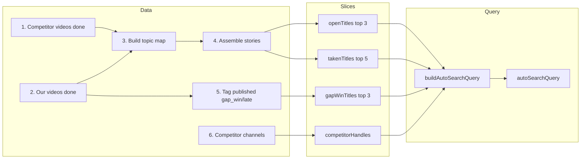
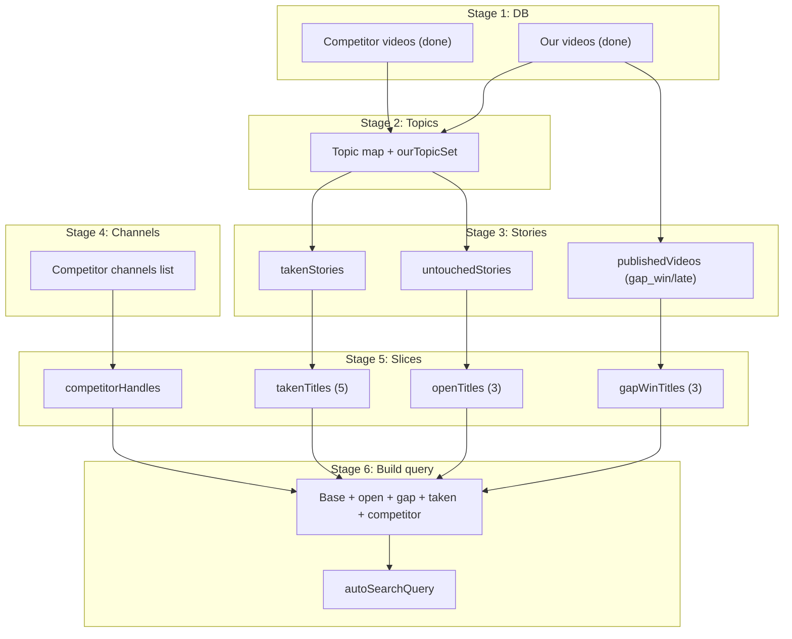

# Query Builder — Stage by Stage

The **Auto Search Query** is the Arabic prompt sent to Perplexity Sonar to discover story suggestions. It is built inside Brain v2 (`getBrainV2Data`). Below is the pipeline stage by stage.

---

## Mermaid: pipeline (stage by stage)





---

## High-level flow

```
┌─────────────────────────────────────────────────────────────────────────────┐
│  DATA GATHERING                    │  QUERY INGREDIENTS    │  FINAL QUERY    │
│  (DB + processing)                 │  (slices for prompt)  │  (Arabic text)   │
├───────────────────────────────────┼──────────────────────┼─────────────────┤
│  1. Competitor videos (done)       │                      │                 │
│  2. Our videos (done)              │  gapWinTitles        │                 │
│  3. Topic map (competitor topics)  │  openTitles          │  buildAuto      │
│  4. Assemble stories (taken/open) │  takenTitles         │  SearchQuery()  │
│  5. Tag our videos (gap_win/late) │  competitorHandles  │       │         │
│  6. Competitor channels list       │                      │       ▼         │
│  7. Slice & format titles/handles │                      │  autoSearchQuery │
└───────────────────────────────────┴──────────────────────┴─────────────────┘
```

---

## Stage-by-stage (backend)

| Stage | What happens | Output used for query |
|-------|----------------|------------------------|
| **1. init** | Start, set `requestTime` | — |
| **2. Competitor videos** | `db.video.findMany` — competitor channels, stage `done`, with `analysisResult` | Feeds topic extraction |
| **3. query-our-videos** | `db.video.findMany` — our channels, stage `done`, with `analysisResult` | Feeds topic set + later “published videos” |
| **4. build-topic-map** | From each competitor video, `extractTopics(analysisResult)` → normalize with `normTopic()`; build `topicMap` (topic → entries). From our videos, build `ourTopicSet` (topics we already covered). | Topic keys for stories |
| **5. assemble-stories** | For each topic in `topicMap`: if we covered it → `takenStories`; else if ≤14 days old → `untouchedStories` (open); else → `takenStories`. Sort untouched by `daysSince`. | `takenStories`, `untouchedStories` |
| **6. tag-published-videos** | For each of our videos: compare publish date with competitor entries for same topic → tag `gap_win` (we were first) or `late`. Build `publishedVideos` list. | Gap-win titles for “similar to our wins” |
| **7. query-competitor-channels** | `db.channel.findMany` — competitor channels, order by subscribers. | Handles for “did competitors cover this?” |
| **8. Slice for prompt** | `gapWinTitles` = top 3 gap_win video titles (≈40 chars each).<br>`openTitles` = top 3 untouched story titles (≈60 chars, with bullet).<br>`takenTitles` = top 5 taken story titles (≈40 chars each).<br>`competitorHandles` = comma-separated handles. | **All four** go into `buildAutoSearchQuery()` |
| **9. buildAutoSearchQuery** | Concatenate: **fixed base** (Arabic: “أعطني أبرز 8 قضايا…”) + **openSection** (priority open issues) + **gapSection** (search similar to our wins) + **takenSection** (avoid these, already filmed) + **competitorSection** (per story: title, summary, source URL, did competitors cover?). | **autoSearchQuery** (full string) |
| **10. load-topic-memory** | Load `TopicMemory` for project. Apply **time decay** (half-life 30 days) → `effectiveWeight`. Query recent `TopicMemoryEvent` → compute **velocityScore** (7d events / 30d events). Augmented memories drive query building (tier1/tier2/avoid) and scoring. | tier1/tier2/avoid sections + scoring |
| **11. score-and-rank** | Multi-signal scoring: `normalizedWeight × 0.25 + viewPotential × 0.20 + freshness × 0.35 − saturationPenalty`. Freshness = exponential decay (half-life 7d). viewPotential = competitor views / max. Saturation = log₂. Reason tags: `winner-like`, `fresh`, `closing-fast`, `high-demand`. Sort, top 5 → `rankedOpportunities`. | — |

---

## What goes into the final query (buildAutoSearchQuery)

```
┌────────────────────────────────────────────────────────────────────────────┐
│  BASE (fixed)                                                               │
│  أعطني أبرز 8 قضايا وأخبار من الجريمة والقضايا الحقيقية في السعودية       │
│  والخليج: خليط من أخبار حديثة (آخر 7 أيام) وقصص قديمة ما زالت تستحق...   │
├────────────────────────────────────────────────────────────────────────────┤
│  OPEN SECTION (if openTitles.length > 0)                                   │
│  أولوية: ابحث عن تطورات جديدة في هذه القضايا الغير مغطاة:                  │
│  • عنوان 1                                                                  │
│  • عنوان 2                                                                  │
│  • عنوان 3                                                                  │
├────────────────────────────────────────────────────────────────────────────┤
│  GAP SECTION (if gapWinTitles.length > 0)                                   │
│  ابحث عن قصص مشابهة في النوع والشعور لـ:                                   │
│  "عنوان فيديو 1…"                                                           │
│  و"عنوان فيديو 2…"                                                          │
│  (حققت أعلى مشاهدات لقناتنا).                                               │
├────────────────────────────────────────────────────────────────────────────┤
│  TAKEN SECTION (if takenTitles.length > 0)                                   │
│  تجنب تماماً أي قصص مشابهة لـ:                                              │
│  "قصة 1…", "قصة 2…", … — هذه تم تصويرها بالفعل.                             │
├────────────────────────────────────────────────────────────────────────────┤
│  COMPETITOR SECTION                                                         │
│  لكل قصة: العنوان، ملخص جملتين، رابط المصدر، وهل غطاها أحد من منافسينا    │
│  (handle1, handle2, …)؟   OR   لكل قصة: العنوان، ملخص جملتين، رابط المصدر. │
└────────────────────────────────────────────────────────────────────────────┘
                                    │
                                    ▼
                          autoSearchQuery (single string)
                                    │
                                    ▼
                    Used by: GET /api/brain-v2 (UI) and POST /api/stories/fetch (Perplexity)
```

---

## Learning system (topicMemory.js)

When a video from "ours" channels completes analysis, `updateTopicMemoryFromVideo` fires:

| Signal | How it's computed | What it affects |
|--------|-------------------|-----------------|
| **viewFactor** | `clamp(videoViews / projectMedianViews, 0.2, 3.0)` | Scales weight delta — high-view wins teach more |
| **engagementFactor** | `clamp(videoEngagement / projectMedianEngagement, 0.5, 2.0)` | Boosts weight for high-engagement videos |
| **weightDelta** | `(gap_win ? +0.3 : −0.15) × viewFactor × engagementFactor` | Drives `effectiveWeight` for scoring & query tiers |
| **winsShort / winsLong** | Incremented based on `videoType` when outcome is `gap_win` | Drives format preference (shorts vs long) in query |
| **demandScore** | `competitorViewsOnTopic / maxCompetitorViews` (0–1 scale) | Tier2 demand section in query |
| **performanceScore** | `viewsSum / videosCount / projectMedianViews` | Normalized per-topic performance |

View thresholds use **median** (not mean) to handle power-law distributions.

---

## Summary

1. **Data**: Competitor + our videos (done) → topics → taken vs untouched stories; our videos tagged gap_win/late; competitor channel list.
2. **Slices**: Top gap-win titles, top open (untouched) titles, top taken titles, competitor handles.
3. **Learning**: TopicMemory stores per-topic weight (view-weighted, engagement-boosted), demandScore, performanceScore, format wins. Time-decayed on read (30-day half-life). Velocity computed from recent events.
4. **Query**: Dynamic base (learned tags, region hints, format preference) + pattern section + memory tiers (tier1 proven winners, tier2 high-demand untouched) + open/gap/taken/avoid sections → one Arabic prompt.
5. **Scoring**: Multi-signal ranking (time-decayed weight, competitor view potential, exponential freshness, log saturation penalty) → top 5 ranked opportunities.
6. That prompt is shown in the Brain v2 UI as **Auto Search Query** and is what **Fetch** sends to Perplexity to get story suggestions.
